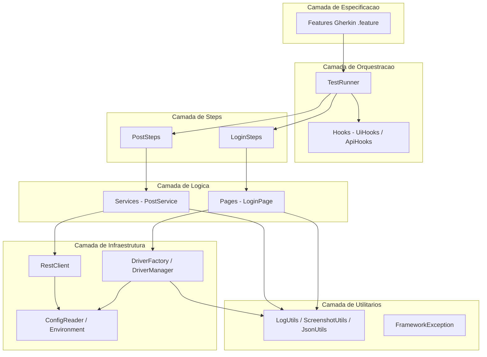
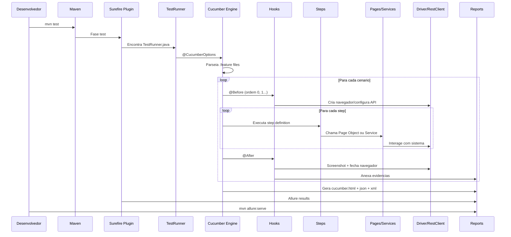
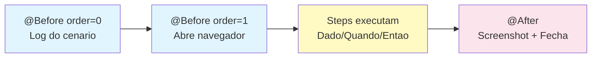
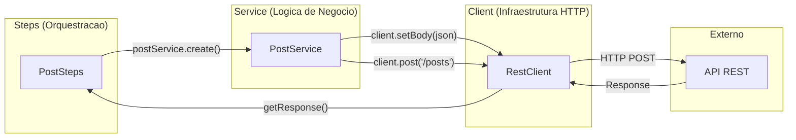
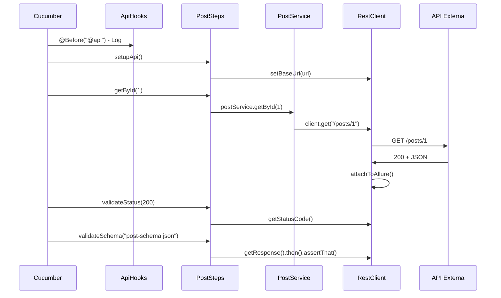
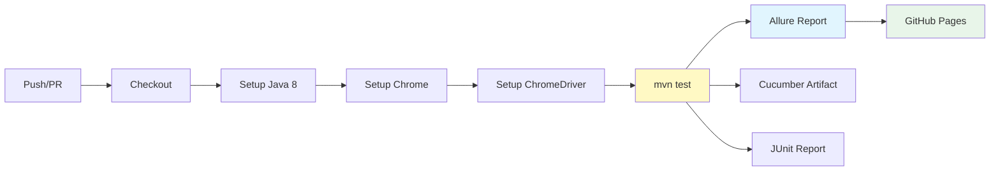
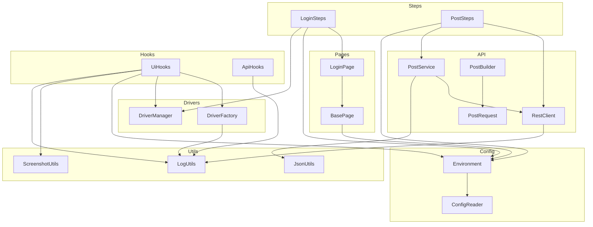

# Framework Profissional de Automacao de Testes
## Construindo uma Arquitetura Enterprise do Zero

> Este material acompanha o projeto de referencia. Cada parte corresponde a uma etapa da construcao do framework, desde a fundacao ate a integracao continua.

---

## Sumario

- [Parte 1 — Visao Geral e Arquitetura](#parte-1--visao-geral-e-arquitetura)
  - [1.1 O que e automacao de testes e por que automatizar](#11-o-que-e-automacao-de-testes-e-por-que-automatizar)
  - [1.2 O que e um framework](#12-o-que-e-um-framework)
  - [1.3 Piramide de testes](#13-piramide-de-testes)
  - [1.4 Arquitetura em camadas](#14-arquitetura-em-camadas)
  - [1.5 Fluxo completo de execucao](#15-fluxo-completo-de-execucao)
  - [1.6 Responsabilidade de cada camada](#16-responsabilidade-de-cada-camada)
  - [1.7 Decisoes tecnologicas e justificativas](#17-decisoes-tecnologicas-e-justificativas)
  - [1.8 Estrutura completa de diretorios](#18-estrutura-completa-de-diretorios)
  - [1.9 Pre-requisitos](#19-pre-requisitos)
- [Parte 2 — Construcao do Framework UI](#parte-2--construcao-do-framework-ui)
  - [2.1 Criacao do projeto Maven](#21-criacao-do-projeto-maven)
  - [2.2 DriverFactory](#22-driverfactory)
  - [2.3 DriverManager](#23-drivermanager)
  - [2.4 BasePage](#24-basepage)
  - [2.5 LoginPage](#25-loginpage)
  - [2.6 Cucumber — Features em portugues](#26-cucumber--features-em-portugues)
  - [2.7 TestRunner](#27-testrunner)
  - [2.8 LoginSteps](#28-loginsteps)
  - [2.9 UiHooks](#29-uihooks)
  - [2.10 Evidencias — Screenshots automaticas](#210-evidencias--screenshots-automaticas)
- [Parte 3 — Construcao do Framework API](#parte-3--construcao-do-framework-api)
  - [3.1 REST Assured — Introducao](#31-rest-assured--introducao)
  - [3.2 RestClient](#32-restclient)
  - [3.3 Padrao Client-Service](#33-padrao-client-service)
  - [3.4 PostService](#34-postservice)
  - [3.5 PostRequest — Modelo POJO](#35-postrequest--modelo-pojo)
  - [3.6 PostBuilder — Builder Pattern com Faker](#36-postbuilder--builder-pattern-com-faker)
  - [3.7 JsonUtils](#37-jsonutils)
  - [3.8 Payloads externalizados](#38-payloads-externalizados)
  - [3.9 JSON Schema Validation](#39-json-schema-validation)
  - [3.10 Feature de API em portugues](#310-feature-de-api-em-portugues)
  - [3.11 PostSteps](#311-poststeps)
  - [3.12 TestData vs Payload](#312-testdata-vs-payload)
- [Parte 4 — Engenharia do Framework](#parte-4--engenharia-do-framework)
  - [4.1 PicoContainer — Injecao de dependencia](#41-picocontainer--injecao-de-dependencia)
  - [4.2 ConfigReader](#42-configreader)
  - [4.3 Environment](#43-environment)
  - [4.4 Configuracao por ambiente](#44-configuracao-por-ambiente)
  - [4.5 Logging corporativo](#45-logging-corporativo)
  - [4.6 FrameworkException](#46-frameworkexception)
  - [4.7 Screenshots configuraveis](#47-screenshots-configuraveis)
  - [4.8 Allure Report](#48-allure-report)
  - [4.9 Estrategia de Tags](#49-estrategia-de-tags)
  - [4.10 Organizacao e nomenclatura](#410-organizacao-e-nomenclatura)
- [Parte 5 — Integracao e Manutencao](#parte-5--integracao-e-manutencao)
  - [5.1 GitHub Actions — Pipeline completo](#51-github-actions--pipeline-completo)
  - [5.2 Como adicionar um novo teste UI](#52-como-adicionar-um-novo-teste-ui)
  - [5.3 Como adicionar um novo teste API](#53-como-adicionar-um-novo-teste-api)
  - [5.4 Padroes de Code Review](#54-padroes-de-code-review)
  - [5.5 Checklist para iniciar novo projeto](#55-checklist-para-iniciar-novo-projeto)
  - [5.6 Troubleshooting](#56-troubleshooting)
  - [5.7 FAQ](#57-faq)
  - [5.8 Glossario](#58-glossario)
  - [5.9 Comandos rapidos](#59-comandos-rapidos)
  - [5.10 Como evoluir a arquitetura](#510-como-evoluir-a-arquitetura)

---

## Parte 1 — Visao Geral e Arquitetura

### 1.1 O que e automacao de testes e por que automatizar

Automacao de testes e a pratica de usar software para executar testes que seriam feitos manualmente. Em vez de um QA clicar em cada campo, preencher formularios e verificar resultados toda vez que o sistema muda, um script faz isso de forma repetivel, rapida e confiavel.

A justificativa economica e clara: um teste manual que leva 10 minutos, executado 50 vezes por sprint, consome mais de 8 horas de trabalho humano. Automatizado, ele roda em segundos a cada commit. O investimento inicial se paga em poucas semanas.

**O ciclo de vida de um bug:**

Quanto mais tarde um bug e encontrado, mais caro ele e para corrigir. A automacao atua na camada de prevencao — detecta regressoes ANTES de chegarem a producao.

```
Custo de correcao por fase:
  Desenvolvimento:   1x  (barato)
  Testes manuais:    5x
  QA formal:        10x
  Homologacao:      20x
  Producao:        100x  (caro + dano reputacional)
```

A automacao de testes opera na fase de "Testes" — encontra o bug quando custa 5x, nao quando custa 100x.

**Quando NAO automatizar:**

Nem tudo deve ser automatizado. Automatize quando:
- O teste sera executado mais de 5 vezes
- O fluxo e estavel (nao muda toda sprint)
- O resultado e deterministico (mesma entrada = mesma saida)
- Ha ROI positivo (custo de automacao < custo de execucao manual)

Nao automatize quando:
- O fluxo muda constantemente (tela em desenvolvimento ativo)
- E um teste exploratorio (sem roteiro definido)
- E um teste de usabilidade (requer percepcao humana)
- O sistema nao tem interface estavel (prototipos)

**Beneficios concretos:**

| Aspecto | Manual | Automatizado |
|---------|--------|--------------|
| Velocidade de execucao | 10-30 min por fluxo | 5-30 seg por fluxo |
| Consistencia | Sujeito a erro humano | Execucao identica sempre |
| Feedback | Apos horas/dias | Em minutos (CI/CD) |
| Cobertura de regressao | Parcial (tempo limitado) | Completa (todas as suites) |
| Custo por execucao | Alto (hora-homem) | Praticamente zero |
| Execucao noturna | Inviavel | Trivial |

> **Dica:** Automatizar nao significa eliminar testes manuais. Testes exploratorios, de usabilidade e cenarios ad-hoc continuam sendo manuais. Automatize o que e repetitivo e regressivo.

---

### 1.2 O que e um framework

Ha uma diferenca critica entre "ter scripts de teste" e "ter um framework de automacao". Scripts soltos sao arquivos Java que abrem o navegador, clicam em elementos e verificam resultados — sem padrao, sem reuso, sem estrutura.

Um framework e uma arquitetura organizada que define:
- **Onde** colocar cada tipo de codigo (separacao de responsabilidades)
- **Como** elementos sao localizados e interagidos (Page Objects)
- **Como** dados de teste sao gerenciados (configuracoes por ambiente)
- **Como** os testes sao executados e reportados (Runner + Reports)
- **Como** novos testes sao adicionados (padrao replicavel)

| Caracteristica | Scripts Soltos | Framework |
|----------------|---------------|-----------|
| Manutencao | Alterar em N arquivos | Alterar em 1 lugar |
| Reuso de codigo | Copiar e colar | Heranca + composicao |
| Onboarding de novos QAs | Dias | Horas |
| Escala para +100 testes | Caos | Organizado |
| Integracao com CI/CD | Dificil | Nativa |
| Reports profissionais | Inexistente | Allure/Cucumber |

> **Dica:** Se voce precisa mais de 1 hora para explicar como adicionar um novo teste, seu framework precisa de refatoracao.

---

### 1.3 Piramide de testes

A piramide de testes (Martin Fowler / Mike Cohn) define a proporcao ideal de testes em um sistema:

```
         /\
        /  \      E2E (UI)          - Poucos, lentos, frageis
       /----\     
      /      \    Integracao (API)   - Medios, rapidos, estaveis
     /--------\   
    /          \  Unitarios          - Muitos, rapidos, isolados
   /____________\
```

**Neste framework, cobrimos as duas camadas superiores:**
- **Testes de UI (E2E):** Validam fluxos completos do usuario via navegador (Selenium)
- **Testes de API (Integracao):** Validam contratos, status codes e regras de negocio via HTTP (REST Assured)

A estrategia e: manter poucos testes UI nos caminhos criticos (login, checkout) e muitos testes API para validacoes de dados e regras.

**Caracteristicas de cada camada:**

| Camada | Quantidade | Velocidade | Estabilidade | Manutencao | Confianca |
|--------|-----------|-----------|-------------|-----------|-----------|
| Unitarios | Centenas | Milissegundos | Muito alta | Baixa | Isolada |
| API | Dezenas | 0.5-3 segundos | Alta | Media | Integracao |
| UI | Poucos | 5-30 segundos | Media-baixa | Alta | E2E |

**Distribuicao recomendada:**
- 70% unitarios (responsabilidade do time de desenvolvimento)
- 20% API (responsabilidade compartilhada QA + DEV)
- 10% UI (responsabilidade principal do QA)

**Anti-padrao: Piramide invertida (Ice Cream Cone)**
```
   ______________
  /              \    UI: Tudo testado via interface (LENTO)
  \______________/
      /    \          API: Quase nenhum
      \____/
       /  \           Unit: Inexistente
       \__/
```

Se sua organizacao tem mais testes UI do que API e unit, voce esta no anti-padrao "cone de sorvete". Migre gradualmente: para cada novo teste UI, pergunte "isso poderia ser um teste de API?".

> **Dica:** Cada teste de UI que pode ser substituido por um teste de API deve ser. Testes de API sao 10x mais rapidos e 5x mais estaveis.

---

### 1.4 Arquitetura em camadas

O framework segue uma arquitetura em camadas, onde cada camada tem responsabilidade unica e se comunica apenas com a camada imediatamente abaixo.



Cada camada e isolada e testavel independentemente. Se amanha o Selenium for substituido por Playwright, apenas a camada de infraestrutura muda — os Steps e Features permanecem intactos.

> **Dica:** A regra de ouro da arquitetura em camadas: uma camada NUNCA deve depender de uma camada acima dela. Steps conhecem Pages, mas Pages nunca importam Steps.

---

### 1.5 Fluxo completo de execucao

Quando voce executa `mvn test`, uma cadeia precisa de eventos acontece. Entender esse fluxo e fundamental para debugar problemas.



O ponto chave e que o Cucumber controla o ciclo de vida. Ele le os `.feature`, mapeia cada frase para um metodo Java (step definition), e gerencia os hooks de setup/teardown.

> **Dica:** Se um teste falha no @Before, o cenario inteiro e marcado como falho. Sempre verifique os logs de hook primeiro ao investigar falhas.

---

### 1.6 Responsabilidade de cada camada

| Camada | Responsabilidade | Exemplos de Classes |
|--------|-----------------|---------------------|
| Especificacao | Descrever comportamento em linguagem natural | `login.feature`, `posts.feature` |
| Orquestracao | Configurar execucao e ciclo de vida | `TestRunner`, `UiHooks`, `ApiHooks` |
| Steps | Traduzir Gherkin para acoes Java | `LoginSteps`, `PostSteps` |
| Logica (UI) | Encapsular interacoes com paginas | `BasePage`, `LoginPage` |
| Logica (API) | Encapsular regras de negocio HTTP | `PostService`, `PostBuilder` |
| Infraestrutura | Gerenciar conexoes e configuracoes | `DriverFactory`, `RestClient`, `Environment` |
| Utilitarios | Funcoes transversais de suporte | `LogUtils`, `ScreenshotUtils`, `JsonUtils` |
| Modelos | Representar dados estruturados | `PostRequest` |
| Excecoes | Erros semanticos do framework | `FrameworkException` |

> **Dica:** Se uma classe nao se encaixa claramente em nenhuma camada, provavelmente ela esta fazendo coisas demais e deve ser dividida.

---

### 1.7 Decisoes tecnologicas e justificativas

| Tecnologia | Versao | Justificativa |
|------------|--------|---------------|
| Java | 8 | Compatibilidade maxima com ambientes corporativos; LTS |
| Maven | 3.x | Gerenciador de build padrao; integracao nativa com CI |
| Selenium WebDriver | 3.141.59 | Ultima versao compativel com Java 8; estavel em producao |
| Cucumber | 7.18.0 | BDD em portugues; integracao madura com JUnit |
| JUnit 4 | 4.13.2 | Runner padrao para Cucumber; compativel com Surefire |
| REST Assured | 4.5.1 | Ultima versao Java 8; API fluente given/when/then |
| PicoContainer | 7.18.0 | DI leve por cenario; zero configuracao |
| Allure Report | 2.24.0 | Relatorios visuais ricos; historico de execucoes |
| SLF4J + Logback | 1.7.36 / 1.2.12 | Logging desacoplado; configuravel por ambiente |
| JavaFaker | 1.0.2 | Dados dinamicos; evita dados fixos em testes |
| AspectJ | 1.9.19 | Necessario para integracao Allure (weaving) |
| GitHub Actions | - | CI/CD gratuito; integracao nativa com repositorio |

> **Dica:** A escolha do Java 8 e estrategica: a maioria dos ambientes corporativos brasileiros ainda roda Java 8 em producao. Seu framework de testes deve ser compativel com o ambiente onde sera executado.

---

### 1.8 Estrutura completa de diretorios

```
selenium-cucumber-project/
├── .github/
│   └── workflows/
│       └── testes.yml                  # Pipeline CI/CD
├── src/
│   └── test/
│       ├── java/
│       │   ├── api/
│       │   │   ├── builders/
│       │   │   │   └── PostBuilder.java        # Builder Pattern + Faker
│       │   │   ├── clients/
│       │   │   │   └── RestClient.java         # Cliente HTTP corporativo
│       │   │   ├── models/
│       │   │   │   └── PostRequest.java        # POJO de request
│       │   │   └── services/
│       │   │       └── PostService.java        # Logica de negocio API
│       │   ├── config/
│       │   │   ├── ConfigReader.java           # Leitura de .properties
│       │   │   └── Environment.java            # Gerenciamento de ambientes
│       │   ├── drivers/
│       │   │   ├── DriverFactory.java          # Criacao do navegador
│       │   │   └── DriverManager.java          # ThreadLocal para paralelo
│       │   ├── exceptions/
│       │   │   └── FrameworkException.java     # Excecao customizada
│       │   ├── hooks/
│       │   │   ├── ApiHooks.java               # Hooks para @api
│       │   │   └── UiHooks.java                # Hooks para @ui
│       │   ├── pages/
│       │   │   ├── base/
│       │   │   │   └── BasePage.java           # Classe abstrata base
│       │   │   └── login/
│       │   │       └── LoginPage.java          # Page Object do login
│       │   ├── runners/
│       │   │   └── TestRunner.java             # Ponto de entrada
│       │   ├── steps/
│       │   │   ├── api/
│       │   │   │   └── PostSteps.java          # Steps de API
│       │   │   └── ui/
│       │   │       └── LoginSteps.java         # Steps de UI
│       │   └── utils/
│       │       ├── JsonUtils.java              # Carregamento de JSON
│       │       ├── LogUtils.java               # Logging corporativo
│       │       └── ScreenshotUtils.java        # Captura de tela
│       └── resources/
│           ├── environments/
│           │   ├── dev.properties              # Configuracao DEV
│           │   └── hml.properties              # Configuracao HML
│           ├── features/
│           │   ├── api/
│           │   │   └── posts.feature           # Cenarios de API
│           │   └── ui/
│           │       └── login.feature           # Cenarios de UI
│           ├── payloads/
│           │   └── posts/
│           │       ├── create-post.json        # Payload de criacao
│           │       └── update-post.json        # Payload de atualizacao
│           ├── schemas/
│           │   └── post-schema.json            # Schema de validacao
│           └── logback.xml                     # Configuracao de logging
└── pom.xml                                     # Configuracao Maven
```

A organizacao segue o principio de **coesao**: arquivos que mudam juntos ficam juntos. Todas as classes de API ficam em `api/`, todos os resources de API ficam em subpastas correspondentes.

> **Dica:** Ao criar um novo recurso (ex: Users), replique a mesma estrutura: `api/services/UserService.java`, `api/models/UserRequest.java`, `payloads/users/create-user.json`, `features/api/users.feature`.

---

### 1.9 Pre-requisitos

Para executar este framework localmente, voce precisa de quatro componentes fundamentais. Cada um cumpre um papel especifico na cadeia de execucao.

**Visao geral dos componentes:**

```
┌──────────┐     ┌──────────┐     ┌──────────────┐     ┌──────────┐
│   JDK 8  │────>│  Maven   │────>│ ChromeDriver │────>│  Chrome  │
│ (compila)│     │ (executa)│     │  (controla)  │     │(renderiza)│
└──────────┘     └──────────┘     └──────────────┘     └──────────┘
```

- **JDK 8** compila o codigo Java do framework
- **Maven** gerencia dependencias e executa os testes
- **ChromeDriver** e a ponte entre o Selenium e o Chrome
- **Chrome** e o navegador que renderiza as paginas

**1. JDK 8 (Java Development Kit)**

O JDK inclui o compilador (`javac`) e a JVM (`java`). Certifique-se de instalar o JDK (nao apenas o JRE).

Verifique se ja esta instalado:
```bash
java -version
# Esperado: java version "1.8.x"

javac -version
# Esperado: javac 1.8.x
```

Caso nao tenha, instale o Temurin (AdoptOpenJDK):
- Windows: Baixe em https://adoptium.net/ e escolha JDK 8 LTS
- Configure `JAVA_HOME` apontando para a pasta de instalacao
- Adicione `%JAVA_HOME%\bin` ao PATH
- Reinicie o terminal apos configurar

**Verificacao pos-instalacao:**
```bash
echo %JAVA_HOME%
# Esperado: C:\Program Files\Eclipse Adoptium\jdk-8.x.x-hotspot (ou similar)
```

**2. Apache Maven 3.x**

O Maven gerencia dependencias e o ciclo de build. Ele baixa automaticamente todas as bibliotecas declaradas no pom.xml.

```bash
mvn -version
# Esperado: Apache Maven 3.x.x
# Esperado: Java version: 1.8.x (confirma que usa o JDK correto)
```

- Windows: Baixe em https://maven.apache.org/download.cgi
- Extraia para `C:\maven`
- Configure `MAVEN_HOME` e adicione `%MAVEN_HOME%\bin` ao PATH

**Primeiro uso:** Na primeira execucao, o Maven baixa todas as dependencias (~100 MB). As execucoes seguintes sao rapidas porque usa cache local (`~/.m2/repository/`).

**3. Google Chrome (ultima versao)**

O framework usa Chrome como navegador padrao. Mantenha-o atualizado para evitar incompatibilidades com o ChromeDriver.

Para verificar a versao: acesse `chrome://version` na barra de endereco.

**4. ChromeDriver**

O ChromeDriver deve ser compativel com a versao do Chrome instalada:
- Verifique a versao do Chrome em `chrome://version`
- Baixe o driver correspondente em https://chromedriver.chromium.org/downloads
- Para Chrome 115+: https://googlechromelabs.github.io/chrome-for-testing/
- Coloque em um diretorio acessivel (ex: `C:\chromedriver\`)
- Configure a variavel de ambiente `CHROME_DRIVER_PATH` ou use o path padrao

**Compatibilidade Chrome/ChromeDriver:**

| Chrome | ChromeDriver |
|--------|-------------|
| 120.x | chromedriver 120.x |
| 121.x | chromedriver 121.x |
| 125.x | chromedriver 125.x |

A regra e simples: a versao MAJOR (primeiro numero) deve ser identica.

**Validacao completa do ambiente:**
```bash
java -version && mvn -version && google-chrome --version && chromedriver --version
```

Se todos os quatro comandos retornam versoes, seu ambiente esta pronto.

> **Dica:** Em ambientes CI (GitHub Actions), o Chrome e o ChromeDriver sao instalados automaticamente pelo pipeline. A configuracao local e necessaria apenas para desenvolvimento.

---

## Parte 2 — Construcao do Framework UI

### 2.1 Criacao do projeto Maven

O `pom.xml` e o coracao de qualquer projeto Java gerenciado pelo Maven. Ele define as dependencias, plugins de build e configuracoes de compilacao. Cada dependencia foi escolhida com criterio de compatibilidade com Java 8 e maturidade em producao.

```xml
<?xml version="1.0" encoding="UTF-8"?>
<project xmlns="http://maven.apache.org/POM/4.0.0"
         xmlns:xsi="http://www.w3.org/2001/XMLSchema-instance"
         xsi:schemaLocation="http://maven.apache.org/POM/4.0.0
         http://maven.apache.org/xsd/maven-4.0.0.xsd">

    <modelVersion>4.0.0</modelVersion>

    <groupId>com.automacao</groupId>
    <artifactId>selenium-restassured-cucumber-github-actions</artifactId>
    <version>1.0.0</version>
    <packaging>jar</packaging>

    <name>selenium-restassured-cucumber-github-actions</name>
    <description>Automação de testes Web (Selenium) e API (REST Assured) com Cucumber BDD</description>

    <properties>
        <java.version>8</java.version>
        <maven.compiler.source>${java.version}</maven.compiler.source>
        <maven.compiler.target>${java.version}</maven.compiler.target>
        <project.build.sourceEncoding>UTF-8</project.build.sourceEncoding>

        <!-- Versões das dependências -->
        <!-- Selenium 3.x — última versão compatível com Java 8 -->
        <selenium.version>3.141.59</selenium.version>
        <!-- Cucumber 7.x requer Java 8+ -->
        <cucumber.version>7.18.0</cucumber.version>
        <junit.version>4.13.2</junit.version>
        <!-- REST Assured 4.x — última versão com suporte a Java 8 -->
        <rest.assured.version>4.5.1</rest.assured.version>
        <!-- Allure Report -->
        <allure.version>2.24.0</allure.version>
    </properties>

    <dependencies>

        <!-- Selenium WebDriver -->
        <dependency>
            <groupId>org.seleniumhq.selenium</groupId>
            <artifactId>selenium-java</artifactId>
            <version>${selenium.version}</version>
        </dependency>

        <!-- Cucumber JVM -->
        <dependency>
            <groupId>io.cucumber</groupId>
            <artifactId>cucumber-java</artifactId>
            <version>${cucumber.version}</version>
        </dependency>

        <!-- Cucumber + JUnit integration -->
        <dependency>
            <groupId>io.cucumber</groupId>
            <artifactId>cucumber-junit</artifactId>
            <version>${cucumber.version}</version>
            <scope>test</scope>
        </dependency>

        <!-- JUnit -->
        <dependency>
            <groupId>junit</groupId>
            <artifactId>junit</artifactId>
            <version>${junit.version}</version>
            <scope>test</scope>
        </dependency>

        <!-- REST Assured - testes de API REST -->
        <dependency>
            <groupId>io.rest-assured</groupId>
            <artifactId>rest-assured</artifactId>
            <version>${rest.assured.version}</version>
            <scope>test</scope>
        </dependency>

        <!-- JSON Schema Validator - valida estrutura da resposta -->
        <dependency>
            <groupId>io.rest-assured</groupId>
            <artifactId>json-schema-validator</artifactId>
            <version>${rest.assured.version}</version>
            <scope>test</scope>
        </dependency>

        <!-- Allure Cucumber Integration -->
        <dependency>
            <groupId>io.qameta.allure</groupId>
            <artifactId>allure-cucumber7-jvm</artifactId>
            <version>${allure.version}</version>
            <scope>test</scope>
            <exclusions>
                <exclusion>
                    <groupId>io.cucumber</groupId>
                    <artifactId>gherkin</artifactId>
                </exclusion>
                <exclusion>
                    <groupId>io.cucumber</groupId>
                    <artifactId>messages</artifactId>
                </exclusion>
            </exclusions>
        </dependency>

        <!-- AspectJ Weaver (necessario para Allure) -->
        <dependency>
            <groupId>org.aspectj</groupId>
            <artifactId>aspectjweaver</artifactId>
            <version>1.9.19</version>
            <scope>test</scope>
        </dependency>

        <!-- PicoContainer — Injecao de Dependencia por cenario no Cucumber -->
        <dependency>
            <groupId>io.cucumber</groupId>
            <artifactId>cucumber-picocontainer</artifactId>
            <version>${cucumber.version}</version>
            <scope>test</scope>
        </dependency>

        <!-- SLF4J API — fachada de logging -->
        <dependency>
            <groupId>org.slf4j</groupId>
            <artifactId>slf4j-api</artifactId>
            <version>1.7.36</version>
        </dependency>

        <!-- Logback — implementacao SLF4J -->
        <dependency>
            <groupId>ch.qos.logback</groupId>
            <artifactId>logback-classic</artifactId>
            <version>1.2.12</version>
        </dependency>

        <!-- JavaFaker — geracao de dados de teste dinamicos -->
        <dependency>
            <groupId>com.github.javafaker</groupId>
            <artifactId>javafaker</artifactId>
            <version>1.0.2</version>
            <scope>test</scope>
        </dependency>

    </dependencies>

    <build>
        <plugins>

            <!-- Maven Surefire Plugin - executa os testes JUnit -->
            <plugin>
                <groupId>org.apache.maven.plugins</groupId>
                <artifactId>maven-surefire-plugin</artifactId>
                <version>3.2.5</version>
                <configuration>
                    <includes>
                        <include>**/TestRunner.java</include>
                    </includes>
                    <argLine>
                        -Djavax.net.ssl.trustStore=${user.home}/.maven-cacerts
                        -Djavax.net.ssl.trustStorePassword=changeit
                        -javaagent:"${settings.localRepository}/org/aspectj/aspectjweaver/1.9.19/aspectjweaver-1.9.19.jar"
                    </argLine>
                    <systemPropertyVariables>
                        <allure.results.directory>target/allure-results</allure.results.directory>
                    </systemPropertyVariables>
                </configuration>
            </plugin>

            <!-- Maven Compiler Plugin -->
            <plugin>
                <groupId>org.apache.maven.plugins</groupId>
                <artifactId>maven-compiler-plugin</artifactId>
                <version>3.13.0</version>
                <configuration>
                    <source>${java.version}</source>
                    <target>${java.version}</target>
                    <encoding>UTF-8</encoding>
                </configuration>
            </plugin>

            <!-- Allure Maven Plugin - gera relatorio -->
            <plugin>
                <groupId>io.qameta.allure</groupId>
                <artifactId>allure-maven</artifactId>
                <version>2.12.0</version>
                <configuration>
                    <reportVersion>${allure.version}</reportVersion>
                    <resultsDirectory>allure-results</resultsDirectory>
                </configuration>
            </plugin>

        </plugins>
    </build>

</project>
```

**Decisoes de design do pom.xml:**

- Todas as versoes estao centralizadas em `<properties>` para facilitar atualizacoes futuras — basta alterar um numero em um lugar.
- O Surefire esta configurado para encontrar apenas `TestRunner.java`, garantindo que o Cucumber controla a execucao (e nao o JUnit direto).
- O `argLine` do Surefire injeta o AspectJ como agente JVM, necessario para que o Allure intercepte os steps automaticamente.
- As exclusoes no `allure-cucumber7-jvm` evitam conflitos de versao com as bibliotecas Gherkin que ja vem com o Cucumber.

> **Dica:** Sempre defina versoes como properties. Quando precisar atualizar o Cucumber de 7.18 para 7.19, voce muda em UM lugar e todas as dependencias se ajustam.

---

### 2.2 DriverFactory

A DriverFactory e responsavel por criar instancias do WebDriver. Ela encapsula toda a logica de configuracao do navegador, incluindo a deteccao automatica de ambiente CI para modo headless.

```java
package drivers;

import org.openqa.selenium.WebDriver;
import org.openqa.selenium.chrome.ChromeDriver;
import org.openqa.selenium.chrome.ChromeOptions;
import utils.LogUtils;

/**
 * Cria instancias de WebDriver.
 */
public class DriverFactory {

    private static final boolean IN_CI =
            System.getenv("CI") != null || System.getenv("JENKINS_URL") != null;

    public WebDriver create(String browser) {
        LogUtils.info("Criando driver: " + browser + (IN_CI ? " [headless]" : " [visual]"));
        switch (browser.toLowerCase()) {
            case "chrome": return createChrome();
            default: throw new IllegalArgumentException("Browser nao suportado: " + browser);
        }
    }

    private WebDriver createChrome() {
        if (!IN_CI) {
            String path = System.getenv("CHROME_DRIVER_PATH") != null
                    ? System.getenv("CHROME_DRIVER_PATH")
                    : "C:\\chromedriver\\chromedriver-win64\\chromedriver.exe";
            System.setProperty("webdriver.chrome.driver", path);
        }

        ChromeOptions options = new ChromeOptions();
        if (IN_CI) {
            options.addArguments("--headless=new", "--no-sandbox",
                    "--disable-dev-shm-usage", "--window-size=1920,1080");
        } else {
            options.addArguments("--start-maximized");
        }
        options.addArguments("--disable-notifications", "--remote-allow-origins=*");
        return new ChromeDriver(options);
    }
}
```

**Decisoes de design:**

- A deteccao de CI usa variaveis de ambiente padrao (`CI` para GitHub Actions, `JENKINS_URL` para Jenkins). Isso permite que o mesmo codigo rode local e no pipeline sem nenhuma alteracao.
- Em CI, o Chrome roda headless com `--no-sandbox` e `--disable-dev-shm-usage` — flags obrigatorias para containers Linux.
- O `--window-size=1920,1080` garante que screenshots em CI tenham resolucao consistente.
- Localmente, o path do ChromeDriver aceita variavel de ambiente ou usa um padrao sensato.

> **Dica:** Nunca faca commit de caminhos absolutos locais (ex: `C:\Users\joao\...`). Use variaveis de ambiente para paths que variam entre maquinas.

---

### 2.3 DriverManager

O DriverManager resolve um problema critico: como compartilhar a mesma instancia de WebDriver entre Hooks, Steps e Pages sem acopla-los via campo estatico comum. A resposta e ThreadLocal.

```java
package drivers;

import org.openqa.selenium.WebDriver;

/**
 * Gerencia o WebDriver via ThreadLocal (seguro para paralelo).
 */
public class DriverManager {

    private static final ThreadLocal<WebDriver> driver = new ThreadLocal<>();

    private DriverManager() {}

    public static WebDriver getDriver() {
        return driver.get();
    }

    public static void setDriver(WebDriver webDriver) {
        driver.set(webDriver);
    }

    public static void quit() {
        WebDriver d = driver.get();
        if (d != null) {
            d.quit();
            driver.remove();
        }
    }
}
```

**Decisoes de design:**

- `ThreadLocal<WebDriver>` garante que cada thread tem sua propria instancia do navegador. Quando o Cucumber executar cenarios em paralelo (futuro), cada cenario tera seu Chrome isolado sem interferencia.
- O construtor e privado (padrao utility class) porque todos os metodos sao estaticos.
- O `quit()` faz `driver.remove()` apos fechar — isso previne memory leaks em execucoes longas com muitos cenarios.

> **Dica:** ThreadLocal e essencial para paralelismo, mas tambem e util em execucao serial: ele garante um ponto unico de acesso ao driver sem precisar passar o objeto por parametro em toda a cadeia.

---

### 2.4 BasePage

A BasePage e a classe abstrata que serve de fundacao para todos os Page Objects. Ela encapsula as interacoes comuns com o Selenium (clicar, digitar, navegar) e configura o WebDriverWait com timeout do ambiente.

```java
package pages.base;

import config.Environment;
import org.openqa.selenium.By;
import org.openqa.selenium.TimeoutException;
import org.openqa.selenium.WebDriver;
import org.openqa.selenium.WebElement;
import org.openqa.selenium.support.ui.ExpectedConditions;
import org.openqa.selenium.support.ui.WebDriverWait;
import utils.LogUtils;

/**
 * Classe base para todos os Page Objects.
 */
public abstract class BasePage {

    protected final WebDriver driver;
    protected final WebDriverWait wait;

    protected BasePage(WebDriver driver) {
        this.driver = driver;
        int timeout = new Environment().getInt("timeout.explicit", 10);
        this.wait = new WebDriverWait(driver, timeout);
    }

    protected void navigate(String url) {
        LogUtils.info("Navegando: " + url);
        driver.get(url);
    }

    protected void type(By locator, String text) {
        WebElement element = wait.until(ExpectedConditions.visibilityOfElementLocated(locator));
        element.clear();
        element.sendKeys(text);
    }

    protected void click(By locator) {
        wait.until(ExpectedConditions.elementToBeClickable(locator)).click();
    }

    protected String getText(By locator) {
        return wait.until(ExpectedConditions.visibilityOfElementLocated(locator)).getText();
    }

    protected boolean urlContains(String fragment) {
        try {
            return wait.until(ExpectedConditions.urlContains(fragment));
        } catch (TimeoutException e) {
            LogUtils.warn("Timeout aguardando URL conter: " + fragment);
            return false;
        }
    }
}
```

**Decisoes de design:**

- A classe e `abstract` porque nunca deve ser instanciada diretamente — ela so existe para ser herdada por Pages concretas.
- Os metodos sao `protected` (nao public) porque sao destinados apenas as subclasses, nao ao mundo externo. Steps nunca devem chamar `type()` diretamente.
- O timeout vem do `Environment`, entao cada ambiente pode ter timeouts diferentes (DEV = 10s, HML = 15s).
- Todo `type()` faz `clear()` antes de `sendKeys()` para evitar concatenacao de texto em campos pre-preenchidos.
- O `urlContains()` captura `TimeoutException` e retorna `false` em vez de propagar a excecao — isso torna as assercoes mais limpas nos Steps.

> **Dica:** Se voce precisa de uma interacao especifica que nao existe na BasePage (ex: drag-and-drop), adicione-a aqui. Todas as Pages herdam automaticamente.

---

### 2.5 LoginPage

O LoginPage implementa o Page Object Pattern: cada pagina da aplicacao tem uma classe Java correspondente que encapsula seus elementos e acoes. O codigo externo (Steps) nunca lida com localizadores — apenas com metodos semanticos.

```java
package pages.login;

import org.openqa.selenium.By;
import org.openqa.selenium.WebDriver;
import pages.base.BasePage;

/**
 * Page Object da pagina de Login.
 */
public class LoginPage extends BasePage {

    private final By usernameField = By.name("username");
    private final By passwordField = By.name("password");
    private final By loginButton   = By.cssSelector("button[type='submit']");
    private final By errorMessage  = By.cssSelector(".oxd-alert-content-text");

    public LoginPage(WebDriver driver) {
        super(driver);
    }

    public void open(String url) {
        navigate(url);
    }

    public void fillUsername(String username) {
        type(usernameField, username);
    }

    public void fillPassword(String password) {
        type(passwordField, password);
    }

    public void clickLogin() {
        click(loginButton);
    }

    public String getErrorMessage() {
        return getText(errorMessage);
    }

    public boolean isOnDashboard() {
        return urlContains("/dashboard");
    }
}
```

**Decisoes de design:**

- Localizadores sao `private final` — eles pertencem exclusivamente a esta Page e nunca mudam apos construcao.
- Metodos tem nomes semanticos (`fillUsername`, `clickLogin`) em vez de tecnicos (`typeInField1`, `clickButton`). Isso torna os Steps legiveis como documentacao.
- A Page recebe o driver no construtor (injecao de dependencia) em vez de buscar de um singleton. Isso facilita testes unitarios da propria Page.
- Nao ha logica de negocio na Page: ela nao decide se o login foi bem-sucedido — apenas expoe `isOnDashboard()` para o Step decidir.

> **Dica:** Um Page Object nunca deve conter assercoes (Assert). A responsabilidade de verificar e do Step. A Page apenas informa o estado atual.

---

### 2.6 Cucumber — Features em portugues

O Cucumber permite escrever especificacoes executaveis em linguagem natural. Com a diretiva `# language: pt`, todas as keywords ficam em portugues, tornando os cenarios acessiveis para analistas de negocio e POs.

```gherkin
# language: pt
@ui
Funcionalidade: Login no sistema
  Como um usuário registrado
  Quero fazer login na aplicação
  Para acessar as funcionalidades do sistema

  Contexto:
    Dado que estou na página de login

  @smoke
  Cenário: Login com credenciais válidas
    Quando faço login como administrador
    Então devo ser redirecionado para a página inicial

  Cenário: Login com senha incorreta
    Quando faço login com usuário "admin" e senha incorreta
    Então devo ver a mensagem de erro "Invalid credentials"

  Esquema do Cenário: Login com credenciais inválidas
    Quando faço login com usuário "<usuario>" e senha "<senha>"
    Então devo ver a mensagem de erro "<mensagem>"

    Exemplos:
      | usuario       | senha      | mensagem            |
      | usuarioErrado | admin123   | Invalid credentials |
      | wronguser     | wrongpass  | Invalid credentials |
```

**Tabela de keywords Gherkin em portugues:**

| Portugues | Ingles | Funcao |
|-----------|--------|--------|
| Funcionalidade | Feature | Agrupa cenarios relacionados |
| Contexto | Background | Steps executados antes de cada cenario |
| Cenario | Scenario | Caso de teste individual |
| Esquema do Cenario | Scenario Outline | Template com multiplas combinacoes |
| Exemplos | Examples | Tabela de dados para Outline |
| Dado | Given | Pre-condicao (setup) |
| Quando | When | Acao do usuario |
| Entao | Then | Resultado esperado |
| E | And | Continuacao do step anterior |

**Decisoes de design:**

- A tag `@ui` permite filtrar apenas testes de interface. A tag `@smoke` marca cenarios criticos para execucao rapida.
- O `Contexto` (Background) evita repetir "Dado que estou na pagina de login" em todo cenario.
- O `Esquema do Cenario` com `Exemplos` e um teste parametrizado — executa o mesmo fluxo com dados diferentes.

> **Dica:** Features devem ser escritas na perspectiva do usuario, nao do sistema. Use "Quando faco login" (usuario) em vez de "Quando o sistema valida credenciais" (tecnico).

---

### 2.7 TestRunner

O TestRunner e o ponto de entrada que conecta Maven, JUnit e Cucumber. Ele define onde estao as features, onde estao os steps, e quais plugins de report serao usados.

```java
package runners;

import io.cucumber.junit.Cucumber;
import io.cucumber.junit.CucumberOptions;
import org.junit.runner.RunWith;

/**
 * Runner principal.
 *
 * mvn test                                    -> todos
 * mvn test -Dcucumber.filter.tags="@smoke"    -> smoke
 * mvn test -Dcucumber.filter.tags="@api"      -> API
 * mvn test -Dcucumber.filter.tags="@ui"       -> UI
 * mvn test -Denvironment=hml                  -> ambiente HML
 * mvn allure:serve                            -> relatorio
 */
@RunWith(Cucumber.class)
@CucumberOptions(
    features = "src/test/resources/features",
    glue = {"steps", "hooks"},
    plugin = {
        "pretty",
        "html:target/cucumber-reports/cucumber.html",
        "json:target/cucumber-reports/cucumber.json",
        "junit:target/cucumber-reports/cucumber.xml",
        "io.qameta.allure.cucumber7jvm.AllureCucumber7Jvm"
    },
    monochrome = true
)
public class TestRunner {
}
```

**Decisoes de design:**

- `features` aponta para a pasta raiz — o Cucumber escaneia recursivamente todas as subpastas (`ui/`, `api/`).
- `glue` inclui tanto `steps` quanto `hooks`. Se voce esquecer de incluir `hooks`, os @Before/@After nao serao executados.
- Os quatro plugins geram: saida colorida no console (`pretty`), relatorio HTML nativo, JSON para integracao com ferramentas, XML para JUnit report, e dados para o Allure.
- `monochrome = true` remove caracteres de escape ANSI do output — util em logs de CI.
- A filtragem por tags e feita via linha de comando (`-Dcucumber.filter.tags`), nao no Runner. Isso permite flexibilidade sem recompilar.

> **Dica:** Nunca coloque `tags` fixas no @CucumberOptions em producao. Isso impediria a execucao de todos os testes. Use `-Dcucumber.filter.tags` no comando Maven.

---

### 2.8 LoginSteps

Os Step Definitions conectam a linguagem natural do Gherkin com codigo Java executavel. Cada frase "Dado/Quando/Entao" mapeia para um metodo anotado. O PicoContainer injeta dependencias automaticamente via construtor.

```java
package steps.ui;

import config.Environment;
import drivers.DriverManager;
import io.cucumber.java.pt.Dado;
import io.cucumber.java.pt.Então;
import io.cucumber.java.pt.Quando;
import org.junit.Assert;
import pages.login.LoginPage;

/**
 * Steps de Login (UI).
 * Environment injetado via PicoContainer.
 */
public class LoginSteps {

    private final Environment env;
    private LoginPage loginPage;

    public LoginSteps(Environment env) {
        this.env = env;
    }

    @Dado("que estou na página de login")
    public void openLogin() {
        loginPage = new LoginPage(DriverManager.getDriver());
        loginPage.open(env.baseUrl);
    }

    @Quando("faço login como administrador")
    public void loginAsAdmin() {
        loginPage.fillUsername(env.get("usuario.admin"));
        loginPage.fillPassword(env.get("senha.admin"));
        loginPage.clickLogin();
    }

    @Quando("faço login com usuário {string} e senha {string}")
    public void loginWith(String user, String pass) {
        loginPage.fillUsername(user);
        loginPage.fillPassword(pass);
        loginPage.clickLogin();
    }

    @Quando("faço login com usuário {string} e senha incorreta")
    public void loginWithWrongPassword(String user) {
        loginPage.fillUsername(user);
        loginPage.fillPassword(env.get("senha.invalida"));
        loginPage.clickLogin();
    }

    @Então("devo ser redirecionado para a página inicial")
    public void shouldBeOnDashboard() {
        Assert.assertTrue("Nao redirecionou para o dashboard", loginPage.isOnDashboard());
    }

    @Então("devo ver a mensagem de erro {string}")
    public void shouldSeeError(String expected) {
        Assert.assertEquals("Mensagem incorreta", expected, loginPage.getErrorMessage());
    }
}
```

**Decisoes de design:**

- O `Environment` e injetado via construtor pelo PicoContainer. Nenhuma configuracao XML ou anotacao adicional e necessaria — basta declarar no construtor.
- Credenciais vem do arquivo de propriedades (`env.get("usuario.admin")`), nunca hardcoded no Step. Isso permite trocar credenciais por ambiente sem alterar codigo.
- O `LoginPage` e instanciado no step `@Dado` (nao no construtor) porque o driver so existe apos o Hook abrir o navegador.
- Steps usam `{string}` como expression do Cucumber para capturar parametros dinamicos do Gherkin.

> **Dica:** Cada classe de Steps deve ser coesa — trate apenas de um assunto. LoginSteps cuida de login, nao de cadastro. Se a feature crescer, crie novas classes de Steps.

---

### 2.9 UiHooks

Os Hooks controlam o ciclo de vida do navegador: abrir antes de cada cenario UI e fechar depois. Eles tambem gerenciam a captura de evidencias (screenshots).

```java
package hooks;

import config.Environment;
import drivers.DriverFactory;
import drivers.DriverManager;
import io.cucumber.java.After;
import io.cucumber.java.Before;
import io.cucumber.java.Scenario;
import org.openqa.selenium.WebDriver;
import utils.LogUtils;
import utils.ScreenshotUtils;

import java.util.concurrent.TimeUnit;

/**
 * Hooks para cenarios @ui.
 */
public class UiHooks {

    private final Environment env;

    public UiHooks() {
        this.env = new Environment();
    }

    @Before(value = "@ui", order = 0)
    public void logScenario(Scenario scenario) {
        LogUtils.info("=== [UI] " + scenario.getName() + " ===");
    }

    @Before(value = "@ui", order = 1)
    public void openBrowser() {
        if (DriverManager.getDriver() == null) {
            String browser = env.get("browser", "chrome");
            int implicitWait = env.getInt("timeout.implicit", 10);
            int pageLoad = env.getInt("timeout.pageLoad", 30);

            DriverFactory factory = new DriverFactory();
            WebDriver driver = factory.create(browser);
            driver.manage().timeouts().implicitlyWait(implicitWait, TimeUnit.SECONDS);
            driver.manage().timeouts().pageLoadTimeout(pageLoad, TimeUnit.SECONDS);
            DriverManager.setDriver(driver);
        }
    }

    @After(value = "@ui")
    public void closeBrowser(Scenario scenario) {
        WebDriver driver = DriverManager.getDriver();
        if (driver == null) return;

        String mode = env.get("screenshot.mode", "failure_only");
        boolean shouldCapture = "always".equals(mode) || scenario.isFailed();

        if (shouldCapture) {
            byte[] screenshot = ScreenshotUtils.capture(driver);
            if (screenshot.length > 0) {
                String status = scenario.isFailed() ? "FALHA" : "SUCESSO";
                scenario.attach(screenshot, "image/png", status + " - " + scenario.getName());
                LogUtils.info("Screenshot [" + status + "]");
            }
        }

        DriverManager.quit();
        LogUtils.info("=== Navegador encerrado ===");
    }
}
```

**Ciclo de vida do cenario UI:**



**Decisoes de design:**

- `value = "@ui"` faz o hook rodar APENAS em cenarios com a tag @ui. Cenarios de API nao abrem navegador.
- `order = 0` e `order = 1` garantem sequencia: primeiro loga, depois abre o browser. Ordens menores executam primeiro.
- O `if (DriverManager.getDriver() == null)` previne reabrir o navegador se ele ja estiver aberto (defensivo).
- O screenshot mode e configuravel por ambiente: em DEV capture apenas falhas (economiza tempo), em HML capture sempre (mais evidencias).
- `scenario.attach()` anexa a screenshot diretamente ao relatorio Cucumber/Allure.

> **Dica:** O `@After` sempre executa, mesmo se o cenario falhou. Por isso ele e o local perfeito para cleanup (fechar browser, limpar dados). Nunca faca cleanup no ultimo step.

---

### 2.10 Evidencias — Screenshots automaticas

A captura de evidencias e essencial para rastreabilidade. O ScreenshotUtils encapsula a logica de captura, enquanto o UiHooks decide QUANDO capturar com base na configuracao.

```java
package utils;

import org.openqa.selenium.OutputType;
import org.openqa.selenium.TakesScreenshot;
import org.openqa.selenium.WebDriver;

/**
 * Captura de screenshots.
 */
public class ScreenshotUtils {

    private ScreenshotUtils() {}

    public static byte[] capture(WebDriver driver) {
        if (driver instanceof TakesScreenshot) {
            return ((TakesScreenshot) driver).getScreenshotAs(OutputType.BYTES);
        }
        return new byte[0];
    }
}
```

**Modos de captura:**

| Modo | Configuracao | Quando captura | Uso recomendado |
|------|-------------|----------------|-----------------|
| `failure_only` | `screenshot.mode=failure_only` | Apenas quando cenario falha | DEV (economiza tempo) |
| `always` | `screenshot.mode=always` | Sempre (sucesso e falha) | HML (mais evidencias) |

A decisao de modo fica no arquivo de propriedades do ambiente. O codigo em UiHooks avalia:

```java
String mode = env.get("screenshot.mode", "failure_only");
boolean shouldCapture = "always".equals(mode) || scenario.isFailed();
```

A screenshot e retornada como `byte[]` e anexada ao cenario Cucumber via `scenario.attach()`. Isso garante que a imagem aparece tanto no relatorio Cucumber HTML quanto no Allure Report.

> **Dica:** Em ambientes de homologacao, use `always` — isso gera evidencias visuais para auditoria mesmo quando os testes passam.

---

## Parte 3 — Construcao do Framework API

### 3.1 REST Assured — Introducao

REST Assured e uma biblioteca Java para testar APIs RESTful de forma fluente. Ela usa a mesma estrutura Given/When/Then do BDD para construir requisicoes HTTP e validar respostas.

**Conceitos fundamentais:**

```
given()                    // Configuracao (headers, body, auth)
    .baseUri("https://api.example.com")
    .contentType(ContentType.JSON)
    .body(payload)
.when()                    // Acao (verbo HTTP)
    .post("/users")
.then()                    // Verificacao (assercoes)
    .statusCode(201)
    .body("id", notNullValue());
```

**Anatomia de uma chamada REST:**

Uma chamada de API e composta por:

```
REQUEST:
┌─────────────────────────────────────────────┐
│ POST /posts HTTP/1.1                        │  ← Metodo + Endpoint
│ Host: jsonplaceholder.typicode.com          │  ← Base URI
│ Content-Type: application/json              │  ← Headers
│ Accept: application/json                    │
│                                             │
│ {"title": "Novo Post", "userId": 1}        │  ← Body (payload)
└─────────────────────────────────────────────┘

RESPONSE:
┌─────────────────────────────────────────────┐
│ HTTP/1.1 201 Created                        │  ← Status Code
│ Content-Type: application/json; utf-8       │  ← Headers
│                                             │
│ {"id": 101, "title": "Novo Post", ...}     │  ← Body (resposta)
└─────────────────────────────────────────────┘
```

Nos testes, validamos:
1. **Status Code** — a API retornou o codigo esperado?
2. **Headers** — o Content-Type esta correto?
3. **Body** — os campos tem os valores esperados?
4. **Schema** — a estrutura da resposta esta correta?

**Por que REST Assured em vez de HttpClient puro:**

| Aspecto | HttpClient | REST Assured |
|---------|-----------|--------------|
| Sintaxe | Verbosa (20+ linhas) | Fluente (5 linhas) |
| Validacoes | Manuais (parse JSON + assert) | Built-in (jsonPath, schema) |
| Logging | Manual | Automatico (log().all()) |
| Integracao BDD | Nenhuma | Nativa (given/when/then) |
| Curva de aprendizado | Alta | Baixa |
| Serialização JSON | Manual | Automatica |
| Cookie handling | Manual | Automatico |

**Exemplo comparativo:**

HttpClient (verboso):
```java
HttpClient client = HttpClient.newHttpClient();
HttpRequest request = HttpRequest.newBuilder()
    .uri(URI.create("https://api.example.com/posts/1"))
    .header("Accept", "application/json")
    .GET()
    .build();
HttpResponse<String> response = client.send(request, BodyHandlers.ofString());
JSONObject json = new JSONObject(response.body());
assertEquals(200, response.statusCode());
assertEquals(1, json.getInt("id"));
```

REST Assured (fluente):
```java
given()
    .baseUri("https://api.example.com")
.when()
    .get("/posts/1")
.then()
    .statusCode(200)
    .body("id", equalTo(1));
```

O REST Assured reduz o codigo de teste em ~70% mantendo a mesma cobertura.

Neste framework, o REST Assured e encapsulado dentro do `RestClient` para adicionar features corporativas (logging, Allure attachments, reuso de configuracao).

> **Dica:** REST Assured foi projetado para TESTES, nao para producao. Nunca use em codigo de aplicacao — use HttpClient ou OkHttp para isso.

---

### 3.2 RestClient

O RestClient e o cliente HTTP corporativo do framework. Ele encapsula o REST Assured adicionando logging automatico, attachments para o Allure, e uma interface simplificada para os Services.

```java
package api.clients;

import io.qameta.allure.Allure;
import io.restassured.http.ContentType;
import io.restassured.response.Response;
import io.restassured.specification.RequestSpecification;
import utils.LogUtils;

import static io.restassured.RestAssured.given;

/**
 * Cliente HTTP corporativo.
 * Instancia por cenario (thread-safe via PicoContainer).
 * Anexa request/response ao Allure automaticamente.
 */
public class RestClient {

    private Response response;
    private RequestSpecification request;
    private String baseUri;
    private String lastBody;

    public RestClient() {}

    public void setBaseUri(String baseUri) {
        this.baseUri = baseUri;
        this.request = given()
                .baseUri(baseUri)
                .contentType(ContentType.JSON)
                .accept(ContentType.JSON);
    }

    public void addHeader(String key, String value) {
        request = request.header(key, value);
    }

    public void setBody(String body) {
        this.lastBody = body;
        request = request.body(body);
    }

    public void get(String endpoint) { execute("GET", endpoint); }
    public void post(String endpoint) { execute("POST", endpoint); }
    public void put(String endpoint) { execute("PUT", endpoint); }
    public void delete(String endpoint) { execute("DELETE", endpoint); }

    public int getStatusCode() { return response.getStatusCode(); }
    public String getContentType() { return response.getContentType(); }
    public Response getResponse() { return response; }
    public String getResponseBody() { return response.getBody().asString(); }

    private void execute(String method, String endpoint) {
        LogUtils.info(method + " " + baseUri + endpoint);
        switch (method) {
            case "GET": response = request.when().get(endpoint).then().extract().response(); break;
            case "POST": response = request.when().post(endpoint).then().extract().response(); break;
            case "PUT": response = request.when().put(endpoint).then().extract().response(); break;
            case "DELETE": response = request.when().delete(endpoint).then().extract().response(); break;
        }
        attachToAllure(method, endpoint);
    }

    private void attachToAllure(String method, String endpoint) {
        try {
            String req = method + " " + baseUri + endpoint;
            if (lastBody != null) req += "\n\nBody:\n" + lastBody;
            Allure.addAttachment("Request", "text/plain", req);
            Allure.addAttachment("Response [" + response.getStatusCode() + "]",
                    "application/json", response.getBody().asPrettyString());
        } catch (Exception e) {
            LogUtils.debug("Allure attach falhou: " + e.getMessage());
        }
    }
}
```

**Decisoes de design:**

- O `baseUri` e setado por instancia (nao estatico), permitindo que diferentes Services apontem para APIs diferentes no mesmo cenario.
- O metodo `execute()` centraliza toda execucao HTTP — logging e Allure acontecem em um unico ponto. Isso evita duplicacao.
- O `attachToAllure()` envolve tudo em try-catch porque o Allure nao deve quebrar o teste se falhar ao anexar.
- A classe e instanciada por cenario via PicoContainer, garantindo isolamento total entre testes.
- O `lastBody` armazena o payload para exibir no attachment — util para debug de falhas.

> **Dica:** Nunca instancie `RestClient` manualmente. Declare-o no construtor do Step e o PicoContainer faz o resto.

---

### 3.3 Padrao Client-Service

O framework separa responsabilidades HTTP (Client) de logica de negocio (Service). Essa separacao permite que o mesmo Client seja reusado por diferentes Services, e que os Services sejam testados independentemente.



| Camada | Responsabilidade | Sabe sobre HTTP? | Sabe sobre negocio? |
|--------|-----------------|------------------|---------------------|
| Steps | Orquestrar acoes do cenario | Nao | Indiretamente |
| Service | Montar requests e definir fluxos | Parcialmente | Sim |
| Client | Executar HTTP e capturar resposta | Sim | Nao |

A vantagem e clara: se amanha a API trocar de REST para GraphQL, apenas o Client muda. Se a regra de negocio mudar (ex: campo obrigatorio novo), apenas o Service muda. Os Steps permanecem intactos.

> **Dica:** Um Service nunca deve fazer assercoes. Ele executa a acao e retorna. Quem verifica o resultado e o Step (via `restClient.getStatusCode()`).

---

### 3.4 PostService

O PostService encapsula toda a logica de negocio relacionada ao recurso `/posts`. Ele sabe QUAIS endpoints chamar, COM QUAIS dados, mas delega a execucao HTTP para o RestClient.

```java
package api.services;

import api.clients.RestClient;
import utils.JsonUtils;

/**
 * Service para o recurso /posts.
 * Encapsula logica de negocio das chamadas API.
 */
public class PostService {

    private final RestClient client;

    public PostService(RestClient client) {
        this.client = client;
    }

    public void listAll() {
        client.get("/posts");
    }

    public void getById(int id) {
        client.get("/posts/" + id);
    }

    public void getByUser(int userId) {
        client.get("/posts?userId=" + userId);
    }

    public void create() {
        String body = JsonUtils.load("payloads/posts/create-post.json");
        client.setBody(body);
        client.post("/posts");
    }

    public void update(int id) {
        String body = JsonUtils.load("payloads/posts/update-post.json")
                .replace("\"id\":1", "\"id\":" + id);
        client.setBody(body);
        client.put("/posts/" + id);
    }

    public void delete(int id) {
        client.delete("/posts/" + id);
    }
}
```

**Decisoes de design:**

- O Service recebe o `RestClient` via construtor (injecao de dependencia). Isso permite que o PicoContainer gerencie o ciclo de vida e garanta que Steps e Service compartilhem a MESMA instancia do client.
- Payloads sao carregados de arquivos JSON externos via `JsonUtils.load()`. Isso separa dados de logica e facilita manutencao.
- O `update()` faz replace do ID no JSON — uma estrategia simples para parametrizar payloads sem montar objetos complexos.
- Cada metodo tem nome semantico: `create()`, `listAll()`, `getByUser()`. Os Steps ficam legiveis: `postService.create()`.

> **Dica:** Para APIs com muitos endpoints (10+), considere dividir em sub-services: `PostQueryService` (GETs) e `PostCommandService` (POST/PUT/DELETE).

---

### 3.5 PostRequest — Modelo POJO

O PostRequest e um Plain Old Java Object (POJO) que representa a estrutura de dados de um post. Ele serve como modelo tipado quando voce precisa construir payloads programaticamente em vez de carrega-los de arquivo.

```java
package api.models;

/**
 * Modelo de request para Post.
 */
public class PostRequest {

    private String title;
    private String body;
    private int userId;

    public PostRequest() {}

    public PostRequest(String title, String body, int userId) {
        this.title = title;
        this.body = body;
        this.userId = userId;
    }

    public String getTitle() { return title; }
    public void setTitle(String title) { this.title = title; }
    public String getBody() { return body; }
    public void setBody(String body) { this.body = body; }
    public int getUserId() { return userId; }
    public void setUserId(int userId) { this.userId = userId; }

    public String toJson() {
        return "{\"title\":\"" + title + "\",\"body\":\"" + body + "\",\"userId\":" + userId + "}";
    }
}
```

**Decisoes de design:**

- O construtor vazio permite deserializacao por bibliotecas como Jackson/Gson. O construtor com argumentos permite criacao direta.
- O metodo `toJson()` gera JSON manualmente — simples e sem dependencia de biblioteca de serializacao. Para POJOs pequenos isso e suficiente.
- Getters e setters seguem a convencao JavaBeans, garantindo compatibilidade com qualquer framework de serializacao.
- O campo `body` no POJO tem o mesmo nome do campo no JSON da API. Essa correspondencia e intencional para facilitar mapeamento.

> **Dica:** Para APIs com payloads grandes (10+ campos), considere usar Jackson com `ObjectMapper` em vez de `toJson()` manual. A chance de erro com concatenacao de strings aumenta com a complexidade.

---

### 3.6 PostBuilder — Builder Pattern com Faker

O PostBuilder implementa o Builder Pattern combinado com JavaFaker para gerar dados de teste dinamicos. Ele permite criar posts com dados aleatorios (padrao) ou customizados (quando o cenario exige valores especificos).

```java
package api.builders;

import api.models.PostRequest;
import com.github.javafaker.Faker;

import java.util.Locale;

/**
 * Builder para dados de Post.
 * Gera dados dinamicos via Faker ou permite customizacao.
 */
public class PostBuilder {

    private static final Faker faker = new Faker(new Locale("pt-BR"));

    private String title;
    private String body;
    private int userId;

    private PostBuilder() {
        this.title = faker.lorem().sentence(5);
        this.body = faker.lorem().paragraph(2);
        this.userId = 1;
    }

    public static PostBuilder valid() {
        return new PostBuilder();
    }

    public PostBuilder withTitle(String title) {
        this.title = title;
        return this;
    }

    public PostBuilder withBody(String body) {
        this.body = body;
        return this;
    }

    public PostBuilder withUserId(int userId) {
        this.userId = userId;
        return this;
    }

    public PostRequest build() {
        return new PostRequest(title, body, userId);
    }
}
```

**Exemplo de uso:**

```java
// Post com dados totalmente aleatorios
PostRequest random = PostBuilder.valid().build();

// Post com titulo especifico, resto aleatorio
PostRequest custom = PostBuilder.valid()
    .withTitle("Meu Titulo Fixo")
    .withUserId(5)
    .build();
```

**Decisoes de design:**

- O construtor e privado — a unica forma de criar um Builder e via `PostBuilder.valid()`. Isso garante que todo post começa com dados validos.
- O Faker usa `Locale("pt-BR")` para gerar dados em portugues (nomes, textos).
- O padrao Builder (`withX().withY().build()`) e mais legivel que construtores com muitos parametros.
- A separacao Builder/Model permite ter multiplos builders para o mesmo modelo: `PostBuilder.valid()`, `PostBuilder.invalid()`, `PostBuilder.minimal()`.

> **Dica:** Dados dinamicos (Faker) evitam o problema de "dados viciados" — quando testes passam apenas com dados especificos e falham com dados reais.

---

### 3.7 JsonUtils

O JsonUtils e um utilitario para carregar arquivos JSON do classpath. Ele abstrai a leitura de arquivos e lanca excecao semantica quando o arquivo nao existe.

```java
package utils;

import exceptions.FrameworkException;

import java.io.InputStream;
import java.util.Scanner;

/**
 * Utilitario para leitura de arquivos JSON do classpath.
 */
public class JsonUtils {

    private JsonUtils() {}

    /**
     * Carrega um arquivo JSON do classpath.
     * @param path caminho relativo (ex: "payloads/posts/create-post.json")
     */
    public static String load(String path) {
        InputStream input = JsonUtils.class.getClassLoader().getResourceAsStream(path);
        if (input == null) {
            throw new FrameworkException("Arquivo JSON nao encontrado: " + path);
        }
        try (Scanner scanner = new Scanner(input, "UTF-8")) {
            return scanner.useDelimiter("\\A").next();
        }
    }
}
```

**Decisoes de design:**

- Usa `getClassLoader().getResourceAsStream()` que busca no classpath (dentro de `src/test/resources/`). Isso funciona tanto local quanto em JARs.
- O `Scanner` com delimiter `\\A` (inicio do input) le o arquivo inteiro de uma vez — tecnica concisa para Java 8.
- Lanca `FrameworkException` com mensagem clara em vez de retornar null. Falhar rapido com mensagem explicativa e melhor que NullPointerException 5 linhas depois.
- Construtor privado porque a classe e utilitaria (apenas metodos estaticos).

> **Dica:** Sempre use caminhos relativos ao classpath (ex: `payloads/posts/create-post.json`), nunca caminhos absolutos do sistema de arquivos. Isso garante portabilidade entre maquinas.

---

### 3.8 Payloads externalizados

Payloads JSON ficam em arquivos separados dentro de `src/test/resources/payloads/`. Isso permite que analistas editem dados sem mexer em codigo Java, e facilita versionamento.

**create-post.json:**

```json
{
  "title": "Post de Teste Automatizado",
  "body": "Conteudo via REST Assured",
  "userId": 1
}
```

**update-post.json:**

```json
{
  "id": 1,
  "title": "Titulo Atualizado",
  "body": "Corpo atualizado",
  "userId": 1
}
```

**Quando usar arquivo JSON vs Builder:**

O framework oferece duas estrategias para gerar payloads. A escolha depende do cenario:

- **Arquivo JSON:** Para dados fixos e deterministicos que o cenario valida explicitamente (ex: "o titulo deve ser X").
- **Builder + Faker:** Para dados dinamicos onde o valor exato nao importa (ex: teste de performance, carga).

O `PostService.create()` usa arquivo JSON porque a feature valida o titulo retornado. Se usasse Faker, o titulo seria aleatorio e a assercao `"title" deve ter valor "Post de Teste Automatizado"` falharia.

> **Dica:** Nomeie payloads com o padrao `{acao}-{recurso}.json`. Isso cria uma convencao previsivel: `create-user.json`, `update-order.json`, `partial-update-product.json`.

---

### 3.9 JSON Schema Validation

A validacao de schema garante que a API retorna a estrutura correta independentemente dos VALORES. E um teste de contrato: a API prometeu retornar campos X, Y, Z com tipos especificos.

**post-schema.json:**

```json
{
  "type": "object",
  "required": ["userId", "id", "title", "body"],
  "properties": {
    "userId": { "type": "integer", "minimum": 1 },
    "id": { "type": "integer", "minimum": 1 },
    "title": { "type": "string", "minLength": 1 },
    "body": { "type": "string", "minLength": 1 }
  },
  "additionalProperties": true
}
```

**Step de validacao:**

```java
@E("a resposta deve estar de acordo com o schema {string}")
public void validateSchema(String schemaFile) {
    restClient.getResponse().then().assertThat()
            .body(io.restassured.module.jsv.JsonSchemaValidator
                    .matchesJsonSchemaInClasspath("schemas/" + schemaFile));
}
```

**O que o schema valida:**

| Regra | Significado |
|-------|-------------|
| `"required": [...]` | Esses campos DEVEM existir na resposta |
| `"type": "integer"` | O campo deve ser numerico inteiro |
| `"type": "string"` | O campo deve ser texto |
| `"minimum": 1` | O valor numerico deve ser >= 1 |
| `"minLength": 1` | A string nao pode ser vazia |
| `"additionalProperties": true` | Permite campos extras (nao quebra se API adicionar campos) |

A validacao de schema e complementar a validacao de valores. O schema garante ESTRUTURA, os outros steps garantem CONTEUDO.

> **Dica:** Coloque `"additionalProperties": true` nos schemas. Isso evita que o teste quebre quando a API adiciona um campo novo (evolucao normal de APIs).

---

### 3.10 Feature de API em portugues

A feature de API segue a mesma estrutura BDD da UI, mas sem interacao visual. Cada cenario valida um endpoint especifico com assercoes sobre status code, campos e estrutura.

```gherkin
# language: pt
@api
Funcionalidade: API de Posts
  Como consumidor da API REST
  Quero validar os endpoints de posts
  Para garantir que a API responde corretamente

  Contexto:
    Dado que estou consumindo a API de posts

  @smoke
  Cenário: Listar todos os posts
    Quando busco todos os posts
    Então o status code da resposta deve ser 200
    E o Content-Type da resposta deve conter "application/json"
    E a resposta deve conter 100 posts

  @smoke
  Cenário: Buscar um post por ID
    Quando busco o post de ID 1
    Então o status code da resposta deve ser 200
    E o campo "userId" deve ter valor inteiro 1
    E o campo "id" deve ter valor inteiro 1
    E o campo "title" não deve estar vazio
    E o campo "body" não deve estar vazio

  Cenário: Buscar posts de um usuário específico
    Quando busco os posts do usuário 1
    Então o status code da resposta deve ser 200
    E todos os posts devem ter "userId" igual a 1

  Cenário: Criar um novo post
    Dado que tenho os dados de um novo post
    Quando envio o novo post
    Então o status code da resposta deve ser 201
    E o campo "title" deve ter valor de texto "Post de Teste Automatizado"
    E o campo "userId" deve ter valor inteiro 1
    E o campo "id" não deve estar vazio

  Cenário: Atualizar um post existente
    Dado que tenho os dados de atualização do post 1
    Quando atualizo o post 1
    Então o status code da resposta deve ser 200
    E o campo "title" deve ter valor de texto "Titulo Atualizado"

  Cenário: Deletar um post
    Quando deleto o post 1
    Então o status code da resposta deve ser 200

  Cenário: Buscar post inexistente retorna 404
    Quando busco o post de ID 9999
    Então o status code da resposta deve ser 404

  @smoke
  Cenário: Validar contrato (schema) do post
    Quando busco o post de ID 1
    Então o status code da resposta deve ser 200
    E a resposta deve estar de acordo com o schema "post-schema.json"
```

**Decisoes de design:**

- O `Contexto` configura a API uma unica vez para todos os cenarios (define baseUri).
- Cenarios cobrem o CRUD completo: Create (POST 201), Read (GET 200), Update (PUT 200), Delete (DELETE 200).
- O cenario 404 valida o caminho negativo — essencial para garantir que a API retorna erro adequado.
- Steps de validacao sao genericos (`"o campo X deve ter valor Y"`) — reusaveis para qualquer endpoint.

> **Dica:** Organize cenarios do mais simples ao mais complexo: primeiro GETs (sem body), depois POST/PUT (com body), depois DELETE, depois negativos.

---

### 3.11 PostSteps

O PostSteps e a classe mais completa de steps do framework. Ela demonstra injecao de multiplas dependencias, validacoes genericas reusaveis e integracao entre Service e Client.

```java
package steps.api;

import api.clients.RestClient;
import api.services.PostService;
import config.Environment;
import io.cucumber.java.pt.Dado;
import io.cucumber.java.pt.E;
import io.cucumber.java.pt.Então;
import io.cucumber.java.pt.Quando;
import org.junit.Assert;

import java.util.List;

/**
 * Steps de API Posts.
 * Todas as dependencias injetadas via PicoContainer.
 */
public class PostSteps {

    private final Environment env;
    private final RestClient restClient;
    private final PostService postService;

    public PostSteps(Environment env, RestClient restClient, PostService postService) {
        this.env = env;
        this.restClient = restClient;
        this.postService = postService;
    }

    @Dado("que estou consumindo a API de posts")
    public void setupApi() {
        restClient.setBaseUri(env.apiBaseUrl);
    }

    @Dado("que tenho os dados de um novo post")
    public void prepareNewPost() {
        postService.create();
    }

    @Dado("que tenho os dados de atualização do post {int}")
    public void prepareUpdate(int id) {
        postService.update(id);
    }

    @Quando("busco todos os posts")
    public void getAll() {
        postService.listAll();
    }

    @Quando("busco o post de ID {int}")
    public void getById(int id) {
        postService.getById(id);
    }

    @Quando("busco os posts do usuário {int}")
    public void getByUser(int userId) {
        postService.getByUser(userId);
    }

    @Quando("envio o novo post")
    public void submitPost() {
        // POST executado no @Dado via postService.create()
    }

    @Quando("atualizo o post {int}")
    public void updatePost(int id) {
        // PUT executado no @Dado via postService.update()
    }

    @Quando("deleto o post {int}")
    public void deletePost(int id) {
        postService.delete(id);
    }

    @Então("o status code da resposta deve ser {int}")
    public void validateStatus(int expected) {
        Assert.assertEquals("Status incorreto", expected, restClient.getStatusCode());
    }

    @E("o Content-Type da resposta deve conter {string}")
    public void validateContentType(String expected) {
        Assert.assertTrue("Content-Type incorreto", restClient.getContentType().contains(expected));
    }

    @E("a resposta deve conter {int} posts")
    public void validateCount(int expected) {
        Assert.assertEquals("Quantidade incorreta", expected,
                restClient.getResponse().jsonPath().getList("$").size());
    }

    @E("o campo {string} deve ter valor inteiro {int}")
    public void validateIntField(String field, int expected) {
        Assert.assertEquals("Campo '" + field + "' incorreto", expected,
                restClient.getResponse().jsonPath().getInt(field));
    }

    @E("o campo {string} deve ter valor de texto {string}")
    public void validateTextField(String field, String expected) {
        Assert.assertEquals("Campo '" + field + "' incorreto", expected,
                restClient.getResponse().jsonPath().getString(field));
    }

    @E("o campo {string} não deve estar vazio")
    public void validateNotEmpty(String field) {
        Object value = restClient.getResponse().jsonPath().get(field);
        Assert.assertNotNull("Campo nulo", value);
        Assert.assertNotEquals("Campo vazio", "", value.toString().trim());
    }

    @E("todos os posts devem ter {string} igual a {int}")
    public void validateAllFields(String field, int expected) {
        List<Integer> values = restClient.getResponse().jsonPath().getList(field, Integer.class);
        Assert.assertFalse("Lista vazia", values.isEmpty());
        for (int i = 0; i < values.size(); i++) {
            Assert.assertEquals("Post[" + i + "] incorreto", expected, (int) values.get(i));
        }
    }

    @E("a resposta deve estar de acordo com o schema {string}")
    public void validateSchema(String schemaFile) {
        restClient.getResponse().then().assertThat()
                .body(io.restassured.module.jsv.JsonSchemaValidator
                        .matchesJsonSchemaInClasspath("schemas/" + schemaFile));
    }
}
```

**Ciclo de vida de um cenario API:**



**Decisoes de design:**

- O construtor recebe 3 dependencias (`Environment`, `RestClient`, `PostService`). O PicoContainer cria e injeta todas automaticamente.
- Steps de validacao sao genericos: `"o campo X deve ter valor Y"` funciona para QUALQUER endpoint que retorne JSON. Nao precisamos criar steps especificos por recurso.
- O `validateAllFields` itera sobre arrays JSON — util para validar que um filtro (`?userId=1`) realmente retornou apenas registros do usuario correto.
- Alguns `@Quando` estao vazios (ex: `submitPost()`) porque a acao ja foi executada no `@Dado`. Isso e intencional para que o Gherkin leia naturalmente.

> **Dica:** Steps genericos (validar campo, validar status) sao poderosos. Crie uma classe `CommonApiSteps` com validacoes reusaveis e importe via PicoContainer.

---

### 3.12 TestData vs Payload

Existem duas estrategias para fornecer dados aos testes de API. A escolha errada causa testes frageis ou testes que nao validam nada.

| Criterio | Arquivo JSON (Payload) | Builder + Faker (TestData) |
|----------|----------------------|---------------------------|
| Dados deterministicos | Sim — valor fixo e previsivel | Nao — valor muda a cada execucao |
| Cenarios com assercao de valor | Ideal | Inadequado |
| Cenarios de carga/stress | Inadequado (mesmo dado) | Ideal (dados unicos) |
| Cenarios negativos | Bom (controle total) | Bom (customizavel) |
| Manutencao | Baixa (editar JSON) | Media (editar Builder) |
| Exemplo | `create-post.json` | `PostBuilder.valid().build()` |
| Validacao tipica | `"title" deve ser "X"` | `"title" nao deve ser vazio` |

**Regra pratica:**

- Se a feature Gherkin menciona um valor ESPECIFICO na assercao → use arquivo JSON
- Se a feature valida apenas existencia/tipo → use Builder

**Exemplo de cenario com Payload (valor fixo):**
```gherkin
Então o campo "title" deve ter valor de texto "Post de Teste Automatizado"
```
Aqui o payload DEVE conter exatamente "Post de Teste Automatizado".

**Exemplo de cenario com Builder (valor dinamico):**
```gherkin
Então o campo "title" não deve estar vazio
```
Aqui qualquer titulo serve — perfeito para Faker.

> **Dica:** Comece com arquivos JSON (mais simples). Migre para Builder apenas quando precisar de dados dinamicos ou multiplas variacoes do mesmo payload.

---

## Parte 4 — Engenharia do Framework

### 4.1 PicoContainer — Injecao de dependencia

O PicoContainer e o mecanismo de injecao de dependencia (DI) do Cucumber. Ele resolve um problema fundamental: como compartilhar objetos entre diferentes classes de Steps dentro do MESMO cenario.

**O que e Injecao de Dependencia?**

Injecao de dependencia e um principio onde objetos NAO criam suas proprias dependencias — eles as RECEBEM de fora. Isso e o oposto do padrao "new" direto:

```java
// SEM DI — cria a propria dependencia (acoplado)
public class PostSteps {
    private RestClient client = new RestClient();
}

// COM DI — recebe a dependencia (desacoplado)
public class PostSteps {
    private final RestClient client;
    public PostSteps(RestClient client) {
        this.client = client;
    }
}
```

O beneficio: no segundo caso, quem controla QUAL RestClient e injetado e o container (PicoContainer). Ele pode injetar a mesma instancia em multiplas classes, garantindo compartilhamento de estado.

**Problema sem DI:**
```java
// Sem DI - cada Step cria sua propria instancia
public class PostSteps {
    private RestClient client = new RestClient(); // instancia A
}
public class ValidationSteps {
    private RestClient client = new RestClient(); // instancia B (diferente!)
}
// PostSteps faz o request, mas ValidationSteps nao ve a response
```

**Solucao com PicoContainer:**
```java
// Com DI - mesma instancia compartilhada automaticamente
public class PostSteps {
    private final RestClient client;
    public PostSteps(RestClient client) { this.client = client; } // instancia A
}
public class ValidationSteps {
    private final RestClient client;
    public ValidationSteps(RestClient client) { this.client = client; } // mesma instancia A!
}
```

**Como funciona internamente:**

1. O Cucumber detecta que `PostSteps` precisa de um `RestClient` (parametro do construtor)
2. O PicoContainer verifica se ja existe uma instancia de `RestClient` neste cenario
3. Se nao existe, cria uma nova (chamando o construtor padrao)
4. Se ja existe, reutiliza a mesma instancia
5. Ao final do cenario, todas as instancias sao descartadas (escopo por cenario)

**Cadeia de resolucao neste framework:**

```
PostSteps(Environment, RestClient, PostService)
    └── Environment()                    → novo Environment
    └── RestClient()                     → novo RestClient
    └── PostService(RestClient)          → usa o MESMO RestClient criado acima
```

O PicoContainer e "inteligente": ele percebe que `PostService` precisa de um `RestClient`, e que um `RestClient` ja foi criado para `PostSteps`. Entao ele reutiliza a mesma instancia.

**Regras do PicoContainer:**
- Classes DEVEM ter exatamente UM construtor publico
- Todas as dependencias devem ser declaradas como parametros do construtor
- Nao precisa de anotacao, XML, ou configuracao — funciona automaticamente
- O escopo e POR CENARIO — a cada cenario, novas instancias sao criadas
- Tipos primitivos (int, String) nao sao resolviveis — use classes wrapper

**Comparacao com outros DI containers:**

| Aspecto | PicoContainer | Spring | Guice |
|---------|--------------|--------|-------|
| Configuracao | Zero (automatico) | XML ou anotacoes | Modulos Java |
| Escopo | Por cenario (ideal para testes) | Configuravel | Configuravel |
| Overhead | Minimo | Alto | Medio |
| Curva de aprendizado | Minima | Alta | Media |
| Uso em automacao | Perfeito | Excessivo | Aceitavel |

> **Dica:** Se voce receber o erro "PicoContainer cannot resolve dependency", verifique se a classe tem um construtor sem parametros ou se todas as dependencias do construtor tambem tem construtores resolviveis.

---

### 4.2 ConfigReader

O ConfigReader e responsavel por carregar arquivos `.properties` do classpath e resolver valores com hierarquia de prioridade (variavel de ambiente > arquivo).

```java
package config;

import exceptions.FrameworkException;

import java.io.IOException;
import java.io.InputStream;
import java.util.Properties;

/**
 * Le arquivos .properties do classpath.
 */
public class ConfigReader {

    private final Properties props = new Properties();

    public ConfigReader(String fileName) {
        try (InputStream input = getClass().getClassLoader().getResourceAsStream(fileName)) {
            if (input == null) {
                throw new FrameworkException("Arquivo nao encontrado no classpath: " + fileName);
            }
            props.load(input);
        } catch (IOException e) {
            throw new FrameworkException("Erro ao carregar " + fileName, e);
        }
    }

    public String get(String key) {
        String envValue = System.getenv(key.replace(".", "_").toUpperCase());
        if (envValue != null) return envValue;
        return props.getProperty(key);
    }

    public String get(String key, String defaultValue) {
        String value = get(key);
        return value != null ? value : defaultValue;
    }

    public int getInt(String key, int defaultValue) {
        String value = get(key);
        return value != null ? Integer.parseInt(value) : defaultValue;
    }
}
```

**Decisoes de design:**

- A hierarquia de resolucao e: **variavel de ambiente > arquivo .properties**. Isso permite que o CI sobreponha qualquer configuracao sem alterar arquivos.
- A conversao `key.replace(".", "_").toUpperCase()` transforma `base.url` em `BASE_URL` — padrao para variaveis de ambiente.
- O `getInt()` com defaultValue evita NumberFormatException quando a propriedade nao existe.
- O `FrameworkException` e lancado com mensagem clara no construtor — se o arquivo nao existe, o teste falha imediatamente com diagnostico claro.

**Exemplo de override por variavel de ambiente:**
```bash
# No CI, override a URL sem alterar dev.properties:
export BASE_URL=https://staging.example.com
```

> **Dica:** Use variaveis de ambiente para secrets (senhas, tokens). Nunca coloque credenciais de producao em arquivos .properties commitados no git.

---

### 4.3 Environment

O Environment e a classe de fachada que determina QUAL arquivo de propriedades carregar com base no ambiente ativo. Ele implementa uma hierarquia de resolucao: System Property > Variavel de ambiente > Padrao (dev).

```java
package config;

/**
 * Gerencia configuracoes de ambiente.
 * Carrega o .properties correto com base em -Denvironment=dev|hml|prod
 *
 * Hierarquia:
 *   1. System Property (-Denvironment=hml)
 *   2. Variavel de ambiente (ENVIRONMENT=hml)
 *   3. Padrao: dev
 */
public class Environment {

    private final ConfigReader config;
    private final String env;

    public String baseUrl;
    public String apiBaseUrl;

    public Environment() {
        this.env = resolveEnvironment();
        this.config = new ConfigReader("environments/" + env + ".properties");
        this.baseUrl = config.get("base.url");
        this.apiBaseUrl = config.get("api.base.url");
    }

    public String get(String key) {
        return config.get(key);
    }

    public String get(String key, String defaultValue) {
        return config.get(key, defaultValue);
    }

    public int getInt(String key, int defaultValue) {
        return config.getInt(key, defaultValue);
    }

    public String getEnv() {
        return env;
    }

    private String resolveEnvironment() {
        if (System.getProperty("environment") != null) {
            return System.getProperty("environment");
        }
        if (System.getenv("ENVIRONMENT") != null) {
            return System.getenv("ENVIRONMENT");
        }
        return "dev";
    }
}
```

**Fluxo de resolucao:**

```
mvn test -Denvironment=hml
    → System.getProperty("environment") = "hml"
    → Carrega: environments/hml.properties

mvn test (sem parametro)
    → System.getProperty("environment") = null
    → System.getenv("ENVIRONMENT") = null
    → Carrega: environments/dev.properties (padrao)
```

**Decisoes de design:**

- Campos publicos `baseUrl` e `apiBaseUrl` sao atalhos para as propriedades mais usadas. Evitam chamar `env.get("base.url")` dezenas de vezes.
- O `resolveEnvironment()` segue prioridade: JVM property > env var > padrao. Isso permite flexibilidade maxima.
- O padrao "dev" garante que rodar `mvn test` sem nenhum parametro funciona imediatamente (experiencia zero-config para novos devs).

> **Dica:** Em pipelines CI, use `mvn test -Denvironment=hml` para executar contra homologacao. Cada ambiente pode ter URLs, timeouts e credenciais diferentes.

---

### 4.4 Configuracao por ambiente

Cada ambiente tem seu proprio arquivo de propriedades. Isso permite que os mesmos testes rodem contra DEV, HML ou Producao apenas mudando um parametro.

**dev.properties:**

```properties
# ============================================================
# Ambiente: DEV
# ============================================================

base.url=https://opensource-demo.orangehrmlive.com/web/index.php/auth/login
api.base.url=https://jsonplaceholder.typicode.com

# Navegador
browser=chrome

# Timeouts (segundos)
timeout.implicit=10
timeout.pageLoad=30
timeout.explicit=10

# Evidencias: always | failure_only
screenshot.mode=failure_only

# ============================================================
# Credenciais de TESTE
# Em CI/CD use variaveis de ambiente (GitHub Secrets).
# Em producao use um Secrets Manager (Vault, AWS Secrets).
# ============================================================
usuario.admin=admin
senha.admin=admin123
senha.invalida=senhaErrada
```

**hml.properties:**

```properties
# ============================================================
# Ambiente: HML (Homologacao)
# ============================================================

base.url=https://opensource-demo.orangehrmlive.com/web/index.php/auth/login
api.base.url=https://jsonplaceholder.typicode.com

browser=chrome
timeout.implicit=15
timeout.pageLoad=45
timeout.explicit=15
screenshot.mode=always

usuario.admin=admin
senha.admin=admin123
senha.invalida=senhaErrada
```

**Diferencas entre ambientes:**

| Propriedade | DEV | HML |
|-------------|-----|-----|
| timeout.implicit | 10s | 15s (ambiente mais lento) |
| timeout.pageLoad | 30s | 45s |
| timeout.explicit | 10s | 15s |
| screenshot.mode | failure_only | always (mais evidencias) |

Os timeouts maiores em HML compensam a infraestrutura compartilhada (tipicamente mais lenta que DEV local). O modo de screenshot "always" gera evidencias completas para auditoria.

> **Dica:** Crie um `prod.properties` apenas com operacoes de leitura (GETs). Nunca execute POST/PUT/DELETE em producao automaticamente.

---

### 4.5 Logging corporativo

O framework usa SLF4J como fachada de logging e Logback como implementacao. Essa separacao permite trocar a implementacao (ex: Log4j2) sem alterar nenhuma linha de codigo.

**LogUtils.java:**

```java
package utils;

import org.slf4j.Logger;
import org.slf4j.LoggerFactory;

/**
 * Logging corporativo via SLF4J + Logback.
 */
public class LogUtils {

    private static final Logger log = LoggerFactory.getLogger("automation");

    private LogUtils() {}

    public static void info(String msg) { log.info(msg); }
    public static void warn(String msg) { log.warn(msg); }
    public static void error(String msg) { log.error(msg); }
    public static void error(String msg, Throwable t) { log.error(msg, t); }
    public static void debug(String msg) { log.debug(msg); }
}
```

**logback.xml:**

```xml
<?xml version="1.0" encoding="UTF-8"?>
<configuration>
    <appender name="CONSOLE" class="ch.qos.logback.core.ConsoleAppender">
        <encoder>
            <pattern>%d{HH:mm:ss} %-5level - %msg%n</pattern>
        </encoder>
    </appender>

    <appender name="FILE" class="ch.qos.logback.core.FileAppender">
        <file>target/test-execution.log</file>
        <encoder>
            <pattern>%d{yyyy-MM-dd HH:mm:ss} [%thread] %-5level %logger{36} - %msg%n</pattern>
        </encoder>
    </appender>

    <logger name="automation" level="INFO"/>

    <root level="WARN">
        <appender-ref ref="CONSOLE"/>
        <appender-ref ref="FILE"/>
    </root>
</configuration>
```

**Niveis de log e quando usar:**

| Nivel | Quando usar | Exemplo |
|-------|-------------|---------|
| `DEBUG` | Detalhes internos (desabilitado por padrao) | "Locator encontrado: By.id('btn')" |
| `INFO` | Acoes de alto nivel | "Navegando: https://..." |
| `WARN` | Situacoes inesperadas que nao impedem execucao | "Timeout aguardando URL" |
| `ERROR` | Erros que comprometem o teste | "Driver nao inicializou" |

**Decisoes de design:**

- O logger usa nome fixo `"automation"` — um unico canal para todo o framework. Isso simplifica filtragem.
- O CONSOLE usa pattern curto (`HH:mm:ss`) para nao poluir o output. O FILE usa pattern completo com thread e data.
- O root level e WARN — bibliotecas externas (Selenium, REST Assured) so logam avisos e erros, evitando ruido.
- O arquivo vai para `target/` que e limpo a cada `mvn clean`. Logs nao acumulam indefinidamente.

> **Dica:** Use `LogUtils.info()` em pontos estrategicos: inicio de cenario, navegacao, chamadas HTTP. Isso cria um "diario de execucao" que facilita debugging sem precisar rodar em modo debug.

---

### 4.6 FrameworkException

A FrameworkException e uma excecao customizada para erros de infraestrutura do framework. Ela sinaliza problemas que nao sao falhas de teste, mas sim falhas na CONFIGURACAO ou SETUP.

```java
package exceptions;

/**
 * Excecao customizada do framework.
 * Usada para erros de infraestrutura (config nao encontrado, template ausente, etc).
 */
public class FrameworkException extends RuntimeException {

    public FrameworkException(String message) {
        super(message);
    }

    public FrameworkException(String message, Throwable cause) {
        super(message, cause);
    }
}
```

**Quando usar FrameworkException vs Assert:**

| Situacao | Use | Motivo |
|----------|-----|--------|
| Arquivo de config nao encontrado | `FrameworkException` | Problema de infra, nao do teste |
| Status code diferente do esperado | `Assert.assertEquals` | Falha de teste (comportamento) |
| JSON payload ausente | `FrameworkException` | Problema de setup |
| Campo da resposta com valor errado | `Assert.assertNotNull` | Falha de teste |
| ChromeDriver nao encontrado | `FrameworkException` | Problema de ambiente |

**Decisoes de design:**

- Estende `RuntimeException` (unchecked) — nao obriga try-catch em toda a cadeia. O teste simplesmente falha com stack trace claro.
- Dois construtores: um para mensagem pura, outro para "envelopar" excecoes de bibliotecas (IOException, etc).
- A mensagem deve ser descritiva: "Arquivo nao encontrado no classpath: environments/xyz.properties" e muito mais util que "NullPointerException".

> **Dica:** Crie excecoes customizadas para cada tipo de falha de infra: `ConfigNotFoundException`, `DriverCreationException`. Isso facilita filtragem em reports.

---

### 4.7 Screenshots configuraveis

O sistema de screenshots e controlado por configuracao de ambiente. Isso permite comportamento diferente em DEV (rapido, so falhas) e HML (completo, todas as evidencias).

**Implementacao no UiHooks:**

```java
@After(value = "@ui")
public void closeBrowser(Scenario scenario) {
    WebDriver driver = DriverManager.getDriver();
    if (driver == null) return;

    String mode = env.get("screenshot.mode", "failure_only");
    boolean shouldCapture = "always".equals(mode) || scenario.isFailed();

    if (shouldCapture) {
        byte[] screenshot = ScreenshotUtils.capture(driver);
        if (screenshot.length > 0) {
            String status = scenario.isFailed() ? "FALHA" : "SUCESSO";
            scenario.attach(screenshot, "image/png", status + " - " + scenario.getName());
            LogUtils.info("Screenshot [" + status + "]");
        }
    }

    DriverManager.quit();
}
```

**Fluxo de decisao:**

```
screenshot.mode = "failure_only"?
    ├── Cenario FALHOU → Captura screenshot
    └── Cenario PASSOU → Nao captura (economiza tempo)

screenshot.mode = "always"?
    ├── Cenario FALHOU → Captura screenshot
    └── Cenario PASSOU → Captura screenshot (evidencia de sucesso)
```

O `scenario.attach()` do Cucumber aceita `byte[]` e automaticamente anexa a imagem ao relatorio HTML e ao Allure. O nome do attachment inclui o status e o nome do cenario para facilitar navegacao.

> **Dica:** Em pipelines CI, screenshots de sucesso sao uteis para validacao visual por humanos. Em desenvolvimento local, elas apenas atrasam a execucao.

---

### 4.8 Allure Report

O Allure gera relatorios visuais ricos com historico de execucoes, graficos de tendencia e evidencias anexadas. A integracao requer tres componentes: dependencia Maven, plugin no Runner e AspectJ.

**O que o Allure oferece que o Cucumber Report nao oferece:**

| Feature | Cucumber HTML | Allure Report |
|---------|--------------|---------------|
| Graficos de tendencia | Nao | Sim |
| Historico entre execucoes | Nao | Sim |
| Categorias de falha | Nao | Sim (auto-agrupamento) |
| Timeline de execucao | Nao | Sim |
| Attachments (screenshot, json) | Basico | Rico |
| Retries e flakiness | Nao | Sim |
| Filtros e busca | Nao | Sim |
| Ambiente/labels | Nao | Sim |
| Severidade | Nao | Sim |

**1. Dependencia no pom.xml:**
```xml
<dependency>
    <groupId>io.qameta.allure</groupId>
    <artifactId>allure-cucumber7-jvm</artifactId>
    <version>2.24.0</version>
</dependency>
```

**2. Plugin no TestRunner:**
```java
plugin = {
    "io.qameta.allure.cucumber7jvm.AllureCucumber7Jvm"
}
```

**3. AspectJ no Surefire:**
```xml
<argLine>
    -javaagent:"${settings.localRepository}/org/aspectj/aspectjweaver/1.9.19/aspectjweaver-1.9.19.jar"
</argLine>
<systemPropertyVariables>
    <allure.results.directory>target/allure-results</allure.results.directory>
</systemPropertyVariables>
```

**4. Plugin Maven para gerar o relatorio:**
```xml
<plugin>
    <groupId>io.qameta.allure</groupId>
    <artifactId>allure-maven</artifactId>
    <version>2.12.0</version>
</plugin>
```

**Como funciona internamente:**

1. Durante a execucao, o plugin Cucumber gera arquivos JSON em `target/allure-results/`
2. Cada cenario gera um arquivo `-result.json` com steps, duracao, status e attachments
3. O AspectJ intercepta metodos anotados com `@Step` e registra no Allure (transparente)
4. O comando `mvn allure:serve` le esses JSONs e gera um site HTML interativo
5. O site abre automaticamente no navegador padrao

**Como visualizar o relatorio:**
```bash
mvn allure:serve
```
Este comando gera o relatorio HTML e abre automaticamente no navegador. O relatorio inclui:
- Dashboard com taxa de sucesso/falha
- Timeline mostrando duracao de cada teste
- Categorias de falha agrupadas
- Steps detalhados com attachments (screenshots, requests/responses)
- Historico de execucoes (quando publicado via CI)

**Secoes do Dashboard:**

- **Overview:** Resumo geral (% passed, failed, broken, skipped)
- **Suites:** Agrupamento por feature file
- **Behaviors:** Agrupamento por funcionalidade (tag)
- **Graphs:** Graficos de status, duracao, severidade
- **Timeline:** Linha do tempo mostrando paralelismo
- **Packages:** Agrupamento por package Java

**Customizacoes uteis:**

Para adicionar severidade aos cenarios:
```gherkin
@severity=critical
Cenário: Login com credenciais válidas
```

Para adicionar links ao Jira:
```java
Allure.link("JIRA", "https://jira.empresa.com/browse/PROJ-123");
```

Para adicionar descricao:
```java
Allure.description("Este cenario valida o fluxo principal de login");
```

> **Dica:** O `mvn allure:serve` cria um servidor temporario. Para gerar arquivos estaticos permanentes, use `mvn allure:report` — o HTML fica em `target/site/allure-maven-plugin/`.

---

### 4.9 Estrategia de Tags

Tags organizam cenarios em categorias executaveis independentemente. A estrategia correta de tags permite execucoes seletivas no CI e feedback rapido em desenvolvimento.

| Tag | Significado | Uso |
|-----|-------------|-----|
| `@ui` | Testes de interface (Selenium) | Filtrar apenas UI |
| `@api` | Testes de API (REST Assured) | Filtrar apenas API |
| `@smoke` | Cenarios criticos de regressao | Execucao rapida pos-deploy |
| `@wip` | Trabalho em progresso | Excluir de CI |
| `@bug` | Bug conhecido | Documentacao |

**Comandos com tags:**

```bash
# Executar apenas testes de API (rapido, sem browser)
mvn test -Dcucumber.filter.tags="@api"

# Executar apenas testes de UI
mvn test -Dcucumber.filter.tags="@ui"

# Executar smoke tests (subconjunto rapido)
mvn test -Dcucumber.filter.tags="@smoke"

# Executar smoke de API apenas
mvn test -Dcucumber.filter.tags="@api and @smoke"

# Excluir trabalho em progresso
mvn test -Dcucumber.filter.tags="not @wip"

# Combinacoes complexas
mvn test -Dcucumber.filter.tags="(@api or @ui) and @smoke and not @bug"
```

**Estrategia recomendada para CI:**

| Gatilho | Tags executadas | Motivo |
|---------|----------------|--------|
| Push em feature branch | `@smoke` | Feedback rapido (< 2 min) |
| Pull Request | `not @wip` | Suite completa exceto WIP |
| Deploy em HML | `@smoke` com `-Denvironment=hml` | Validacao pos-deploy |
| Noturno (scheduled) | Tudo | Regressao completa |

> **Dica:** Toda feature deve ter pelo menos 1 cenario @smoke. O smoke test e a "prova de vida" — confirma que a funcionalidade basica esta operacional.

---

### 4.10 Organizacao e nomenclatura

Convencoes de nomenclatura consistentes reduzem a carga cognitiva e tornam o framework previsivel. Quando qualquer QA abre o projeto, deve saber ONDE encontrar qualquer coisa.

**Nomenclatura de classes:**

| Tipo | Padrao | Exemplo |
|------|--------|---------|
| Page Object | `{Pagina}Page` | `LoginPage`, `DashboardPage` |
| Steps | `{Recurso}Steps` | `LoginSteps`, `PostSteps` |
| Service | `{Recurso}Service` | `PostService`, `UserService` |
| Builder | `{Recurso}Builder` | `PostBuilder`, `UserBuilder` |
| Model | `{Recurso}Request` | `PostRequest`, `UserRequest` |
| Hooks | `{Tipo}Hooks` | `UiHooks`, `ApiHooks` |
| Utils | `{Funcao}Utils` | `LogUtils`, `JsonUtils` |

**Nomenclatura de metodos:**

| Tipo | Padrao | Exemplo |
|------|--------|---------|
| Acoes de Page | Verbo semantico | `fillUsername()`, `clickLogin()` |
| Consultas de Page | `is/get/has` | `isOnDashboard()`, `getErrorMessage()` |
| Acoes de Service | Verbo CRUD | `create()`, `update()`, `delete()` |
| Steps Given | Substantivo/estado | `openLogin()`, `setupApi()` |
| Steps When | Verbo de acao | `loginAsAdmin()`, `getById()` |
| Steps Then | `should/validate` | `shouldBeOnDashboard()`, `validateStatus()` |

**Nomenclatura de arquivos de recurso:**

| Tipo | Padrao | Exemplo |
|------|--------|---------|
| Feature | `{recurso}.feature` | `login.feature`, `posts.feature` |
| Payload | `{acao}-{recurso}.json` | `create-post.json` |
| Schema | `{recurso}-schema.json` | `post-schema.json` |
| Config | `{ambiente}.properties` | `dev.properties`, `hml.properties` |

> **Dica:** A melhor documentacao e codigo que se auto-explica. Se voce precisa de comentarios para explicar o que `mP1()` faz, renomeie para `clickMainPageButton()`.

---

## Parte 5 — Integracao e Manutencao

### 5.1 GitHub Actions — Pipeline completo

O pipeline CI/CD automatiza a execucao dos testes a cada push ou pull request. Ele configura o ambiente (Java, Chrome, ChromeDriver), executa os testes e publica relatorios automaticamente.

```yaml
name: Automacao de Testes - Selenium + REST Assured

on:
  push:
    branches: [ main, develop ]
  pull_request:
    branches: [ main ]
  workflow_dispatch:

permissions:
  contents: write
  pages: write

jobs:
  testes:
    name: Executar Testes (UI + API)
    runs-on: ubuntu-latest

    steps:
      - name: Checkout do repositorio
        uses: actions/checkout@v4

      - name: Configurar Java 8
        uses: actions/setup-java@v4
        with:
          java-version: '8'
          distribution: 'temurin'
          cache: maven

      - name: Instalar Google Chrome
        uses: browser-actions/setup-chrome@v1
        with:
          chrome-version: stable

      - name: Configurar ChromeDriver
        run: |
          CHROME_VERSION=$(google-chrome --version | grep -oP '\d+\.\d+\.\d+')
          echo "Chrome version: $CHROME_VERSION"
          DRIVER_URL="https://storage.googleapis.com/chrome-for-testing-public/${CHROME_VERSION}.0/linux64/chromedriver-linux64.zip"
          wget -q "$DRIVER_URL" -O /tmp/chromedriver.zip || true
          if [ -f /tmp/chromedriver.zip ]; then
            unzip -o /tmp/chromedriver.zip -d /tmp/
            sudo mv /tmp/chromedriver-linux64/chromedriver /usr/local/bin/
            sudo chmod +x /usr/local/bin/chromedriver
          fi
          chromedriver --version

      - name: Executar testes Maven
        run: mvn test --no-transfer-progress
        env:
          CI: true

      - name: Gerar relatorio Allure
        uses: simple-elf/allure-report-action@master
        if: always()
        with:
          allure_results: target/allure-results
          allure_history: allure-history

      - name: Publicar Allure Report no GitHub Pages
        uses: peaceiris/actions-gh-pages@v4
        if: always()
        with:
          github_token: ${{ secrets.GITHUB_TOKEN }}
          publish_branch: gh-pages
          publish_dir: allure-history

      - name: Publicar relatorio Cucumber
        uses: actions/upload-artifact@v4
        if: always()
        with:
          name: cucumber-report-${{ github.run_number }}
          path: target/cucumber-reports/
          retention-days: 30

      - name: Publicar resultado JUnit
        uses: mikepenz/action-junit-report@v4
        if: always()
        with:
          report_paths: target/cucumber-reports/cucumber.xml
          detailed_summary: true
          include_passed: true
```

**Diagrama do pipeline:**



**Explicacao de cada step:**

| Step | Funcao | Por que? |
|------|--------|----------|
| Checkout | Clona o repositorio | Obter o codigo-fonte |
| Setup Java | Instala JDK 8 Temurin | Compilar e executar testes |
| Setup Chrome | Instala Chrome estavel | Navegador para testes UI |
| ChromeDriver | Instala driver compativel | Controle do Chrome via Selenium |
| mvn test | Executa a suite completa | CI=true ativa headless |
| Allure Report | Gera HTML rico | Visualizacao detalhada |
| GitHub Pages | Publica relatorio online | Acesso via URL publica |
| Cucumber Artifact | Salva reports como artefato | Download por 30 dias |
| JUnit Report | Exibe no PR | Resultado direto no GitHub |

**Pontos-chave:**

- `if: always()` garante que relatorios sao gerados MESMO quando testes falham. Sem isso, uma falha no `mvn test` impediria a publicacao de evidencias.
- `env: CI: true` faz a DriverFactory detectar ambiente CI e usar headless automaticamente.
- `cache: maven` acelera builds subsequentes reutilizando dependencias baixadas.
- `workflow_dispatch` permite execucao manual via interface do GitHub.

> **Dica:** O Allure Report publicado no GitHub Pages fica acessivel em `https://{usuario}.github.io/{repositorio}/`. Compartilhe essa URL com o time.

---

### 5.2 Como adicionar um novo teste UI

Siga este checklist ao adicionar um novo teste de interface ao framework:

1. **Crie o Page Object** em `pages/{funcionalidade}/{Pagina}Page.java`
   - Estenda `BasePage`
   - Declare localizadores como `private final By`
   - Crie metodos semanticos (nao tecnicos)

2. **Crie ou edite a Feature** em `resources/features/ui/{funcionalidade}.feature`
   - Use `# language: pt` na primeira linha
   - Adicione tag `@ui` na Funcionalidade
   - Marque cenarios criticos com `@smoke`

3. **Crie os Step Definitions** em `steps/ui/{Funcionalidade}Steps.java`
   - Injete `Environment` via construtor
   - Obtenha o driver via `DriverManager.getDriver()`
   - Instancie a Page no primeiro @Dado

4. **Verifique o glue** no TestRunner
   - Confirme que `glue = {"steps", "hooks"}` cobre seu pacote

5. **Adicione configuracoes** se necessario
   - Novas URLs em `dev.properties` e `hml.properties`
   - Novas credenciais como propriedades

6. **Execute localmente**
   ```bash
   mvn test -Dcucumber.filter.tags="@ui and @nome-da-tag"
   ```

7. **Verifique o relatorio**
   ```bash
   mvn allure:serve
   ```

8. **Commit com mensagem descritiva**
   ```bash
   git add .
   git commit -m "feat(ui): adiciona testes de cadastro de usuario"
   ```

> **Dica:** Antes de commitar, execute a suite completa (`mvn test`) para garantir que o novo teste nao quebrou nada existente.

---

### 5.3 Como adicionar um novo teste API

Siga este checklist ao adicionar um novo teste de API ao framework:

1. **Crie o Model (POJO)** em `api/models/{Recurso}Request.java`
   - Campos privados com getters/setters
   - Metodo `toJson()` para serializacao simples

2. **Crie o Builder** em `api/builders/{Recurso}Builder.java`
   - Construtor privado com Faker para dados padrao
   - Factory method `valid()` como ponto de entrada
   - Metodos `with{Campo}()` para customizacao

3. **Crie o Service** em `api/services/{Recurso}Service.java`
   - Receba `RestClient` no construtor
   - Metodos para cada operacao CRUD
   - Carregue payloads via `JsonUtils.load()`

4. **Crie os payloads** em `resources/payloads/{recurso}/`
   - `create-{recurso}.json` para POST
   - `update-{recurso}.json` para PUT

5. **Crie o schema** em `resources/schemas/{recurso}-schema.json`
   - Defina campos required, tipos e constraints

6. **Crie a Feature** em `resources/features/api/{recurso}.feature`
   - Use `# language: pt` e tag `@api`
   - Cubra: GET all, GET by ID, POST, PUT, DELETE, 404

7. **Crie os Steps** em `steps/api/{Recurso}Steps.java`
   - Injete `Environment`, `RestClient`, `{Recurso}Service`
   - Reutilize steps genericos de validacao

8. **Adicione a apiBaseUrl** (se necessario)
   - Se a API e diferente, adicione no `Environment`

9. **Execute localmente**
   ```bash
   mvn test -Dcucumber.filter.tags="@api"
   ```

10. **Valide o relatorio Allure**
    - Verifique se requests/responses estao anexados

> **Dica:** Comece pelo cenario mais simples (GET by ID) e va adicionando complexidade. Teste cada step individualmente antes de compor o cenario completo.

---

### 5.4 Padroes de Code Review

Use esta tabela como checklist ao revisar PRs de testes automatizados:

| Categoria | Verificacao | Aprovado? |
|-----------|-------------|-----------|
| **Nomenclatura** | Classes seguem padrao (Page, Steps, Service)? | |
| **Nomenclatura** | Metodos sao semanticos (nao tecnicos)? | |
| **Page Object** | Localizadores sao private final? | |
| **Page Object** | Nao contem assercoes (Assert)? | |
| **Steps** | Usam DI via construtor (nao new)? | |
| **Steps** | Sao coesos (um assunto por classe)? | |
| **Feature** | Tem tag @ui ou @api? | |
| **Feature** | Pelo menos 1 cenario @smoke? | |
| **Feature** | Cenarios sao independentes entre si? | |
| **Service** | Nao faz assercoes? | |
| **Service** | Delega HTTP para RestClient? | |
| **Config** | Nenhum valor hardcoded? | |
| **Config** | Credenciais vem de properties/env vars? | |
| **Geral** | Nenhum `Thread.sleep()` explicito? | |
| **Geral** | Nenhum `System.out.println()`? (use LogUtils) | |
| **Geral** | Testes passam localmente? | |
| **Geral** | Nao quebra testes existentes? | |

> **Dica:** Um PR de teste deve conter: feature + steps + page/service. Se faltar alguma peca, o teste esta incompleto.

---

### 5.5 Checklist para iniciar novo projeto

Ao iniciar um novo projeto de automacao baseado neste framework:

**Fase 1 — Setup inicial:**
- [ ] Clonar o repositorio template
- [ ] Atualizar `groupId` e `artifactId` no pom.xml
- [ ] Atualizar `<name>` e `<description>` no pom.xml
- [ ] Configurar `base.url` e `api.base.url` em dev.properties
- [ ] Configurar credenciais (dev.properties ou env vars)
- [ ] Atualizar o path do ChromeDriver (ou configurar env var)
- [ ] Executar `mvn clean compile` para validar dependencias
- [ ] Executar `mvn test -Dcucumber.filter.tags="@api"` para validar setup basico

**Fase 2 — Primeiro teste:**
- [ ] Identificar a tela/endpoint mais simples da aplicacao
- [ ] Criar a primeira Page Object da tela principal
- [ ] Criar o primeiro cenario @smoke (o mais simples possivel)
- [ ] Executar `mvn test` e validar que passa
- [ ] Verificar que o Allure gera relatorio (`mvn allure:serve`)

**Fase 3 — CI/CD:**
- [ ] Configurar GitHub Actions (copiar testes.yml)
- [ ] Ajustar steps de CI se necessario (versao Chrome, env vars)
- [ ] Habilitar GitHub Pages para o branch `gh-pages`
- [ ] Configurar secrets no repositorio (credenciais)
- [ ] Fazer primeiro push e validar pipeline
- [ ] Verificar que o Allure Report esta acessivel online

**Fase 4 — Time:**
- [ ] Compartilhar URL do Allure Report com o time
- [ ] Documentar convencoes especificas do projeto
- [ ] Criar template de PR para testes
- [ ] Definir responsaveis por manutencao da suite
- [ ] Agendar revisao semanal de testes flakey

> **Dica:** O primeiro teste deve ser o mais simples possivel (ex: abrir a pagina e verificar o titulo). Isso valida toda a infra antes de adicionar complexidade.

---

### 5.6 Troubleshooting

Os 10 erros mais comuns ao trabalhar com o framework e suas solucoes:

| # | Erro | Causa | Solucao |
|---|------|-------|---------|
| 1 | `SessionNotCreatedException: ChromeDriver version mismatch` | ChromeDriver incompativel com Chrome instalado | Baixe a versao correta em chromedriver.chromium.org |
| 2 | `NoSuchElementException` | Elemento nao encontrado na pagina | Verifique o localizador; adicione wait explicito |
| 3 | `TimeoutException` | Elemento nao apareceu no tempo configurado | Aumente `timeout.explicit` ou verifique se a pagina carregou |
| 4 | `FrameworkException: Arquivo nao encontrado no classpath` | Arquivo .properties ou .json ausente | Verifique o caminho e se esta em `src/test/resources/` |
| 5 | `PicoContainer: cannot instantiate` | Classe sem construtor resolvivel | Adicione construtor publico com dependencias resolviveis |
| 6 | `StaleElementReferenceException` | Elemento ficou obsoleto (pagina recarregou) | Re-localize o elemento apos navegacao |
| 7 | `Connection refused` em REST Assured | API nao acessivel ou URL errada | Verifique `api.base.url` no .properties |
| 8 | `WebDriverException: unknown error: Chrome failed to start` | Chrome nao instalado ou headless ausente em CI | Verifique flag `--headless=new` e `--no-sandbox` |
| 9 | `cucumber.runtime.CucumberException: Glue not found` | Package dos steps nao esta no glue | Adicione o package em `@CucumberOptions(glue = {...})` |
| 10 | `allure-results directory empty` | AspectJ nao carregado | Verifique `-javaagent` no argLine do Surefire |

**Detalhamento dos 5 erros mais comuns:**

**Erro #1 — ChromeDriver version mismatch:**
```
org.openqa.selenium.SessionNotCreatedException: 
session not created: This version of ChromeDriver only supports Chrome version 120
Current browser version is 125.0.6422.60
```
O Chrome atualiza automaticamente, mas o ChromeDriver nao. Sempre que o Chrome atualizar, voce precisa baixar o ChromeDriver correspondente. Em CI, isso e automatico pelo step de setup.

**Erro #2 — NoSuchElementException:**
```
org.openqa.selenium.NoSuchElementException: 
no such element: Unable to locate element: {"method":"css selector","selector":".btn-primary"}
```
Possiveis causas:
- O localizador esta errado (typo no CSS selector)
- O elemento ainda nao carregou (falta wait)
- O elemento esta dentro de um iframe (precisa switchTo)
- O elemento esta em outra aba (precisa switchTo window)

**Erro #5 — PicoContainer:**
```
io.cucumber.core.exception.CucumberException: 
Failed to instantiate class steps.api.PostSteps
```
Possiveis causas:
- A classe tem 2 construtores (PicoContainer exige apenas 1)
- Uma dependencia do construtor nao tem construtor padrao
- Dependencia circular (A depende de B que depende de A)

**Erro #6 — StaleElementReferenceException:**
```
org.openqa.selenium.StaleElementReferenceException: 
stale element reference: element is not attached to the page document
```
Isso acontece quando voce guarda uma referencia a um elemento (`WebElement`) e a pagina recarrega ou o DOM muda. Solucao: sempre re-localize o elemento antes de interagir. No nosso framework, os metodos da BasePage ja fazem isso (usam `By` em vez de `WebElement` armazenado).

**Erro #8 — Chrome failed to start:**
```
org.openqa.selenium.WebDriverException: 
unknown error: Chrome failed to start: crashed
```
Em CI Linux, isso ocorre quando faltam flags obrigatorias:
- `--headless=new` — sem interface grafica
- `--no-sandbox` — containers nao suportam sandbox
- `--disable-dev-shm-usage` — previne crash por memoria compartilhada

**Processo de investigacao:**

1. Leia a mensagem de erro COMPLETA (nao apenas a primeira linha)
2. Identifique se e erro de INFRA (FrameworkException) ou de TESTE (AssertionError)
3. Verifique os logs em `target/test-execution.log`
4. Se for UI, verifique a screenshot anexada ao relatorio
5. Se for API, verifique o request/response no Allure

> **Dica:** 80% dos problemas de CI sao de compatibilidade Chrome/ChromeDriver. Quando o pipeline quebra sem motivo aparente, verifique se o Chrome atualizou automaticamente.

---

### 5.7 FAQ

**1. Posso rodar testes em paralelo?**
Sim. O `DriverManager` com `ThreadLocal` ja suporta paralelismo. Configure o Surefire com `<parallel>methods</parallel>` ou use o Cucumber paralelo nativo.

**2. Como adicionar outro navegador (Firefox)?**
Adicione um case `"firefox"` no switch da `DriverFactory.create()` com `FirefoxDriver` e `FirefoxOptions`. Altere `browser=firefox` no .properties.

**3. Como rodar contra uma API autenticada?**
Use `restClient.addHeader("Authorization", "Bearer " + token)` no step de setup. O token pode vir do `Environment` ou de um step anterior de login.

**4. Como ignorar um teste temporariamente?**
Adicione a tag `@wip` no cenario e execute com `-Dcucumber.filter.tags="not @wip"`.

**5. Como rodar apenas 1 cenario especifico?**
Crie uma tag unica (`@focus`) no cenario e execute com `-Dcucumber.filter.tags="@focus"`. Remova antes de commitar.

**6. Por que usar JUnit 4 e nao JUnit 5?**
O Cucumber 7 suporta ambos, mas JUnit 4 com `@RunWith(Cucumber.class)` e mais simples de configurar e compativel com todas as versoes do Surefire.

**7. Como debugar um teste que passa local e falha no CI?**
Verifique: (a) timeouts — CI e mais lento, (b) resolucao de tela — headless pode ter layout diferente, (c) dados — APIs podem retornar dados diferentes.

**8. Posso usar Selenium 4?**
Selenium 4 requer Java 11+. Se migrar para Java 11, atualize `selenium.version` e remova a configuracao manual do ChromeDriver (Selenium 4 tem SeleniumManager built-in).

**9. Como gerar dados unicos por execucao?**
Use o `PostBuilder` com JavaFaker. Cada chamada a `PostBuilder.valid().build()` gera titulo e corpo diferentes.

**10. Como reportar um bug encontrado pelo teste?**
Marque o cenario com `@bug(JIRA-123)` para documentar. O relatorio Allure agrupa por tags, facilitando rastreabilidade.

> **Dica:** Mantenha este FAQ atualizado com perguntas reais do time. E a documentacao mais consultada de qualquer framework.

---

### 5.8 Glossario

| Termo | Definicao |
|-------|-----------|
| **BDD** | Behavior-Driven Development — metodologia que descreve comportamento em linguagem natural |
| **Cucumber** | Framework que executa especificacoes BDD escritas em Gherkin |
| **Gherkin** | Linguagem de especificacao com keywords (Dado/Quando/Entao) |
| **Page Object** | Padrao que encapsula elementos e acoes de uma pagina em uma classe |
| **Step Definition** | Metodo Java que implementa uma frase Gherkin |
| **Hook** | Codigo executado antes (@Before) ou depois (@After) de cenarios |
| **Feature** | Arquivo .feature que descreve uma funcionalidade em Gherkin |
| **Cenario** | Caso de teste individual dentro de uma Feature |
| **WebDriver** | Interface do Selenium para controlar navegadores |
| **REST Assured** | Biblioteca Java para testes de API REST |
| **ThreadLocal** | Mecanismo Java que isola variaveis por thread |
| **PicoContainer** | Framework leve de injecao de dependencia |
| **Allure** | Framework de reporting com interface visual rica |
| **Headless** | Modo de execucao de navegador sem interface grafica |
| **CI/CD** | Continuous Integration / Continuous Delivery — automacao de build e deploy |
| **Pipeline** | Sequencia automatizada de steps (build, test, deploy) |
| **Smoke Test** | Subconjunto minimo de testes que valida funcionalidade basica |
| **Schema Validation** | Validacao da ESTRUTURA (nao valores) de uma resposta JSON |
| **Builder Pattern** | Padrao de design para construcao fluente de objetos complexos |
| **POJO** | Plain Old Java Object — classe simples sem dependencias de framework |

---

### 5.9 Comandos rapidos

**Execucao de testes:**

| Comando | Descricao |
|---------|-----------|
| `mvn test` | Executa todos os testes |
| `mvn test -Dcucumber.filter.tags="@smoke"` | Apenas smoke tests |
| `mvn test -Dcucumber.filter.tags="@api"` | Apenas testes de API |
| `mvn test -Dcucumber.filter.tags="@ui"` | Apenas testes de UI |
| `mvn test -Dcucumber.filter.tags="@api and @smoke"` | Smoke tests de API |
| `mvn test -Dcucumber.filter.tags="not @wip"` | Tudo exceto WIP |
| `mvn test -Denvironment=hml` | Executar contra HML |
| `mvn test -Denvironment=hml -Dcucumber.filter.tags="@smoke"` | Smoke em HML |

**Relatorios:**

| Comando | Descricao |
|---------|-----------|
| `mvn allure:serve` | Gera e abre Allure no navegador |
| `mvn allure:report` | Gera HTML estatico em target/site/ |

**Utilitarios Maven:**

| Comando | Descricao |
|---------|-----------|
| `mvn clean` | Limpa pasta target/ |
| `mvn clean test` | Limpa e executa tudo |
| `mvn dependency:tree` | Mostra arvore de dependencias |
| `mvn versions:display-dependency-updates` | Mostra atualizacoes disponiveis |
| `mvn compile -X` | Compilacao com debug verbose |

**Variaveis de ambiente uteis:**

| Variavel | Valor | Efeito |
|----------|-------|--------|
| `CI=true` | Qualquer valor | Ativa modo headless |
| `ENVIRONMENT=hml` | dev, hml, prod | Seleciona ambiente |
| `CHROME_DRIVER_PATH=/usr/local/bin/chromedriver` | Caminho | Override do path do driver |
| `BASE_URL=https://staging.app.com` | URL | Override da URL base |
| `API_BASE_URL=https://api-staging.app.com` | URL | Override da URL da API |

> **Dica:** Crie aliases no seu terminal para os comandos mais usados: `alias smoke="mvn test -Dcucumber.filter.tags='@smoke'"`.

---

### 5.10 Como evoluir a arquitetura

O framework atual e uma base solida. Aqui estao os proximos passos para evolucao conforme a maturidade do time e do projeto cresce:

**Curto prazo (1-2 sprints):**
- Adicionar mais Page Objects para telas criticas
- Expandir cenarios de API para outros endpoints
- Configurar execucao noturna (cron) no GitHub Actions
- Adicionar mais cenarios negativos e edge cases
- Criar `prod.properties` com testes read-only
- Implementar cenarios de login com multiplos perfis (admin, user, guest)
- Adicionar validacao de headers customizados

**Medio prazo (1-3 meses):**
- Implementar execucao paralela com `maven-surefire-plugin` parallel
- Adicionar suporte a Firefox e Edge na DriverFactory
- Criar camada de dados dinamicos com JavaFaker para UI
- Implementar retry automatico para testes flakey
- Adicionar testes de acessibilidade (axe-core via Selenium)
- Separar Runners: `UiRunner.java` e `ApiRunner.java`
- Implementar Page Factory com @FindBy (alternativa ao By manual)
- Criar interceptors para logging automatico de requests
- Adicionar health-check step antes da suite (verificar se APIs estao no ar)

**Longo prazo (3-6 meses):**
- Migrar para Java 11+ e Selenium 4 (SeleniumManager elimina ChromeDriver manual)
- Implementar testes visuais com comparacao de screenshots
- Adicionar testes de performance com Gatling ou k6
- Criar dashboard de metricas (taxa de flakiness, tempo medio)
- Implementar BDD reverso: gerar steps a partir de Swagger/OpenAPI
- Considerar migrar UI para Playwright (mais estavel que Selenium)
- Implementar banco de dados de resultados para historico
- Criar API interna para disparar suites sob demanda
- Adicionar testes de contrato com Pact (consumer-driven contracts)

**Modelo de maturidade de automacao:**

| Nivel | Descricao | Indicadores |
|-------|-----------|-------------|
| 1 - Inicial | Scripts soltos, sem framework | Poucos testes, ninguem mantem |
| 2 - Estruturado | Framework organizado (VOCE ESTA AQUI) | Page Objects, CI, relatorios |
| 3 - Otimizado | Paralelo, multi-browser, dados dinamicos | <5min smoke, <15min full |
| 4 - Integrado | Conectado com Jira, dashboards, alertas | Metricas de qualidade automaticas |
| 5 - Preditivo | ML para detectar flakiness, auto-heal | Self-healing locators, analytics |

**Principios para evolucao:**
- Nunca quebre a compatibilidade com testes existentes
- Adicione features de forma incremental, nao em big-bang
- Cada evolucao deve ter sua propria branch e PR
- Valide com o time antes de adotar novas bibliotecas
- Documente decisoes arquiteturais em ADRs (Architecture Decision Records)
- Meça o impacto: tempo de execucao antes e depois da mudanca
- Mantenha um CHANGELOG do framework

> **Dica:** A melhor evolucao e a que resolve uma dor REAL do time. Nao adicione complexidade "porque e legal" — adicione porque resolve um problema concreto.

---

---

## Apendice — Diagramas Complementares de Arquitetura

### Diagrama de Dependencias entre Classes

Este diagrama mostra como as classes se relacionam no framework. Setas indicam "depende de":



### Mapa Mental do Framework

```
Framework de Automacao
├── UI (Selenium)
│   ├── Pages (encapsulam elementos)
│   │   ├── BasePage (metodos comuns)
│   │   └── LoginPage (pagina especifica)
│   ├── Drivers (gerenciam navegador)
│   │   ├── DriverFactory (cria)
│   │   └── DriverManager (armazena)
│   └── Hooks (ciclo de vida)
│       └── UiHooks (before/after)
│
├── API (REST Assured)
│   ├── Clients (execucao HTTP)
│   │   └── RestClient (corporativo)
│   ├── Services (logica de negocio)
│   │   └── PostService
│   ├── Models (POJOs)
│   │   └── PostRequest
│   └── Builders (dados dinamicos)
│       └── PostBuilder
│
├── Config (gerenciamento)
│   ├── ConfigReader (leitura)
│   ├── Environment (resolucao)
│   └── *.properties (arquivos)
│
├── Steps (Gherkin → Java)
│   ├── LoginSteps (UI)
│   └── PostSteps (API)
│
├── Utils (transversais)
│   ├── LogUtils (logging)
│   ├── ScreenshotUtils (evidencias)
│   └── JsonUtils (payloads)
│
└── Reports (saida)
    ├── Allure (visual)
    ├── Cucumber HTML
    └── JUnit XML
```

---

## Apendice A — Anatomia Detalhada dos Hooks

### Hooks de API

O framework possui hooks especificos para cenarios de API. Eles sao mais simples que os de UI (nao ha browser para gerenciar), mas cumprem papel importante de observabilidade.

```java
package hooks;

import io.cucumber.java.Before;
import io.cucumber.java.Scenario;
import utils.LogUtils;

/**
 * Hooks para cenarios @api.
 */
public class ApiHooks {

    @Before(value = "@api", order = 0)
    public void logScenario(Scenario scenario) {
        LogUtils.info("=== [API] " + scenario.getName() + " ===");
    }
}
```

**Por que hooks de API sao minimalistas:**

- Nao ha browser para abrir/fechar
- O RestClient e gerenciado pelo PicoContainer (criado/destruido por cenario automaticamente)
- Nao ha screenshots para capturar
- O Allure ja captura request/response via `attachToAllure()` no RestClient

O unico hook necessario e o log de inicio para rastreabilidade nos logs.

**Comparacao de complexidade:**

| Aspecto | UiHooks | ApiHooks |
|---------|---------|----------|
| @Before | 2 metodos (log + browser) | 1 metodo (log) |
| @After | 1 metodo (screenshot + quit) | Nenhum |
| Dependencias | Environment, DriverFactory, DriverManager | Nenhuma |
| Linhas de codigo | ~40 | ~10 |

> **Dica:** Se amanha voce precisar de setup de API mais complexo (ex: criar token de auth), adicione um `@Before` no ApiHooks. Nao polua os Steps com logica de infra.

---

### Ordem de execucao dos Hooks

Quando um cenario tem multiplas tags (ex: `@ui @smoke`), os hooks executam na ordem definida pelo atributo `order`. Hooks com `order` menor executam primeiro.

```
@Before(order = 0) → Primeiro
@Before(order = 1) → Segundo
@Before(order = 2) → Terceiro
... cenario executa ...
@After(order = 2)  → Primeiro (ordem INVERSA no After!)
@After(order = 1)  → Segundo
@After(order = 0)  → Ultimo
```

**Atencao:** No `@After`, a ordem e INVERSA — hooks com order MAIOR executam primeiro. Isso segue a logica de "pilha": o ultimo a abrir e o primeiro a fechar.

---

## Apendice B — Padroes de Design Aplicados

Este framework aplica diversos padroes de design (Design Patterns) do catalogo GoF e padroes especificos de automacao. Entender esses padroes permite que voce os aplique em outros contextos.

### Page Object Pattern

**Problema:** Testes UI tem localizadores (By.id, By.css) espalhados por todo o codigo. Quando a UI muda, dezenas de testes quebram.

**Solucao:** Encapsular todos os localizadores e interacoes de uma pagina em uma unica classe. Quando a UI muda, apenas a Page precisa de atualizacao.

**Aplicacao no framework:**
```
LoginPage.java
├── usernameField (By)      → Localizador encapsulado
├── passwordField (By)      → Localizador encapsulado
├── fillUsername(String)    → Interacao semantica
├── clickLogin()            → Interacao semantica
└── isOnDashboard()         → Consulta de estado
```

**Beneficio quantificado:** Se o seletor do botao de login mudar, voce altera 1 linha em `LoginPage.java`. Sem Page Object, alteraria em TODOS os testes que fazem login.

### Factory Pattern

**Problema:** A criacao de WebDriver envolve logica complexa (opcoes, headless, CI detection). Essa logica nao deve ficar nos Hooks.

**Solucao:** A `DriverFactory` encapsula toda a logica de criacao. O Hook apenas chama `factory.create("chrome")`.

**Aplicacao no framework:**
```
DriverFactory.create("chrome")
├── Detecta CI? → headless + no-sandbox
├── Detecta local? → maximized + path do driver
└── Retorna WebDriver pronto
```

### Builder Pattern

**Problema:** Criar objetos com muitos campos (PostRequest) via construtor e confuso: `new PostRequest("titulo", "corpo", 1)` — qual parametro e qual?

**Solucao:** O `PostBuilder` usa interface fluente para construcao legivel.

**Aplicacao no framework:**
```java
PostBuilder.valid()         // Dados aleatorios padrao
    .withTitle("Meu Post") // Override especifico
    .withUserId(5)         // Override especifico
    .build();              // Retorna PostRequest
```

### Singleton (ThreadLocal)

**Problema:** O WebDriver precisa ser acessivel por Hooks, Steps e Pages sem ser passado como parametro em toda a cadeia.

**Solucao:** `DriverManager` usa `ThreadLocal` — um "singleton por thread" que permite acesso global seguro.

### Template Method

**Problema:** Todas as Pages precisam de metodos comuns (type, click, getText) mas com implementacoes de localizadores diferentes.

**Solucao:** `BasePage` define o template (metodos protegidos) e cada Page filha usa esses metodos com seus proprios localizadores.

---

## Apendice C — Exemplos de Cenarios Avancados

### Cenario com Data Table

O Cucumber suporta tabelas de dados para passar multiplos valores a um step:

```gherkin
Cenário: Criar post com dados customizados
  Dado que tenho os seguintes dados para o post:
    | campo  | valor                    |
    | title  | Post via Data Table      |
    | body   | Corpo do post            |
    | userId | 1                        |
  Quando envio o novo post
  Então o status code da resposta deve ser 201
```

**Step correspondente:**
```java
@Dado("que tenho os seguintes dados para o post:")
public void preparePostFromTable(io.cucumber.datatable.DataTable dataTable) {
    Map<String, String> data = dataTable.asMap(String.class, String.class);
    PostRequest post = new PostRequest(
        data.get("title"),
        data.get("body"),
        Integer.parseInt(data.get("userId"))
    );
    restClient.setBody(post.toJson());
}
```

### Cenario com Scenario Outline e multiplas variacoes

```gherkin
Esquema do Cenário: Validar status codes por endpoint
  Quando faço GET no endpoint "<endpoint>"
  Então o status code da resposta deve ser <status>

  Exemplos:
    | endpoint        | status |
    | /posts          | 200    |
    | /posts/1        | 200    |
    | /posts/9999     | 404    |
    | /invalid        | 404    |
```

Isso gera 4 testes independentes a partir de um unico template, cada um com seus proprios dados e resultado esperado.

### Cenario com Hooks condicionais

```gherkin
@ui @auth-required
Cenário: Acessar pagina protegida
  Dado que estou autenticado como administrador
  Quando acesso a pagina de configuracoes
  Então devo ver o painel de administracao
```

Com um hook condicional:
```java
@Before(value = "@auth-required", order = 2)
public void authenticate() {
    // Login automatico antes de cenarios que precisam de auth
}
```

---

## Apendice D — Metricas e Indicadores

### KPIs de Automacao

Acompanhe estas metricas para medir a saude do framework:

| Metrica | Meta | Como medir |
|---------|------|------------|
| Taxa de sucesso | > 95% | Cenarios passando / total |
| Tempo de execucao (smoke) | < 3 min | Duracao do job @smoke |
| Tempo de execucao (full) | < 15 min | Duracao do job completo |
| Taxa de flakiness | < 5% | Testes instáveis / total |
| Cobertura de funcionalidades | > 80% | Features automatizadas / total |
| MTTR (tempo para corrigir) | < 1 dia | Tempo entre falha e fix |
| Taxa de falsos positivos | < 2% | Falhas de infra / total de falhas |

### Como calcular ROI da automacao

```
ROI = (Custo Manual - Custo Automatizado) / Custo Automatizado x 100

Custo Manual = Execucoes/sprint × Tempo/execucao × Custo/hora
Custo Automatizado = Tempo de criacao + Manutencao mensal

Exemplo:
- 50 execucoes/sprint × 30 min × R$50/h = R$1.250/sprint (manual)
- Criacao: 40h × R$80/h = R$3.200 (investimento unico)
- Manutencao: 4h/sprint × R$80/h = R$320/sprint
- Payback: 3.200 / (1.250 - 320) = 3.4 sprints
```

Apos ~4 sprints, a automacao se paga e a partir dai gera economia pura.

> **Dica:** Apresente o ROI para a gestao usando numeros reais do seu time. E a forma mais eficaz de justificar investimento em automacao.

---

## Apendice E — Padroes de Localizadores

### Hierarquia de preferencia

Nem todos os localizadores sao iguais. Use a hierarquia abaixo para escolher o mais resistente a mudancas:

| Prioridade | Tipo | Exemplo | Estabilidade |
|------------|------|---------|-------------|
| 1 (melhor) | ID semantico | `By.id("login-btn")` | Alta |
| 2 | Name | `By.name("username")` | Alta |
| 3 | data-testid | `By.cssSelector("[data-testid='submit']")` | Alta |
| 4 | CSS seletor curto | `By.cssSelector("button[type='submit']")` | Media |
| 5 | CSS seletor longo | `By.cssSelector("div.form > button.primary")` | Baixa |
| 6 (pior) | XPath absoluto | `By.xpath("/html/body/div[3]/form/button")` | Muito baixa |

**Regras praticas:**

- Se o elemento tem `id` ou `name`, USE. Sao os mais estaveis.
- Se nao tem, peca ao dev para adicionar `data-testid` — e um contrato entre QA e DEV.
- Evite XPath absoluto a todo custo — qualquer mudanca no DOM quebra.
- CSS selectors com atributos (`[type='submit']`) sao mais estaveis que selectors estruturais (`.parent > .child`).

**Exemplo real do framework:**
```java
// BOM - usa atributos semanticos
private final By usernameField = By.name("username");
private final By loginButton = By.cssSelector("button[type='submit']");

// RUIM - depende da estrutura do DOM
private final By loginButton = By.xpath("//div[@class='login-form']/div[3]/button");
```

> **Dica:** Crie uma convencao com o time de desenvolvimento: todo elemento interativo DEVE ter um `data-testid`. Isso elimina 90% dos problemas de localizadores.

---

## Apendice F — Boas Praticas de Gherkin

### O que fazer e o que evitar

| Fazer | Evitar |
|-------|--------|
| Cenarios independentes | Cenarios que dependem de ordem |
| Steps declarativos ("faco login") | Steps imperativos ("clico no campo, digito X") |
| 1 assercao principal por cenario | 10 assercoes em 1 cenario |
| Nomes descritivos no cenario | "Teste 1", "Cenario feliz" |
| Background para setup comum | Repetir Dado em todo cenario |
| Tags para organizacao | Features sem tags |

### Anti-padroes comuns

**Anti-padrao 1: Steps muito tecnicos**
```gherkin
# RUIM - linguagem tecnica
Dado que navego para "https://app.com/login"
Quando digito "admin" no campo "#username"
E clico no elemento "button.submit"

# BOM - linguagem de negocio
Dado que estou na pagina de login
Quando faco login como administrador
```

**Anti-padrao 2: Cenarios dependentes**
```gherkin
# RUIM - cenario 2 depende do cenario 1 ter executado
Cenario: Criar usuario
  ...
Cenario: Editar usuario criado acima
  ...

# BOM - cada cenario e independente
Cenario: Editar usuario existente
  Dado que existe um usuario com ID 1
  ...
```

**Anti-padrao 3: Feature gigante**
```gherkin
# RUIM - 30 cenarios em 1 feature
Funcionalidade: Sistema completo
  Cenario: Login ...
  Cenario: Cadastro ...
  Cenario: Pagamento ...

# BOM - features focadas
# login.feature, cadastro.feature, pagamento.feature
```

> **Dica:** Cada feature deve ter entre 3 e 10 cenarios. Se passar de 10, provavelmente pode ser dividida em features menores e mais coesas.

---

## Consideracoes Finais

Este framework representa uma base profissional para automacao de testes que equilibra simplicidade de uso com robustez arquitetural. Cada decisao — desde a escolha do Java 8 ate a estrategia de screenshots configuraveis — foi tomada pensando em cenarios reais de empresas brasileiras.

O mais importante nao e decorar cada classe, mas entender os PRINCIPIOS por tras delas:

1. **Separacao de responsabilidades** — cada classe faz UMA coisa bem
2. **Configuracao externalizada** — nenhum valor fixo no codigo
3. **Injecao de dependencia** — objetos sao recebidos, nao criados
4. **Reusabilidade** — steps genericos, Pages herdam de base
5. **Observabilidade** — logs, screenshots e reports em toda execucao

Com esses principios internalizados, voce consegue construir e MANTER frameworks profissionais em qualquer tecnologia.

---

## Apendice G — REST Assured em Profundidade

### Metodos HTTP e seus significados

| Metodo | Semantica | Idempotente? | Corpo na request? | Uso tipico |
|--------|-----------|-------------|-------------------|------------|
| GET | Ler recurso | Sim | Nao | Buscar dados |
| POST | Criar recurso | Nao | Sim | Inserir novo registro |
| PUT | Substituir recurso | Sim | Sim | Atualizar completamente |
| PATCH | Atualizar parcialmente | Nao | Sim | Alterar campos especificos |
| DELETE | Remover recurso | Sim | Opcional | Excluir registro |

**Idempotente** significa que executar a mesma operacao N vezes produz o mesmo resultado. GET e PUT sao seguros para retry automatico; POST nao e (pode criar duplicatas).

### Validacoes avancadas com JsonPath

O REST Assured permite extrair e validar qualquer parte de uma resposta JSON usando JsonPath:

```java
// Validar campo simples
response.jsonPath().getString("title")          // "Post de Teste"
response.jsonPath().getInt("userId")            // 1

// Validar array
response.jsonPath().getList("$")                // Lista de objetos
response.jsonPath().getList("$").size()          // Tamanho do array

// Validar campo em posicao especifica do array
response.jsonPath().getString("[0].title")       // Titulo do primeiro item

// Filtrar array
response.jsonPath().getList("findAll { it.userId == 1 }")  // Posts do user 1

// Validar campo aninhado
response.jsonPath().getString("address.city")    // Campo dentro de objeto
```

### Status Codes que voce precisa conhecer

| Codigo | Significado | Quando validar |
|--------|-------------|----------------|
| 200 | OK (sucesso) | GET, PUT, PATCH, DELETE |
| 201 | Created | POST (recurso criado) |
| 204 | No Content | DELETE (sem corpo na resposta) |
| 400 | Bad Request | Payload invalido |
| 401 | Unauthorized | Token ausente/invalido |
| 403 | Forbidden | Sem permissao |
| 404 | Not Found | Recurso inexistente |
| 405 | Method Not Allowed | Verbo HTTP nao suportado |
| 409 | Conflict | Duplicidade (ex: email ja existe) |
| 422 | Unprocessable Entity | Validacao de negocio falhou |
| 500 | Internal Server Error | Bug no servidor |

> **Dica:** Sempre teste cenarios negativos (400, 401, 404). Eles sao tao importantes quanto os positivos — garantem que a API rejeita inputs invalidos corretamente.

---

## Apendice H — Estrategias de Espera (Waits)

### Os tres tipos de espera no Selenium

O gerenciamento de esperas e a causa #1 de testes flakey (instáveis). Entender os tres tipos e fundamental.

| Tipo | Como funciona | Vantagem | Desvantagem |
|------|---------------|----------|-------------|
| Implicit Wait | Espera X segundos em TODA busca de elemento | Simples de configurar | Espera mesmo quando nao precisa |
| Explicit Wait | Espera ATE uma condicao ser verdadeira | Preciso e inteligente | Requer WebDriverWait |
| Thread.sleep() | Para a execucao por tempo fixo | Nenhuma | NUNCA use em testes |

**Implicit Wait (configurado no UiHooks):**
```java
driver.manage().timeouts().implicitlyWait(10, TimeUnit.SECONDS);
```
Toda vez que `driver.findElement()` e chamado, o Selenium espera ate 10 segundos pelo elemento aparecer. Se aparecer em 1 segundo, continua imediatamente.

**Explicit Wait (usado na BasePage):**
```java
WebDriverWait wait = new WebDriverWait(driver, 10);
wait.until(ExpectedConditions.visibilityOfElementLocated(locator));
```
Espera ate 10 segundos ESPECIFICAMENTE por aquele elemento ficar visivel. Mais preciso que implicit.

**Por que NUNCA usar Thread.sleep():**
```java
// RUIM - espera 5 segundos SEMPRE, mesmo se o elemento ja apareceu
Thread.sleep(5000);
driver.findElement(By.id("btn")).click();

// BOM - espera NO MAXIMO 10 segundos, continua assim que aparece
wait.until(ExpectedConditions.elementToBeClickable(By.id("btn"))).click();
```

O `Thread.sleep()` desperdiça tempo (elemento aparece em 0.5s, mas espera 5s) e ao mesmo tempo nao garante sucesso (se o elemento levar 6s, falha).

### ExpectedConditions mais usadas

| Condicao | Quando usar |
|----------|-------------|
| `visibilityOfElementLocated(locator)` | Quando precisa ver/ler o elemento |
| `elementToBeClickable(locator)` | Antes de clicar |
| `invisibilityOfElementLocated(locator)` | Esperar loading sumir |
| `urlContains(fragment)` | Aguardar navegacao |
| `textToBePresentInElement(elem, text)` | Aguardar texto dinamico |
| `alertIsPresent()` | Aguardar popup JavaScript |
| `frameToBeAvailableAndSwitchToIt(frame)` | Aguardar iframe carregar |

> **Dica:** No nosso framework, voce nunca chama `ExpectedConditions` diretamente nos Steps. Os metodos da `BasePage` (`type`, `click`, `getText`) ja encapsulam as esperas adequadas.

---

## Apendice I — Gerenciamento de Dados de Teste

### Estrategias de dados

| Estrategia | Descricao | Quando usar |
|------------|-----------|-------------|
| Dados fixos em .properties | Credenciais, URLs | Configuracao de ambiente |
| Dados fixos em JSON | Payloads determinísticos | Cenarios com assercao de valor |
| Dados dinamicos (Faker) | Valores aleatorios por execucao | Cenarios de existencia |
| Dados parametrizados | Tabela de Exemplos no Gherkin | Variacoes do mesmo fluxo |
| Dados compartilhados (Context) | Objeto compartilhado entre Steps | Steps que passam dados entre si |

### Isolamento de dados

Cada cenario deve ser **independente**. Nunca assuma que um cenario anterior criou dados que o proximo vai usar. Estrategias para isolamento:

1. **API publica de teste (JSONPlaceholder):** Dados ja existem, nao precisam ser criados
2. **Setup no @Dado:** Cada cenario cria seus proprios dados
3. **Cleanup no @After:** Cada cenario limpa o que criou
4. **Dados unicos:** Use Faker para evitar colisao entre execucoes paralelas

**Exemplo de cenario auto-contido:**
```gherkin
Cenário: Editar post existente
  Dado que criei um novo post          ← SETUP proprio
  Quando edito o titulo do post        ← ACAO
  Então o titulo deve estar atualizado ← VERIFICACAO
  # @After: deleta o post criado       ← CLEANUP automatico
```

> **Dica:** Se seus testes so passam em uma ordem especifica, eles estao MAL escritos. Cada cenario deve passar isoladamente: `mvn test -Dcucumber.filter.tags="@cenario-especifico"`.

---

## Apendice J — Depuracao Avancada

### Tecnicas de debug para cada camada

**1. Feature nao executa:**
```bash
# Verifique se o Cucumber encontra a feature
mvn test -Dcucumber.filter.tags="@sua-tag" -X 2>&1 | grep "feature"
```

**2. Step nao e encontrado:**
- Verifique se o texto no .feature bate EXATAMENTE com a anotacao
- Verifique acentos e caracteres especiais
- Verifique se o package esta no `glue` do Runner

**3. Elemento nao encontrado (UI):**
```java
// Adicione log temporario para debug:
LogUtils.debug("URL atual: " + driver.getCurrentUrl());
LogUtils.debug("Page source: " + driver.getPageSource().substring(0, 500));
```

**4. Request falha (API):**
- Verifique o attachment no Allure (request completa)
- Execute a mesma request no Postman manualmente
- Verifique se a baseUri esta correta

**5. Teste passa local, falha no CI:**
- Compare timeouts (CI e mais lento)
- Verifique resolucao de tela (headless)
- Verifique conectividade de rede (firewall corporativo?)
- Compare versoes de Chrome (local vs CI)

### Modo verbose do Maven

Para maxima visibilidade durante debug:
```bash
# Output detalhado do Maven
mvn test -X

# Output detalhado do Cucumber
mvn test -Dcucumber.plugin="pretty"

# Combinacao (usar com filtro para nao poluir)
mvn test -Dcucumber.filter.tags="@debug" -X
```

> **Dica:** Crie uma tag `@debug` temporaria para isolar o cenario problematico. Rode apenas ele com output verbose. Remova a tag antes de commitar.

---

## Apendice K — Seguranca e Credenciais

### Hierarquia de seguranca para credenciais

| Nivel | Onde armazenar | Quando usar | Seguranca |
|-------|---------------|-------------|-----------|
| 1 | Arquivo .properties (DEV) | Desenvolvimento local | Baixa |
| 2 | Variaveis de ambiente | CI/CD (GitHub Secrets) | Media |
| 3 | Secrets Manager (Vault/AWS) | Producao | Alta |
| 4 | Certificados mTLS | APIs criticas | Muito alta |

**GitHub Secrets no pipeline:**

Nunca coloque credenciais no arquivo `testes.yml`. Use secrets:

```yaml
- name: Executar testes
  run: mvn test
  env:
    CI: true
    USUARIO_ADMIN: ${{ secrets.USUARIO_ADMIN }}
    SENHA_ADMIN: ${{ secrets.SENHA_ADMIN }}
```

O `ConfigReader` ja resolve variaveis de ambiente automaticamente:
```
Propriedade: usuario.admin
→ Busca env var: USUARIO_ADMIN
→ Se existe: usa o valor da env var
→ Se nao existe: usa o valor do .properties
```

**Regras de seguranca:**
- NUNCA commite credenciais de producao no repositorio
- Adicione `*.properties` com credenciais reais ao `.gitignore` se necessario
- Use credenciais de teste em ambientes de teste (OrangeHRM demo = admin/admin123)
- Rotacione credenciais periodicamente
- Revise secrets antes de cada deploy

> **Dica:** Credenciais em .properties commitadas sao aceitaveis APENAS para ambientes de demonstracao publica (como o OrangeHRM Demo). Para sistemas internos, use SEMPRE secrets.

---

## Apendice L — Comparacao de Ferramentas

### Selenium vs Alternativas

| Aspecto | Selenium | Cypress | Playwright |
|---------|----------|---------|------------|
| Linguagem | Java, Python, C#, JS | JavaScript only | Java, Python, JS, C# |
| Arquitetura | WebDriver (externo) | In-browser | CDP (externo) |
| Browsers | Chrome, Firefox, Edge, Safari | Chrome, Firefox, Edge | Chrome, Firefox, WebKit |
| Velocidade | Media | Rapida | Rapida |
| Estabilidade | Media (waits manuais) | Alta (auto-wait) | Alta (auto-wait) |
| Ecossistema | Maduro (15+ anos) | Jovem (5 anos) | Jovem (3 anos) |
| Java 8 | Selenium 3.x | N/A | Playwright Java |
| Comunidade | Enorme | Grande | Crescendo |

**Por que Selenium neste framework:**
- Compatibilidade com Java 8 (requisito corporativo)
- Ecossistema maduro com integracao Allure
- Integracao nativa com Cucumber Java
- Maior quantidade de material em portugues
- Padrao de mercado brasileiro (vagas de emprego)

### REST Assured vs Alternativas

| Aspecto | REST Assured | HttpClient | OkHttp | Retrofit |
|---------|-------------|-----------|--------|----------|
| Finalidade | Testes | Producao | Producao | Producao |
| API | Fluente (given/when/then) | Verbosa | Media | Declarativa |
| Validacoes | Built-in | Manual | Manual | Manual |
| JsonPath | Integrado | Precisa de lib | Precisa de lib | Precisa de lib |
| Schema validation | Plugin nativo | Manual | Manual | Manual |
| BDD style | Sim | Nao | Nao | Nao |

> **Dica:** Escolha a ferramenta pelo ECOSSISTEMA, nao pela feature individual. Um framework com boa documentacao, comunidade ativa e integracao com seu stack vale mais que uma ferramenta "melhor" mas isolada.

---

## Apendice M — Maven em Profundidade

### Ciclo de vida do Maven

O Maven organiza a construcao em fases sequenciais. Cada fase executa um conjunto de plugins:

```
validate → compile → test-compile → test → package → verify → install → deploy
```

Quando voce executa `mvn test`, o Maven executa TODAS as fases ate `test` inclusive:
1. `validate` — valida se o projeto esta correto
2. `compile` — compila codigo-fonte principal (src/main)
3. `test-compile` — compila codigo de teste (src/test)
4. `test` — executa testes via Surefire Plugin

**Surefire Plugin:**

O Surefire e o plugin que efetivamente roda os testes. Ele:
- Procura classes que correspondem ao padrao de inclusao (`**/TestRunner.java`)
- Cria uma JVM separada (fork) para execucao
- Injeta argumentos via `<argLine>` (AspectJ agent, truststore)
- Define propriedades de sistema via `<systemPropertyVariables>`
- Gera relatorios XML em `target/surefire-reports/`

### Gerenciamento de dependencias

O Maven resolve dependencias transitivas automaticamente. Por exemplo:

```
selenium-java 3.141.59
├── guava 25.0-jre (transitiva)
├── okhttp 3.11.0 (transitiva)
├── commons-exec 1.3 (transitiva)
└── ...
```

Voce declara `selenium-java` e o Maven baixa automaticamente tudo que o Selenium precisa.

**Scopes importantes:**

| Scope | Significado | Exemplo |
|-------|-------------|---------|
| `compile` (padrao) | Disponivel em todo lugar | SLF4J, Logback |
| `test` | Apenas em src/test | JUnit, Cucumber, REST Assured |
| `provided` | Fornecido pelo container | Servlet API |
| `runtime` | Apenas em execucao | JDBC drivers |

No nosso pom.xml, a maioria das dependencias e `test` porque o framework inteiro vive em `src/test/`.

### Profiles Maven (avancado)

Para cenarios complexos, profiles permitem configuracoes condicionais:

```xml
<profiles>
    <profile>
        <id>smoke</id>
        <properties>
            <cucumber.filter.tags>@smoke</cucumber.filter.tags>
        </properties>
    </profile>
    <profile>
        <id>api-only</id>
        <properties>
            <cucumber.filter.tags>@api</cucumber.filter.tags>
        </properties>
    </profile>
</profiles>
```

Uso: `mvn test -Psmoke` (ativa o profile "smoke").

> **Dica:** Profiles sao uteis quando voce tem configuracoes complexas demais para a linha de comando. Para filtros simples de tag, `-Dcucumber.filter.tags` e suficiente.

---

## Apendice N — Integracao com Ferramentas de Gestao

### Rastreabilidade com Jira/Azure DevOps

Para conectar testes automatizados com requisitos no backlog, use tags rastream:

```gherkin
@JIRA-1234
Cenário: Login com credenciais válidas
  ...
```

No Allure Report, essa tag aparece como link rastreavel. Para ativar:

```java
// Em um hook global:
@Before
public void linkToIssue(Scenario scenario) {
    for (String tag : scenario.getSourceTagNames()) {
        if (tag.startsWith("@JIRA-")) {
            Allure.link("Jira", "https://jira.empresa.com/browse/" + tag.replace("@", ""));
        }
    }
}
```

### Exportacao de resultados

Os resultados podem ser exportados para diversas ferramentas:

| Formato | Arquivo | Ferramenta destino |
|---------|---------|-------------------|
| JUnit XML | `target/cucumber-reports/cucumber.xml` | Jenkins, Azure DevOps, GitHub |
| JSON | `target/cucumber-reports/cucumber.json` | Cucumber Reports, Xray |
| Allure Results | `target/allure-results/` | Allure Server, Allure TestOps |
| HTML | `target/cucumber-reports/cucumber.html` | Qualquer navegador |

**Para Xray (Jira plugin):**
O arquivo `cucumber.json` pode ser importado diretamente no Xray para atualizar status de execucao de testes vinculados a historias.

**Para TestRail:**
Existem plugins que convertem `cucumber.json` para o formato de importacao do TestRail.

> **Dica:** A rastreabilidade bidirecional (requisito → teste → resultado) e exigida em auditorias de qualidade (ISO, SOX). Invista nisso desde o inicio.

---

## Apendice O — Execucao Paralela

### Como configurar paralelismo

O framework ja esta preparado para execucao paralela gracas ao `ThreadLocal` no `DriverManager`. Para ativar:

**Opcao 1: Surefire com fork paralelo**
```xml
<plugin>
    <groupId>org.apache.maven.plugins</groupId>
    <artifactId>maven-surefire-plugin</artifactId>
    <configuration>
        <forkCount>2</forkCount>
        <reuseForks>true</reuseForks>
    </configuration>
</plugin>
```

**Opcao 2: Cucumber paralelo nativo (com plugin)**
```xml
<plugin>
    <groupId>io.cucumber</groupId>
    <artifactId>cucumber-junit-platform-engine</artifactId>
    <configuration>
        <parallel>true</parallel>
        <threadCount>4</threadCount>
    </configuration>
</plugin>
```

**Pre-requisitos para paralelismo:**
- [x] DriverManager com ThreadLocal (ja implementado)
- [x] PicoContainer com escopo por cenario (ja implementado)
- [x] Cenarios independentes (sem compartilhar estado)
- [ ] Dados de teste isolados (nenhum cenario altera dados de outro)
- [ ] Infraestrutura suporta multiplos browsers simultaneos

**Ganho de performance:**

| Cenarios | Serial | 2 threads | 4 threads |
|----------|--------|-----------|-----------|
| 10 UI (5s cada) | 50s | 25s | 13s |
| 20 API (1s cada) | 20s | 10s | 5s |
| Total estimado | 70s | 35s | 18s |

> **Dica:** Comece com paralelismo apenas nos testes de API (sem browser, sem conflito visual). Adicione UI paralelo depois, com cuidado.

---

## Apendice P — Padroes de Asserçao

### Assercoes claras e informativas

A qualidade da mensagem de erro determina quanto tempo voce gasta debugando. Compare:

```java
// RUIM - mensagem generica
Assert.assertTrue(loginPage.isOnDashboard());
// Erro: "expected true but was false" — INUTIL

// BOM - mensagem descritiva
Assert.assertTrue("Nao redirecionou para o dashboard", loginPage.isOnDashboard());
// Erro: "Nao redirecionou para o dashboard" — CLARO
```

### Padrao de assercoes por tipo

| Tipo de validacao | Metodo | Quando usar |
|-------------------|--------|-------------|
| Igualdade exata | `assertEquals(expected, actual)` | Valores conhecidos |
| Verdadeiro/Falso | `assertTrue(msg, condition)` | Estados booleanos |
| Nao nulo | `assertNotNull(msg, value)` | Campos obrigatorios |
| Diferente | `assertNotEquals(msg, unexpected, actual)` | Campos nao-vazio |
| Contem texto | `assertTrue(msg, text.contains(sub))` | Textos parciais |
| Lista vazia | `assertFalse(msg, list.isEmpty())` | Arrays com dados |

### Assercoes compostas (Soft Assertions)

Para cenarios que precisam validar MULTIPLOS campos sem parar no primeiro erro:

```java
// Com JUnit padrao: para no PRIMEIRO erro
Assert.assertEquals("userId incorreto", 1, response.jsonPath().getInt("userId"));
Assert.assertEquals("id incorreto", 1, response.jsonPath().getInt("id"));
// Se userId falha, id nunca e verificado

// Com Soft Assert (AssertJ ou custom): verifica TUDO
SoftAssertions soft = new SoftAssertions();
soft.assertThat(response.jsonPath().getInt("userId")).isEqualTo(1);
soft.assertThat(response.jsonPath().getInt("id")).isEqualTo(1);
soft.assertAll(); // Reporta TODAS as falhas de uma vez
```

O framework atual usa JUnit padrao (para no primeiro erro). Para cenarios complexos com muitas validacoes, considere adicionar AssertJ como dependencia futura.

> **Dica:** SEMPRE inclua uma mensagem descritiva em `Assert`. O custo e minimo (uma String) e o beneficio e enorme quando o teste falha as 3 da manha no CI.

---

## Apendice Q — Organizacao de Features por Dominio

### Estrutura recomendada para projetos grandes

Para projetos com 50+ cenarios, organize features por dominio de negocio:

```
resources/features/
├── ui/
│   ├── autenticacao/
│   │   ├── login.feature
│   │   ├── logout.feature
│   │   └── recuperar-senha.feature
│   ├── cadastro/
│   │   ├── cadastro-usuario.feature
│   │   └── cadastro-empresa.feature
│   └── dashboard/
│       └── dashboard.feature
├── api/
│   ├── posts/
│   │   └── posts.feature
│   ├── users/
│   │   └── users.feature
│   └── comments/
│       └── comments.feature
└── integracao/
    └── login-api-ui.feature
```

### Tags compostas para filtros complexos

```gherkin
@ui @autenticacao @smoke @sprint-15 @JIRA-2345
Cenário: Login com credenciais válidas
```

**Filtros uteis:**
```bash
# Tudo da sprint atual
mvn test -Dcucumber.filter.tags="@sprint-15"

# Smoke do dominio de autenticacao
mvn test -Dcucumber.filter.tags="@autenticacao and @smoke"

# Regressao completa exceto sprint atual (ainda instavel)
mvn test -Dcucumber.filter.tags="not @sprint-15"
```

> **Dica:** Nao exagere nas tags. 3-4 tags por cenario e o maximo razoavel. Tags demais poluem e ninguem lembra de usa-las.

---

## Apendice R — Monitoramento e Alertas

### Configurando notificacoes de falha

Quando o pipeline falha, o time deve ser notificado imediatamente. Opcoes:

**1. GitHub Actions + Slack:**
```yaml
- name: Notificar falha no Slack
  if: failure()
  uses: 8398a7/action-slack@v3
  with:
    status: ${{ job.status }}
    channel: '#qa-automacao'
  env:
    SLACK_WEBHOOK_URL: ${{ secrets.SLACK_WEBHOOK }}
```

**2. GitHub Actions + Email:**
O GitHub ja envia emails automaticos para o autor do commit quando o pipeline falha.

**3. GitHub Actions + Teams:**
```yaml
- name: Notificar falha no Teams
  if: failure()
  uses: jdcargile/ms-teams-notification@v1.4
  with:
    github-token: ${{ secrets.GITHUB_TOKEN }}
    ms-teams-webhook-uri: ${{ secrets.TEAMS_WEBHOOK }}
```

### Dashboard de saude

Crie uma pagina com badges de status no README do repositorio:

```markdown


```

Isso da visibilidade instantanea ao time sobre a saude dos testes.

> **Dica:** Defina um SLA para falhas de teste: "toda falha de smoke deve ser investigada em ate 4 horas uteis". Sem SLA, alertas viram ruido.

---

## Consideracoes Finais

Este framework representa uma base profissional para automacao de testes que equilibra simplicidade de uso com robustez arquitetural. Cada decisao — desde a escolha do Java 8 ate a estrategia de screenshots configuraveis — foi tomada pensando em cenarios reais de empresas brasileiras.

O mais importante nao e decorar cada classe, mas entender os PRINCIPIOS por tras delas:

1. **Separacao de responsabilidades** — cada classe faz UMA coisa bem
2. **Configuracao externalizada** — nenhum valor fixo no codigo
3. **Injecao de dependencia** — objetos sao recebidos, nao criados
4. **Reusabilidade** — steps genericos, Pages herdam de base
5. **Observabilidade** — logs, screenshots e reports em toda execucao

Com esses principios internalizados, voce consegue construir e MANTER frameworks profissionais em qualquer tecnologia.

O proximo passo e seu: aplique esses conceitos em um projeto real, adapte as convencoes ao contexto da sua empresa, e itere continuamente. Um framework nunca esta "pronto" — ele evolui junto com o time e o produto.

---

## Apendice S — Exercicios Praticos

Para fixar os conceitos, realize estes exercicios progressivos:

### Exercicio 1: Novo Page Object (Basico)

**Objetivo:** Criar um Page Object para a tela de Dashboard (apos login bem-sucedido).

**Tarefas:**
1. Crie `pages/dashboard/DashboardPage.java`
2. Estenda `BasePage`
3. Identifique 3 elementos na pagina (menu lateral, header, username)
4. Crie metodos: `getLoggedUsername()`, `clickMenuItem(String)`, `isMenuVisible()`
5. Crie cenario na feature: "Entao devo ver o username 'Admin' no header"

**Validacao:** O teste deve passar com `mvn test -Dcucumber.filter.tags="@dashboard"`

### Exercicio 2: Novo Endpoint API (Intermediario)

**Objetivo:** Adicionar testes para o endpoint `/comments` da JSONPlaceholder API.

**Tarefas:**
1. Crie `api/models/CommentRequest.java` (name, email, body, postId)
2. Crie `api/services/CommentService.java` (listAll, getByPost, create)
3. Crie `payloads/comments/create-comment.json`
4. Crie `schemas/comment-schema.json`
5. Crie `features/api/comments.feature` com 5 cenarios
6. Crie `steps/api/CommentSteps.java`

**Validacao:** `mvn test -Dcucumber.filter.tags="@api"` deve passar com os novos cenarios

### Exercicio 3: Multi-ambiente (Avancado)

**Objetivo:** Configurar um terceiro ambiente e executar testes contra ele.

**Tarefas:**
1. Crie `environments/staging.properties` com URLs diferentes
2. Adicione timeouts mais generosos (25s explicit)
3. Execute: `mvn test -Denvironment=staging -Dcucumber.filter.tags="@smoke"`
4. Verifique nos logs que o ambiente correto foi carregado
5. Compare relatorios de execucao entre ambientes

### Exercicio 4: CI/CD (Avancado)

**Objetivo:** Criar um segundo workflow para execucao agendada.

**Tarefas:**
1. Crie `.github/workflows/regressao-noturna.yml`
2. Configure trigger `schedule: cron('0 3 * * *')` (3h da manha)
3. Execute todos os testes (sem filtro de tag)
4. Adicione notificacao Slack/Teams em caso de falha
5. Publique resultados em branch separada do Pages

**Validacao:** O workflow deve aparecer na aba Actions do GitHub e executar no horario configurado.

### Exercicio 5: Refatoracao (Expert)

**Objetivo:** Extrair steps genericos reusaveis.

**Tarefas:**
1. Identifique steps que se repetem entre PostSteps e futuros CommentSteps
2. Crie `steps/common/CommonApiSteps.java`
3. Mova validacoes genericas (status code, content-type, schema, campo)
4. Ajuste PostSteps para herdar apenas steps especificos
5. Verifique que todos os testes continuam passando

**Validacao:** `mvn test` deve passar sem nenhuma alteracao nas features

---

## Apendice T — Referencias e Leitura Complementar

### Livros recomendados

| Livro | Autor | Topico |
|-------|-------|--------|
| Clean Code | Robert C. Martin | Principios de codigo limpo |
| Design Patterns | Gang of Four | Padroes de projeto |
| Continuous Delivery | Jez Humble | CI/CD e DevOps |
| Agile Testing | Lisa Crispin | Testes em contexto agil |
| BDD in Action | John Ferguson Smart | Cucumber e BDD |
| Java Efetivo | Joshua Bloch | Boas praticas Java |

### Documentacoes oficiais

| Ferramenta | URL |
|-----------|-----|
| Selenium | https://www.selenium.dev/documentation/ |
| Cucumber | https://cucumber.io/docs/cucumber/ |
| REST Assured | https://rest-assured.io/ |
| Allure | https://docs.qameta.io/allure/ |
| Maven | https://maven.apache.org/guides/ |
| GitHub Actions | https://docs.github.com/en/actions |
| JUnit 4 | https://junit.org/junit4/ |
| SLF4J | https://www.slf4j.org/manual.html |
| JavaFaker | https://github.com/DiUS/java-faker |

### Comunidades

- Stack Overflow (tags: selenium, cucumber, rest-assured)
- GitHub Discussions dos projetos oficiais
- Grupos de QA no LinkedIn Brasil
- Canal Selenium Brazil no Telegram

> **Dica:** A documentacao oficial e SEMPRE a fonte mais confiavel. Blogs e tutoriais podem estar desatualizados. Quando em duvida, consulte a doc oficial primeiro.

---

## Nota Final do Autor

Este material foi construido com base em experiencia real de projetos de automacao em empresas brasileiras de medio e grande porte. Cada padrao apresentado aqui foi validado em producao com suites de 200+ cenarios e times de 3-10 QAs.

A automacao de testes nao e apenas uma habilidade tecnica — e uma mentalidade. O QA que domina automacao nao substitui o teste manual; ele AMPLIFICA sua capacidade de garantir qualidade. Com um framework solido, voce pode:

- Executar 100 cenarios de regressao em 10 minutos (o que levaria 2 dias manual)
- Detectar regressoes em minutos apos cada deploy
- Gerar evidencias automaticas para auditoria
- Liberar tempo para testes exploratorios e de usabilidade

O investimento vale a pena. O retorno e mensuravel. E o mercado paga mais por profissionais que dominam essas tecnicas.

Bons testes!
