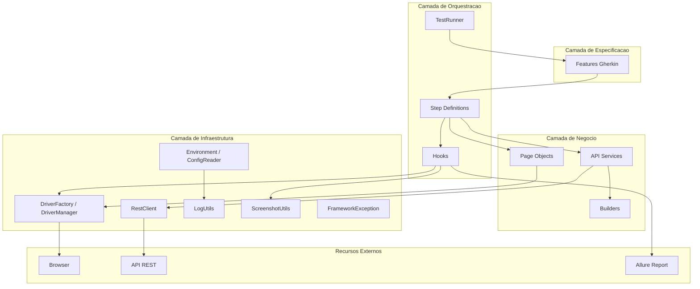
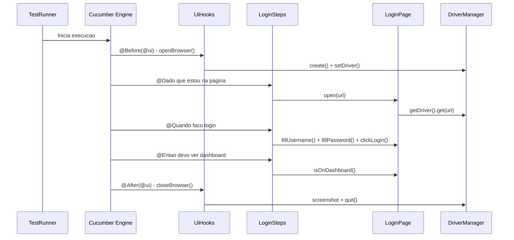
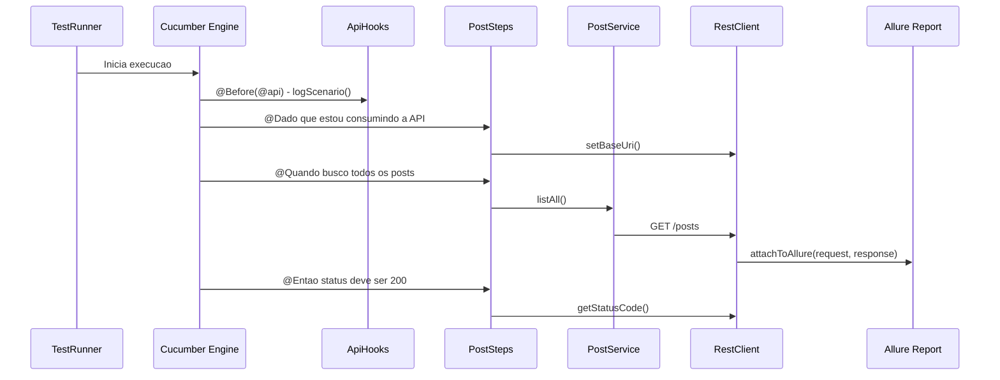
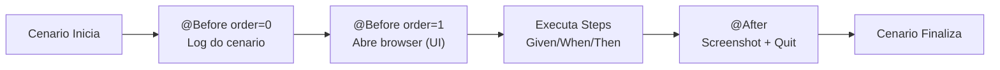
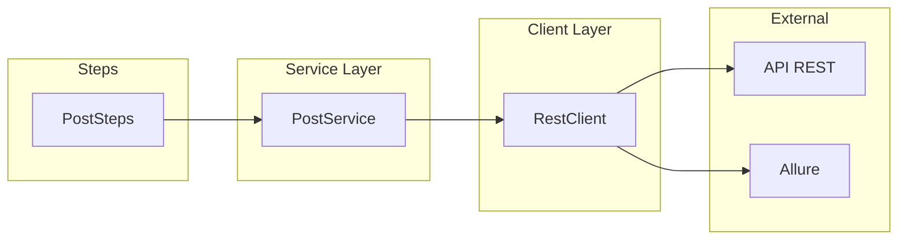
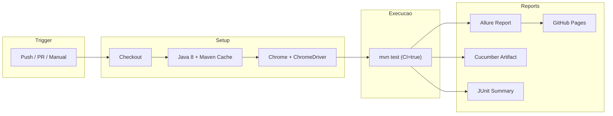
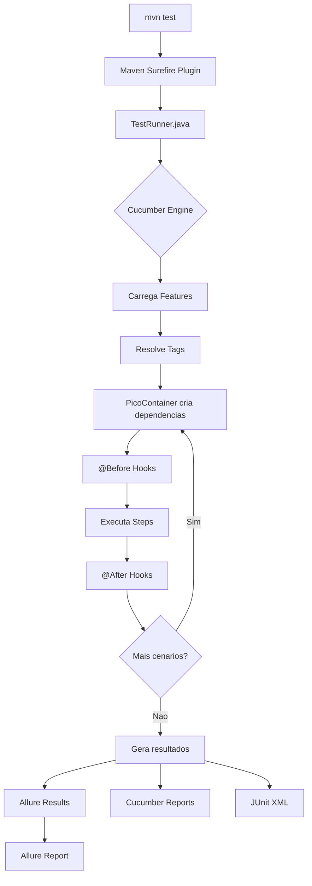
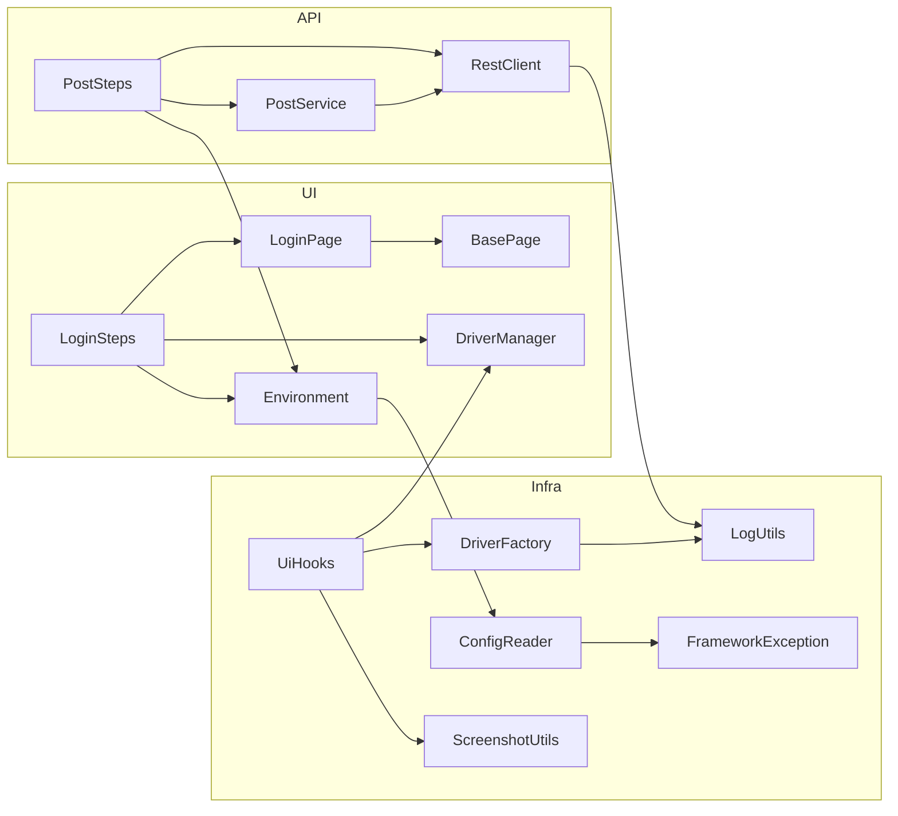
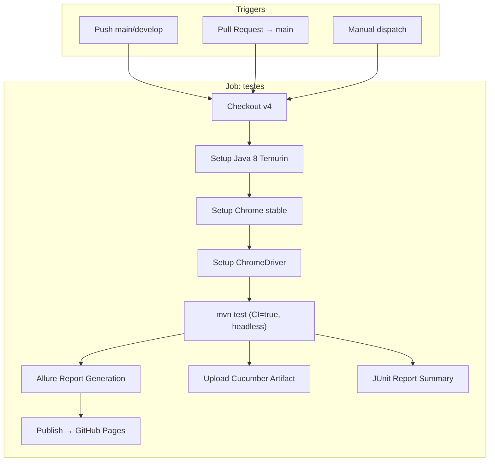

# Framework Profissional de Automacao de Testes: UI + API + CI/CD

> **Nota:** Este material acompanha o framework disponivel neste repositorio. Cada modulo corresponde a uma etapa da construcao do framework.

---

## Arquitetura Geral

```
┌─────────────────────────────────────────────────────────────────────────────────┐
│                           FRAMEWORK DE AUTOMACAO                                 │
├─────────────────────────────────────────────────────────────────────────────────┤
│                                                                                  │
│  ┌─────────────┐    ┌─────────────────┐    ┌──────────────────────────────┐     │
│  │  Features   │───▶│ Step Definitions│───▶│  Pages (UI) / Services (API) │     │
│  │  (Gherkin)  │    │  (Cucumber)     │    │                              │     │
│  └─────────────┘    └─────────────────┘    └──────────────────────────────┘     │
│                             │                          │                          │
│                             ▼                          ▼                          │
│                     ┌──────────────┐          ┌──────────────┐                   │
│                     │    Hooks     │          │   Drivers /   │                   │
│                     │ (Lifecycle)  │          │   Clients     │                   │
│                     └──────────────┘          └──────────────┘                   │
│                             │                          │                          │
│                             ▼                          ▼                          │
│  ┌──────────────────────────────────────────────────────────────────────┐       │
│  │                     CAMADA DE INFRAESTRUTURA                          │       │
│  │  Config │ Environment │ Logging │ Utils │ Exceptions │ Reports       │       │
│  └──────────────────────────────────────────────────────────────────────┘       │
│                                                                                  │
└─────────────────────────────────────────────────────────────────────────────────┘
```

---

## Indice

- [Modulo 1 - Fundamentos e Arquitetura](#modulo-1---fundamentos-e-arquitetura)
  - [1.1 O Papel da Automacao em Projetos Corporativos](#11-o-papel-da-automacao-em-projetos-corporativos)
  - [1.2 Como Pensar como Engenheiro de Automacao](#12-como-pensar-como-engenheiro-de-automacao)
  - [1.3 Arquitetura de Frameworks Profissionais](#13-arquitetura-de-frameworks-profissionais)
  - [1.4 Separacao de Responsabilidades e Camadas](#14-separacao-de-responsabilidades-e-camadas)
  - [1.5 Decisoes Arquiteturais e Justificativas](#15-decisoes-arquiteturais-e-justificativas)
- [Modulo 2 - Construindo o Framework Web](#modulo-2---construindo-o-framework-web)
  - [2.1 Maven e Gerenciamento de Dependencias](#21-maven-e-gerenciamento-de-dependencias)
  - [2.2 Selenium WebDriver e DriverFactory/DriverManager](#22-selenium-webdriver-e-driverfactorydrivermanager)
  - [2.3 Page Object Pattern com BasePage e Heranca](#23-page-object-pattern-com-basepage-e-heranca)
  - [2.4 Cucumber BDD em Portugues](#24-cucumber-bdd-em-portugues)
  - [2.5 Step Definitions e Integracao Feature-Step-Page](#25-step-definitions-e-integracao-feature-step-page)
  - [2.6 Hooks e Ciclo de Vida dos Testes](#26-hooks-e-ciclo-de-vida-dos-testes)
- [Modulo 3 - Automacao de APIs](#modulo-3---automacao-de-apis)
  - [3.1 REST Assured e o Padrao Client-Service](#31-rest-assured-e-o-padrao-client-service)
  - [3.2 RestClient Corporativo com Attachments Allure](#32-restclient-corporativo-com-attachments-allure)
  - [3.3 Services e Encapsulamento de Negocio](#33-services-e-encapsulamento-de-negocio)
  - [3.4 Models e Builders](#34-models-e-builders)
  - [3.5 Payloads Externalizados vs Dados Dinamicos](#35-payloads-externalizados-vs-dados-dinamicos)
  - [3.6 Validacao de Contratos com JSON Schema](#36-validacao-de-contratos-com-json-schema)
  - [3.7 TestData: Separacao entre Payload e Massa de Teste](#37-testdata-separacao-entre-payload-e-massa-de-teste)
- [Modulo 4 - Engenharia do Framework](#modulo-4---engenharia-do-framework)
  - [4.1 Injecao de Dependencia com PicoContainer](#41-injecao-de-dependencia-com-picocontainer)
  - [4.2 Configuracao por Ambiente](#42-configuracao-por-ambiente)
  - [4.3 Logging Corporativo](#43-logging-corporativo)
  - [4.4 Excecoes Customizadas](#44-excecoes-customizadas)
  - [4.5 Captura de Evidencias](#45-captura-de-evidencias)
  - [4.6 Relatorios Allure](#46-relatorios-allure)
  - [4.7 CI/CD com GitHub Actions](#47-cicd-com-github-actions)
  - [4.8 Estrategia de Tags](#48-estrategia-de-tags)
  - [4.9 Nomenclatura e Padroes de Codigo](#49-nomenclatura-e-padroes-de-codigo)
  - [4.10 Como Adicionar Nova Automacao UI](#410-como-adicionar-nova-automacao-ui)
  - [4.11 Como Adicionar Nova Automacao API](#411-como-adicionar-nova-automacao-api)
  - [4.12 Checklist de Novo Projeto](#412-checklist-de-novo-projeto)
  - [4.13 Checklist de Code Review](#413-checklist-de-code-review)
  - [4.14 Troubleshooting](#414-troubleshooting)
  - [4.15 FAQ](#415-faq)

---

## Modulo 1 - Fundamentos e Arquitetura

### 1.1 O Papel da Automacao em Projetos Corporativos

**Conceito**

Automacao de testes nao e simplesmente "fazer o computador clicar". E uma disciplina de engenharia que garante a qualidade continua do software enquanto as equipes entregam valor em ciclos cada vez mais curtos.

**Problema**

Em projetos corporativos, testes manuais se tornam gargalos quando:
- Releases acontecem semanalmente ou diariamente
- Regressoes precisam cobrir centenas de cenarios
- Multiplos ambientes (dev, hml, prod) precisam de validacao
- Compliance exige evidencias rastreáveis de cada execucao

**Solucao**

Um framework de automacao profissional atua como rede de seguranca:
- Executa regressao completa em minutos (nao dias)
- Gera evidencias automaticas (screenshots, logs, relatorios)
- Integra-se ao pipeline CI/CD para feedback rapido
- Valida tanto interface grafica quanto contratos de API

**Boas Praticas**

| Pratica | Motivo |
|---------|--------|
| Automatizar cenarios estaveis | Evita manutenção excessiva |
| Separar testes por camada (UI/API) | Piramide de testes |
| Manter testes independentes | Execucao paralela e isolamento |
| Gerar relatorios ricos | Comunicacao com stakeholders |
| Integrar ao CI/CD | Feedback em minutos |

---

### 1.2 Como Pensar como Engenheiro de Automacao

**Conceito**

O engenheiro de automacao nao e um "testador que programa". E um desenvolvedor de software especializado em qualidade. Pensa em:
- Manutenibilidade do codigo de teste
- Reutilizacao de componentes
- Resiliencia contra mudancas de UI/API
- Performance de execucao

**Problema**

Scripts de teste frageis que quebram com qualquer mudanca na aplicacao, gerando mais trabalho de manutencao do que valor.

**Solucao**

Aplicar principios de engenharia de software:
- **DRY** (Don't Repeat Yourself): abstrair acoes repetidas
- **SRP** (Single Responsibility): cada classe tem uma funcao
- **Composicao sobre heranca**: preferir injecao de dependencia
- **Fail Fast**: erros claros com mensagens descritivas

**Mentalidade Profissional**

```
Testador Manual          →  Engenheiro de Automacao
──────────────────────────────────────────────────
Executa roteiros         →  Projeta frameworks
Encontra bugs            →  Previne regressoes
Documenta defeitos       →  Gera evidencias automaticas
Trabalha isolado         →  Integra ao pipeline
Repete trabalho          →  Automatiza e reutiliza
```

---

### 1.3 Arquitetura de Frameworks Profissionais

**Conceito**

A arquitetura define como os componentes se comunicam. Um framework bem arquitetado permite que novos testes sejam adicionados sem alterar a infraestrutura existente.

**Diagrama de Arquitetura**



**Fluxo de Execucao UI**



**Fluxo de Execucao API**



---

### 1.4 Separacao de Responsabilidades e Camadas

**Conceito**

Cada camada do framework tem uma responsabilidade unica e bem definida. Isso permite que mudancas em uma camada nao impactem as demais.

**Estrutura de Diretorios**

```
src/test/java/
├── runners/              → Orquestracao (TestRunner.java)
├── steps/                → Traducao Gherkin → Acao
│   ├── ui/               → Steps de interface grafica
│   └── api/              → Steps de API
├── pages/                → Page Objects (UI)
│   ├── base/             → Classe abstrata compartilhada
│   └── login/            → Page Object especifico
├── api/                  → Automacao de API
│   ├── clients/          → Cliente HTTP generico
│   ├── services/         → Logica de negocio por recurso
│   ├── models/           → POJOs de request/response
│   └── builders/         → Geracao de dados de teste
├── hooks/                → Ciclo de vida (Before/After)
├── config/               → Configuracao e ambiente
├── drivers/              → Gerenciamento de WebDriver
├── utils/                → Utilitarios transversais
└── exceptions/           → Excecoes customizadas

src/test/resources/
├── features/             → Especificacoes BDD
│   ├── ui/               → Cenarios de interface
│   └── api/              → Cenarios de API
├── environments/         → Properties por ambiente
├── payloads/             → JSONs de request
├── schemas/              → JSON Schemas para validacao
├── testdata/             → Massa de dados de teste
└── logback.xml           → Configuracao de logging
```

**Responsabilidades por Camada**

| Camada | Responsabilidade | Exemplo |
|--------|-----------------|---------|
| Features | Descrever comportamento em linguagem natural | `login.feature` |
| Steps | Traduzir Gherkin para codigo executavel | `LoginSteps.java` |
| Pages | Encapsular interacoes com elementos UI | `LoginPage.java` |
| Services | Encapsular logica de chamadas API | `PostService.java` |
| Hooks | Gerenciar ciclo de vida (setup/teardown) | `UiHooks.java` |
| Config | Fornecer configuracoes por ambiente | `Environment.java` |
| Drivers | Criar e gerenciar instancias WebDriver | `DriverFactory.java` |
| Utils | Funcoes transversais reutilizaveis | `LogUtils.java` |

---

### 1.5 Decisoes Arquiteturais e Justificativas

| Decisao | Alternativas | Justificativa |
|---------|-------------|---------------|
| Java 8 | Java 11/17 | Compatibilidade com Selenium 3.x e ambientes corporativos legados |
| Selenium 3.141.59 | Selenium 4 | Ultima versao estavel para Java 8 sem Selenium Manager |
| Cucumber 7.18 | TestNG + DataProvider | BDD facilita comunicacao com PO/negocio; features em portugues |
| JUnit 4 | JUnit 5 | Integracao nativa com Cucumber 7.x sem Jupiter |
| REST Assured 4.5.1 | HttpClient / OkHttp | API fluente, validacao declarativa, suporte a JSON Schema |
| PicoContainer | Spring / Guice | Zero configuracao; instancia por cenario (isolamento) |
| Allure 2.24 | ExtentReports | Integra com Cucumber nativamente; historico entre runs; CI-friendly |
| SLF4J + Logback | Log4j / System.out | Padrao corporativo; controle fino de niveis e destinos |
| Maven | Gradle | Dominante em projetos Java corporativos; integracao com Surefire |
| GitHub Actions | Jenkins / GitLab CI | Nativo no GitHub; YAML declarativo; marketplace de actions |

---

## Modulo 2 - Construindo o Framework Web

### 2.1 Maven e Gerenciamento de Dependencias

**Conceito**

Maven e o gerenciador de build e dependencias padrao em projetos Java corporativos. Define a estrutura do projeto, gerencia bibliotecas e executa o ciclo de vida de testes.

**Problema**

Sem um gerenciador de dependencias:
- JARs precisam ser baixados e versionados manualmente
- Conflitos entre versoes sao dificeis de detectar
- Build nao e reproduzivel entre maquinas

**Implementacao**

Arquivo `pom.xml` (trecho de dependencias principais):

```xml
<properties>
    <java.version>8</java.version>
    <selenium.version>3.141.59</selenium.version>
    <cucumber.version>7.18.0</cucumber.version>
    <junit.version>4.13.2</junit.version>
    <rest.assured.version>4.5.1</rest.assured.version>
    <allure.version>2.24.0</allure.version>
</properties>

<dependencies>
    <!-- Selenium WebDriver -->
    <dependency>
        <groupId>org.seleniumhq.selenium</groupId>
        <artifactId>selenium-java</artifactId>
        <version>${selenium.version}</version>
    </dependency>

    <!-- Cucumber JVM + JUnit -->
    <dependency>
        <groupId>io.cucumber</groupId>
        <artifactId>cucumber-java</artifactId>
        <version>${cucumber.version}</version>
    </dependency>
    <dependency>
        <groupId>io.cucumber</groupId>
        <artifactId>cucumber-junit</artifactId>
        <version>${cucumber.version}</version>
        <scope>test</scope>
    </dependency>

    <!-- REST Assured -->
    <dependency>
        <groupId>io.rest-assured</groupId>
        <artifactId>rest-assured</artifactId>
        <version>${rest.assured.version}</version>
        <scope>test</scope>
    </dependency>

    <!-- PicoContainer (DI) -->
    <dependency>
        <groupId>io.cucumber</groupId>
        <artifactId>cucumber-picocontainer</artifactId>
        <version>${cucumber.version}</version>
        <scope>test</scope>
    </dependency>

    <!-- Allure + Cucumber Integration -->
    <dependency>
        <groupId>io.qameta.allure</groupId>
        <artifactId>allure-cucumber7-jvm</artifactId>
        <version>${allure.version}</version>
        <scope>test</scope>
    </dependency>

    <!-- Logging: SLF4J + Logback -->
    <dependency>
        <groupId>org.slf4j</groupId>
        <artifactId>slf4j-api</artifactId>
        <version>1.7.36</version>
    </dependency>
    <dependency>
        <groupId>ch.qos.logback</groupId>
        <artifactId>logback-classic</artifactId>
        <version>1.2.12</version>
    </dependency>

    <!-- JavaFaker -->
    <dependency>
        <groupId>com.github.javafaker</groupId>
        <artifactId>javafaker</artifactId>
        <version>1.0.2</version>
        <scope>test</scope>
    </dependency>
</dependencies>
```

**Comandos Essenciais**

```bash
# Executar todos os testes
mvn test

# Filtrar por tag
mvn test -Dcucumber.filter.tags="@smoke"
mvn test -Dcucumber.filter.tags="@api"
mvn test -Dcucumber.filter.tags="@ui"

# Selecionar ambiente
mvn test -Denvironment=hml

# Gerar relatorio Allure
mvn allure:serve

# Limpar e executar
mvn clean test
```

**Boas Praticas**

- Versoes declaradas em `<properties>` para atualizacao centralizada
- Scope `test` para dependencias que nao vao para producao
- Plugin `maven-surefire-plugin` configurado para apontar ao `TestRunner`
- AspectJ Weaver como javaagent para integracao Allure

---

### 2.2 Selenium WebDriver e DriverFactory/DriverManager

**Conceito**

O WebDriver precisa ser criado, configurado e destruido de forma controlada. Separamos essa responsabilidade em duas classes:
- **DriverFactory**: cria instancias configuradas (Factory Pattern)
- **DriverManager**: armazena e gerencia a instancia ativa (ThreadLocal para paralelismo)

**Problema**

Sem essa separacao:
- Testes ficam acoplados a um browser especifico
- Execucao paralela causa conflito de instancias
- Configuracao headless/CI fica espalhada pelo codigo

**Implementacao**

`drivers/DriverFactory.java`:

```java
public class DriverFactory {

    private static final boolean IN_CI =
            System.getenv("CI") != null || System.getenv("JENKINS_URL") != null;

    public WebDriver create(String browser) {
        LogUtils.info("Criando driver: " + browser + (IN_CI ? " [headless]" : " [visual]"));
        switch (browser.toLowerCase()) {
            case "chrome": return createChrome();
            default: throw new IllegalArgumentException("Browser nao suportado: " + browser);
        }
    }

    private WebDriver createChrome() {
        if (!IN_CI) {
            String path = System.getenv("CHROME_DRIVER_PATH") != null
                    ? System.getenv("CHROME_DRIVER_PATH")
                    : "C:\\chromedriver\\chromedriver-win64\\chromedriver.exe";
            System.setProperty("webdriver.chrome.driver", path);
        }

        ChromeOptions options = new ChromeOptions();
        if (IN_CI) {
            options.addArguments("--headless=new", "--no-sandbox",
                    "--disable-dev-shm-usage", "--window-size=1920,1080");
        } else {
            options.addArguments("--start-maximized");
        }
        options.addArguments("--disable-notifications", "--remote-allow-origins=*");
        return new ChromeDriver(options);
    }
}
```

`drivers/DriverManager.java`:

```java
public class DriverManager {

    private static final ThreadLocal<WebDriver> driver = new ThreadLocal<>();

    private DriverManager() {}

    public static WebDriver getDriver() {
        return driver.get();
    }

    public static void setDriver(WebDriver webDriver) {
        driver.set(webDriver);
    }

    public static void quit() {
        WebDriver d = driver.get();
        if (d != null) {
            d.quit();
            driver.remove();
        }
    }
}
```

**Decisoes de Design**

| Decisao | Justificativa |
|---------|---------------|
| `ThreadLocal` | Cada thread tem sua instancia isolada — preparado para paralelo |
| Detecao de CI via env var | Headless automatico em CI, visual em dev local |
| Construtor privado em DriverManager | Classe utilitaria, impede instanciacao |
| Switch para browsers | Extensivel — basta adicionar `case "firefox"` |

**Boas Praticas**

- Nunca instanciar WebDriver diretamente nos testes
- Sempre encerrar via `DriverManager.quit()` no Hook `@After`
- Usar `ThreadLocal.remove()` para evitar memory leaks
- ChromeDriver path configuravel via variavel de ambiente

---

### 2.3 Page Object Pattern com BasePage e Heranca

**Conceito**

O Page Object Pattern encapsula os elementos e acoes de cada pagina em uma classe dedicada. A `BasePage` fornece metodos reutilizaveis que todas as pages herdam.

**Problema**

Sem Page Objects:
- Locators ficam espalhados nos Steps (dificil manutencao)
- Mudanca em um elemento exige alteracao em N arquivos
- Codigo de interacao duplicado em cada Step

**Implementacao**

`pages/base/BasePage.java`:

```java
public abstract class BasePage {

    protected final WebDriver driver;
    protected final WebDriverWait wait;

    protected BasePage(WebDriver driver) {
        this.driver = driver;
        int timeout = new Environment().getInt("timeout.explicit", 10);
        this.wait = new WebDriverWait(driver, timeout);
    }

    protected void navigate(String url) {
        LogUtils.info("Navegando: " + url);
        driver.get(url);
    }

    protected void type(By locator, String text) {
        WebElement element = wait.until(ExpectedConditions.visibilityOfElementLocated(locator));
        element.clear();
        element.sendKeys(text);
    }

    protected void click(By locator) {
        wait.until(ExpectedConditions.elementToBeClickable(locator)).click();
    }

    protected String getText(By locator) {
        return wait.until(ExpectedConditions.visibilityOfElementLocated(locator)).getText();
    }

    protected boolean urlContains(String fragment) {
        try {
            return wait.until(ExpectedConditions.urlContains(fragment));
        } catch (TimeoutException e) {
            LogUtils.warn("Timeout aguardando URL conter: " + fragment);
            return false;
        }
    }
}
```

`pages/login/LoginPage.java`:

```java
public class LoginPage extends BasePage {

    private final By usernameField = By.name("username");
    private final By passwordField = By.name("password");
    private final By loginButton   = By.cssSelector("button[type='submit']");
    private final By errorMessage  = By.cssSelector(".oxd-alert-content-text");

    public LoginPage(WebDriver driver) {
        super(driver);
    }

    public void open(String url) {
        navigate(url);
    }

    public void fillUsername(String username) {
        type(usernameField, username);
    }

    public void fillPassword(String password) {
        type(passwordField, password);
    }

    public void clickLogin() {
        click(loginButton);
    }

    public String getErrorMessage() {
        return getText(errorMessage);
    }

    public boolean isOnDashboard() {
        return urlContains("/dashboard");
    }
}
```

**Principios do Page Object**

1. **Locators privados**: nenhum Step conhece selectores CSS/XPath
2. **Metodos semanticos**: `fillUsername()` em vez de `type(By.name("username"), text)`
3. **Retorno de dados, nao assercoes**: a Page retorna valores, o Step faz assert
4. **Heranca da BasePage**: waits e acoes comuns nao sao duplicadas

**Boas Praticas**

- Um Page Object por pagina/componente significativo
- Locators como `By` (nao como Strings) para type-safety
- `WebDriverWait` explicito em vez de `Thread.sleep()`
- Timeout configuravel via Environment (nao hardcoded)
- Log de navegacao para rastreabilidade

---

### 2.4 Cucumber BDD em Portugues

**Conceito**

Cucumber permite escrever testes em linguagem natural usando Gherkin. Com `# language: pt`, escrevemos cenarios em portugues — facilitando a participacao de POs e stakeholders.

**Problema**

Testes puramente tecnicos sao incompreensiveis para o negocio. Sem BDD:
- Testador escreve, so testador entende
- Nao ha documentacao viva do comportamento
- Desalinhamento entre requisito e teste

**Implementacao**

`features/ui/login.feature`:

```gherkin
# language: pt
@ui
Funcionalidade: Login no sistema
  Como um usuario registrado
  Quero fazer login na aplicacao
  Para acessar as funcionalidades do sistema

  Contexto:
    Dado que estou na pagina de login

  @smoke
  Cenario: Login com credenciais validas
    Quando faco login como administrador
    Entao devo ser redirecionado para a pagina inicial

  Cenario: Login com senha incorreta
    Quando faco login com usuario "admin" e senha incorreta
    Entao devo ver a mensagem de erro "Invalid credentials"

  Esquema do Cenario: Login com credenciais invalidas
    Quando faco login com usuario "<usuario>" e senha "<senha>"
    Entao devo ver a mensagem de erro "<mensagem>"

    Exemplos:
      | usuario       | senha      | mensagem            |
      | usuarioErrado | admin123   | Invalid credentials |
      | wronguser     | wrongpass  | Invalid credentials |
```

`features/api/posts.feature`:

```gherkin
# language: pt
@api
Funcionalidade: API de Posts
  Como consumidor da API REST
  Quero validar os endpoints de posts
  Para garantir que a API responde corretamente

  Contexto:
    Dado que estou consumindo a API de posts

  @smoke
  Cenario: Listar todos os posts
    Quando busco todos os posts
    Entao o status code da resposta deve ser 200
    E o Content-Type da resposta deve conter "application/json"
    E a resposta deve conter 100 posts

  Cenario: Criar um novo post
    Dado que tenho os dados de um novo post
    Quando envio o novo post
    Entao o status code da resposta deve ser 201
    E o campo "title" deve ter valor de texto "Post de Teste Automatizado"

  @smoke
  Cenario: Validar contrato (schema) do post
    Quando busco o post de ID 1
    Entao o status code da resposta deve ser 200
    E a resposta deve estar de acordo com o schema "post-schema.json"
```

**Palavras-chave em Portugues**

| Ingles | Portugues |
|--------|-----------|
| Feature | Funcionalidade |
| Scenario | Cenario |
| Scenario Outline | Esquema do Cenario |
| Given | Dado |
| When | Quando |
| Then | Entao |
| And | E |
| But | Mas |
| Background | Contexto |
| Examples | Exemplos |

**Boas Praticas**

- Sempre declarar `# language: pt` na primeira linha
- Usar `Contexto` para pre-condicoes comuns (evita repeticao)
- Tags para organizacao e filtragem (`@ui`, `@api`, `@smoke`)
- Steps declarativos (o que), nao imperativos (como)
- Um cenario = um comportamento especifico

---

### 2.5 Step Definitions e Integracao Feature-Step-Page

**Conceito**

Steps sao a cola entre a linguagem natural (Feature) e o codigo executavel (Page/Service). Cada frase Gherkin mapeia para um metodo Java anotado.

**Problema**

Sem separacao clara:
- Steps fazem tudo (localizam elementos, interagem, validam)
- Mudanca na UI obriga mudanca nos Steps
- Reutilizacao entre cenarios e impossivel

**Implementacao**

`steps/ui/LoginSteps.java`:

```java
public class LoginSteps {

    private final Environment env;
    private LoginPage loginPage;

    // Injecao via PicoContainer
    public LoginSteps(Environment env) {
        this.env = env;
    }

    @Dado("que estou na pagina de login")
    public void openLogin() {
        loginPage = new LoginPage(DriverManager.getDriver());
        loginPage.open(env.baseUrl);
    }

    @Quando("faco login como administrador")
    public void loginAsAdmin() {
        loginPage.fillUsername(env.get("usuario.admin"));
        loginPage.fillPassword(env.get("senha.admin"));
        loginPage.clickLogin();
    }

    @Quando("faco login com usuario {string} e senha {string}")
    public void loginWith(String user, String pass) {
        loginPage.fillUsername(user);
        loginPage.fillPassword(pass);
        loginPage.clickLogin();
    }

    @Quando("faco login com usuario {string} e senha incorreta")
    public void loginWithWrongPassword(String user) {
        loginPage.fillUsername(user);
        loginPage.fillPassword(env.get("senha.invalida"));
        loginPage.clickLogin();
    }

    @Entao("devo ser redirecionado para a pagina inicial")
    public void shouldBeOnDashboard() {
        Assert.assertTrue("Nao redirecionou para o dashboard", loginPage.isOnDashboard());
    }

    @Entao("devo ver a mensagem de erro {string}")
    public void shouldSeeError(String expected) {
        Assert.assertEquals("Mensagem incorreta", expected, loginPage.getErrorMessage());
    }
}
```

**Fluxo de Integracao**

```
Feature (Gherkin)          Step Definition           Page Object
─────────────────          ───────────────           ───────────
"Dado que estou na    →    openLogin()          →    LoginPage.open(url)
 pagina de login"

"Quando faco login    →    loginAsAdmin()       →    LoginPage.fillUsername()
 como administrador"                                  LoginPage.fillPassword()
                                                      LoginPage.clickLogin()

"Entao devo ser       →    shouldBeOnDashboard()→    LoginPage.isOnDashboard()
 redirecionado..."
```

**Boas Praticas**

- Steps devem ser **finos**: delegam para Pages/Services
- Assercoes (Assert) ficam **nos Steps**, nunca nas Pages
- `{string}` e `{int}` para parametrizacao do Cucumber
- Um arquivo de Steps por dominio/funcionalidade
- Credenciais lidas do Environment, nunca hardcoded

---

### 2.6 Hooks e Ciclo de Vida dos Testes

**Conceito**

Hooks sao metodos executados automaticamente pelo Cucumber antes (`@Before`) e depois (`@After`) de cada cenario. Gerenciam setup e teardown.

**Problema**

Sem hooks:
- Cada Step precisa abrir/fechar browser
- Screenshots precisam ser capturadas manualmente
- Limpeza de recursos e esquecida (browser aberto, conexoes pendentes)

**Implementacao**

`hooks/UiHooks.java`:

```java
public class UiHooks {

    private final Environment env;

    public UiHooks() {
        this.env = new Environment();
    }

    @Before(value = "@ui", order = 0)
    public void logScenario(Scenario scenario) {
        LogUtils.info("=== [UI] " + scenario.getName() + " ===");
    }

    @Before(value = "@ui", order = 1)
    public void openBrowser() {
        if (DriverManager.getDriver() == null) {
            String browser = env.get("browser", "chrome");
            int implicitWait = env.getInt("timeout.implicit", 10);
            int pageLoad = env.getInt("timeout.pageLoad", 30);

            DriverFactory factory = new DriverFactory();
            WebDriver driver = factory.create(browser);
            driver.manage().timeouts().implicitlyWait(implicitWait, TimeUnit.SECONDS);
            driver.manage().timeouts().pageLoadTimeout(pageLoad, TimeUnit.SECONDS);
            DriverManager.setDriver(driver);
        }
    }

    @After(value = "@ui")
    public void closeBrowser(Scenario scenario) {
        WebDriver driver = DriverManager.getDriver();
        if (driver == null) return;

        String mode = env.get("screenshot.mode", "failure_only");
        boolean shouldCapture = "always".equals(mode) || scenario.isFailed();

        if (shouldCapture) {
            byte[] screenshot = ScreenshotUtils.capture(driver);
            if (screenshot.length > 0) {
                String status = scenario.isFailed() ? "FALHA" : "SUCESSO";
                scenario.attach(screenshot, "image/png", status + " - " + scenario.getName());
            }
        }

        DriverManager.quit();
        LogUtils.info("=== Navegador encerrado ===");
    }
}
```

`hooks/ApiHooks.java`:

```java
public class ApiHooks {

    @Before(value = "@api", order = 0)
    public void logScenario(Scenario scenario) {
        LogUtils.info("=== [API] " + scenario.getName() + " ===");
    }
}
```

**Ciclo de Vida Completo**



**Parametro `order`**

- `@Before`: menor order executa primeiro (0 antes de 1)
- `@After`: menor order executa primeiro tambem
- Usar para garantir sequencia (log → browser → steps → screenshot → quit)

**Parametro `value`**

- `@ui`: hook so executa em cenarios com tag `@ui`
- `@api`: hook so executa em cenarios com tag `@api`
- Sem value: executa em todos os cenarios

**Boas Praticas**

- Separar hooks por contexto (UiHooks, ApiHooks)
- Screenshot condicional (`failure_only` em dev, `always` em hml)
- Sempre fechar browser no `@After` — mesmo em caso de excecao
- Log de inicio/fim para rastreabilidade

---

## Modulo 3 - Automacao de APIs

### 3.1 REST Assured e o Padrao Client-Service

**Conceito**

REST Assured fornece uma DSL fluente para testes de API HTTP. No framework, adotamos o padrao **Client-Service** para separar responsabilidades:
- **RestClient**: infraestrutura HTTP generica (qualquer API)
- **Service**: logica de negocio especifica (PostService, UserService, etc.)

**Problema**

Sem essa separacao:
- Codigo REST Assured duplicado em cada Step
- Mudanca na autenticacao exige alterar todos os testes
- Impossivel reutilizar logica entre cenarios diferentes

**Solucao: Padrao Client-Service**



**Responsabilidades**

| Camada | Faz | Nao Faz |
|--------|-----|---------|
| Steps | Orquestra cenario, faz assercoes | Monta requests, conhece endpoints |
| Service | Conhece endpoints e payloads do recurso | Faz HTTP direto, valida respostas |
| Client | Executa HTTP, anexa ao Allure | Conhece regras de negocio |

---

### 3.2 RestClient Corporativo com Attachments Allure

**Conceito**

O `RestClient` e o coracao da camada de API. Encapsula toda comunicacao HTTP e automaticamente registra request/response no Allure.

**Implementacao**

```java
public class RestClient {

    private Response response;
    private RequestSpecification request;
    private String baseUri;
    private String lastBody;

    public void setBaseUri(String baseUri) {
        this.baseUri = baseUri;
        this.request = given()
                .baseUri(baseUri)
                .contentType(ContentType.JSON)
                .accept(ContentType.JSON);
    }

    public void addHeader(String key, String value) {
        request = request.header(key, value);
    }

    public void setBody(String body) {
        this.lastBody = body;
        request = request.body(body);
    }

    public void get(String endpoint) { execute("GET", endpoint); }
    public void post(String endpoint) { execute("POST", endpoint); }
    public void put(String endpoint) { execute("PUT", endpoint); }
    public void delete(String endpoint) { execute("DELETE", endpoint); }

    public int getStatusCode() { return response.getStatusCode(); }
    public String getContentType() { return response.getContentType(); }
    public Response getResponse() { return response; }

    private void execute(String method, String endpoint) {
        LogUtils.info(method + " " + baseUri + endpoint);
        switch (method) {
            case "GET":    response = request.when().get(endpoint).then().extract().response(); break;
            case "POST":   response = request.when().post(endpoint).then().extract().response(); break;
            case "PUT":    response = request.when().put(endpoint).then().extract().response(); break;
            case "DELETE": response = request.when().delete(endpoint).then().extract().response(); break;
        }
        attachToAllure(method, endpoint);
    }

    private void attachToAllure(String method, String endpoint) {
        try {
            String req = method + " " + baseUri + endpoint;
            if (lastBody != null) req += "\n\nBody:\n" + lastBody;
            Allure.addAttachment("Request", "text/plain", req);
            Allure.addAttachment("Response [" + response.getStatusCode() + "]",
                    "application/json", response.getBody().asPrettyString());
        } catch (Exception e) {
            LogUtils.debug("Allure attach falhou: " + e.getMessage());
        }
    }
}
```

**Caracteristicas Corporativas**

| Feature | Beneficio |
|---------|-----------|
| `baseUri` configuravel | Muda ambiente sem alterar testes |
| ContentType padrao JSON | Nao precisa repetir em cada chamada |
| Attachment automatico | Toda chamada fica documentada no Allure |
| Logging automatico | Rastreabilidade em `target/test-execution.log` |
| Instancia por cenario | PicoContainer cria nova a cada cenario (isolamento) |

**Boas Praticas**

- Nunca chamar `given()` diretamente nos Steps
- Headers de autenticacao adicionados via `addHeader()` no Hook ou Setup
- Response armazenada internamente — Steps apenas consultam
- Try-catch no Allure attachment para nao quebrar o teste por erro de report

---

### 3.3 Services e Encapsulamento de Negocio

**Conceito**

O Service encapsula a logica de negocio de um recurso da API. Conhece os endpoints, prepara payloads e delega a execucao para o RestClient.

**Problema**

Sem Services:
- Steps conhecem URLs, metodos HTTP e payloads
- Mudanca de endpoint exige alterar multiplos Steps
- Logica duplicada entre cenarios do mesmo recurso

**Implementacao**

`api/services/PostService.java`:

```java
public class PostService {

    private final RestClient client;

    public PostService(RestClient client) {
        this.client = client;
    }

    public void listAll() {
        client.get("/posts");
    }

    public void getById(int id) {
        client.get("/posts/" + id);
    }

    public void getByUser(int userId) {
        client.get("/posts?userId=" + userId);
    }

    public void create() {
        String body = JsonUtils.load("payloads/posts/create-post.json");
        client.setBody(body);
        client.post("/posts");
    }

    public void update(int id) {
        String body = JsonUtils.load("payloads/posts/update-post.json")
                .replace("\"id\":1", "\"id\":" + id);
        client.setBody(body);
        client.put("/posts/" + id);
    }

    public void delete(int id) {
        client.delete("/posts/" + id);
    }
}
```

**Padrao de Criacao de Novos Services**

Para cada recurso da API (users, comments, albums), crie um Service seguindo:

```java
public class [Recurso]Service {

    private final RestClient client;

    public [Recurso]Service(RestClient client) {
        this.client = client;
    }

    // Metodos CRUD mapeando os endpoints do recurso
    public void listAll() { client.get("/[recurso]"); }
    public void getById(int id) { client.get("/[recurso]/" + id); }
    public void create() { /* carrega payload + POST */ }
    public void update(int id) { /* carrega payload + PUT */ }
    public void delete(int id) { client.delete("/[recurso]/" + id); }
}
```

**Boas Praticas**

- Um Service por recurso REST
- Recebe RestClient via construtor (injecao PicoContainer)
- Payloads lidos via `JsonUtils.load()` (externalizados)
- Nao faz assercoes — apenas executa operacoes

---

### 3.4 Models e Builders

**Conceito**

- **Model (POJO)**: representa a estrutura de dados de um request/response
- **Builder**: constroi instancias do Model com dados validos (padrao Builder + Faker)

**Problema**

Dados hardcoded nos testes:
- Conflito quando mesmos dados sao usados em paralelo
- Massa de teste esgota (IDs unicos, emails duplicados)
- Cenarios nao sao independentes

**Implementacao**

`api/models/PostRequest.java`:

```java
public class PostRequest {

    private String title;
    private String body;
    private int userId;

    public PostRequest() {}

    public PostRequest(String title, String body, int userId) {
        this.title = title;
        this.body = body;
        this.userId = userId;
    }

    // Getters e Setters
    public String getTitle() { return title; }
    public void setTitle(String title) { this.title = title; }
    public String getBody() { return body; }
    public void setBody(String body) { this.body = body; }
    public int getUserId() { return userId; }
    public void setUserId(int userId) { this.userId = userId; }

    public String toJson() {
        return "{\"title\":\"" + title + "\",\"body\":\"" + body + "\",\"userId\":" + userId + "}";
    }
}
```

`api/builders/PostBuilder.java`:

```java
public class PostBuilder {

    private static final Faker faker = new Faker(new Locale("pt-BR"));

    private String title;
    private String body;
    private int userId;

    private PostBuilder() {
        // Dados aleatorios por padrao (validos)
        this.title = faker.lorem().sentence(5);
        this.body = faker.lorem().paragraph(2);
        this.userId = 1;
    }

    public static PostBuilder valid() {
        return new PostBuilder();
    }

    public PostBuilder withTitle(String title) {
        this.title = title;
        return this;
    }

    public PostBuilder withBody(String body) {
        this.body = body;
        return this;
    }

    public PostBuilder withUserId(int userId) {
        this.userId = userId;
        return this;
    }

    public PostRequest build() {
        return new PostRequest(title, body, userId);
    }
}
```

**Uso nos Testes**

```java
// Post valido com dados aleatorios
PostRequest post = PostBuilder.valid().build();

// Post customizado
PostRequest post = PostBuilder.valid()
    .withTitle("Titulo Especifico")
    .withUserId(5)
    .build();
```

**Boas Praticas**

- Faker com locale `pt-BR` para dados em portugues
- `valid()` retorna instancia com dados validos por padrao
- Metodos `with*()` para customizacao fluente
- Metodo `toJson()` no Model para serializacao simples
- Um Builder por Model

---

### 3.5 Payloads Externalizados vs Dados Dinamicos

**Conceito**

O framework suporta duas estrategias para dados de teste:
1. **Payloads externalizados** (JSONs em `resources/payloads/`): para cenarios com dados fixos e previsíveis
2. **Dados dinamicos** (Builder + Faker): para cenarios que precisam de dados unicos a cada execucao

**Quando Usar Cada Um**

| Estrategia | Quando | Exemplo |
|-----------|--------|---------|
| Payload externalizado | Dados fixos, validacao exata de campos | `create-post.json` com titulo especifico |
| Builder + Faker | Dados aleatorios, execucao paralela | Posts com titulos unicos por run |
| Combinacao | Payload com placeholders substituidos | Template JSON + dados do Builder |

**Payloads em `resources/payloads/posts/`**

`create-post.json`:
```json
{
  "title": "Post de Teste Automatizado",
  "body": "Corpo do post criado via automacao",
  "userId": 1
}
```

`update-post.json`:
```json
{
  "id": 1,
  "title": "Titulo Atualizado",
  "body": "Corpo atualizado via automacao",
  "userId": 1
}
```

**Carregamento via JsonUtils**

```java
public class JsonUtils {

    public static String load(String path) {
        InputStream input = JsonUtils.class.getClassLoader().getResourceAsStream(path);
        if (input == null) {
            throw new FrameworkException("Arquivo JSON nao encontrado: " + path);
        }
        try (Scanner scanner = new Scanner(input, "UTF-8")) {
            return scanner.useDelimiter("\\A").next();
        }
    }
}
```

**Boas Praticas**

- Payloads organizados por recurso: `payloads/posts/`, `payloads/users/`
- JsonUtils lanca `FrameworkException` se arquivo nao existe (fail fast)
- Para dados sensiveis em CI, usar variaveis de ambiente
- Faker para campos que nao sao validados diretamente no `@Entao`

---

### 3.6 Validacao de Contratos com JSON Schema

**Conceito**

Validacao de contrato garante que a API retorna a estrutura esperada (campos, tipos, obrigatoriedade). Usa JSON Schema para definir o contrato e REST Assured para validar.

**Problema**

Testes que validam apenas status code nao detectam:
- Campos removidos na resposta
- Tipos alterados (string → number)
- Campos obrigatorios que passaram a ser null

**Implementacao**

`schemas/post-schema.json`:
```json
{
  "$schema": "http://json-schema.org/draft-07/schema#",
  "type": "object",
  "required": ["userId", "id", "title", "body"],
  "properties": {
    "userId": { "type": "integer" },
    "id": { "type": "integer" },
    "title": { "type": "string" },
    "body": { "type": "string" }
  },
  "additionalProperties": false
}
```

**Uso no Step**

```java
@E("a resposta deve estar de acordo com o schema {string}")
public void validateSchema(String schemaFile) {
    restClient.getResponse().then().assertThat()
            .body(JsonSchemaValidator.matchesJsonSchemaInClasspath("schemas/" + schemaFile));
}
```

**Feature Gherkin**

```gherkin
@smoke
Cenario: Validar contrato (schema) do post
  Quando busco o post de ID 1
  Entao o status code da resposta deve ser 200
  E a resposta deve estar de acordo com o schema "post-schema.json"
```

**Boas Praticas**

- Um schema por recurso/endpoint
- Usar `"additionalProperties": false` para detectar campos extras
- Schemas em `resources/schemas/` (carregados do classpath)
- Validar contrato em cenarios `@smoke` (execucao frequente)
- Manter schemas alinhados com a documentacao da API (Swagger/OpenAPI)

---

### 3.7 TestData: Separacao entre Payload e Massa de Teste

**Conceito**

Existe uma diferenca importante:
- **Payload**: corpo do request enviado a API (estrutura tecnica)
- **Massa de teste (TestData)**: dados usados para alimentar cenarios (credenciais, IDs, configuracoes)

**Estrutura**

```
resources/
├── payloads/         → Bodies de request (POST/PUT)
│   └── posts/
│       ├── create-post.json
│       └── update-post.json
├── testdata/         → Massa de dados para cenarios
│   └── login.json    → Credenciais, usuarios de teste
└── schemas/          → Contratos de resposta
    └── post-schema.json
```

**Exemplo de TestData**

`testdata/login.json`:
```json
{
  "admin": {
    "username": "admin",
    "password": "admin123"
  },
  "invalid": {
    "username": "wronguser",
    "password": "wrongpass"
  }
}
```

**Boas Praticas**

- Payloads = estrutura tecnica da API (formato, campos)
- TestData = dados do cenario (quem, onde, quanto)
- Em CI/CD, credenciais vem de Secrets (nao do testdata)
- Separacao permite reutilizar payloads com dados diferentes
- JsonUtils serve para ambos (mesmo mecanismo de carregamento)

---

## Modulo 4 - Engenharia do Framework

### 4.1 Injecao de Dependencia com PicoContainer

**Conceito**

PicoContainer e o mecanismo de Injecao de Dependencia (DI) nativo do Cucumber. Cria automaticamente as dependencias necessarias para cada cenario, garantindo isolamento.

**Problema**

Sem DI:
- Steps precisam criar suas dependencias manualmente
- Estado compartilhado entre cenarios (efeitos colaterais)
- Acoplamento forte entre classes

**Como Funciona**

1. Cucumber detecta o `cucumber-picocontainer` no classpath
2. Para cada cenario, PicoContainer cria novas instancias
3. Dependencias declaradas no construtor sao injetadas automaticamente
4. Ao final do cenario, tudo e descartado (sem estado residual)

**Implementacao**

```java
// PostSteps recebe Environment, RestClient e PostService automaticamente
public class PostSteps {

    private final Environment env;
    private final RestClient restClient;
    private final PostService postService;

    // PicoContainer injeta todas as dependencias
    public PostSteps(Environment env, RestClient restClient, PostService postService) {
        this.env = env;
        this.restClient = restClient;
        this.postService = postService;
    }

    @Dado("que estou consumindo a API de posts")
    public void setupApi() {
        restClient.setBaseUri(env.apiBaseUrl);
    }
    // ...
}
```

**Cadeia de Resolucao**

```
PostSteps precisa de:
  ├── Environment (construtor sem args → cria direto)
  ├── RestClient (construtor sem args → cria direto)
  └── PostService precisa de:
      └── RestClient (mesma instancia ja criada → reutiliza)
```

**Regras do PicoContainer**

| Regra | Detalhe |
|-------|---------|
| Construtor unico | Cada classe deve ter exatamente UM construtor |
| Instancia por cenario | Nova instancia a cada cenario (isolamento) |
| Compartilhamento | Mesma instancia compartilhada dentro do cenario |
| Sem anotacoes | Nao precisa de `@Inject`, `@Autowired`, etc. |
| Zero configuracao | Basta ter no classpath |

**Boas Praticas**

- Todas as dependencias via construtor (nunca `new` manual em Steps)
- Evitar construtores com argumentos primitivos (PicoContainer nao resolve)
- Para compartilhar estado entre Steps do mesmo cenario, usar objeto compartilhado
- Manter classes com construtor simples e previsivel

---

### 4.2 Configuracao por Ambiente

**Conceito**

O framework suporta multiplos ambientes (dev, hml, prod) via arquivos `.properties`. O ambiente e selecionado por System Property ou variavel de ambiente.

**Problema**

URLs, credenciais e timeouts hardcoded:
- Mudar ambiente exige alterar codigo
- Risco de testar em producao acidentalmente
- CI/CD nao consegue parametrizar

**Implementacao**

`config/Environment.java`:

```java
public class Environment {

    private final ConfigReader config;
    private final String env;
    public String baseUrl;
    public String apiBaseUrl;

    public Environment() {
        this.env = resolveEnvironment();
        this.config = new ConfigReader("environments/" + env + ".properties");
        this.baseUrl = config.get("base.url");
        this.apiBaseUrl = config.get("api.base.url");
    }

    private String resolveEnvironment() {
        // Prioridade: System Property > Env Var > Default
        if (System.getProperty("environment") != null)
            return System.getProperty("environment");
        if (System.getenv("ENVIRONMENT") != null)
            return System.getenv("ENVIRONMENT");
        return "dev";
    }

    public String get(String key) { return config.get(key); }
    public String get(String key, String defaultValue) { return config.get(key, defaultValue); }
    public int getInt(String key, int defaultValue) { return config.getInt(key, defaultValue); }
}
```

`config/ConfigReader.java`:

```java
public class ConfigReader {

    private final Properties props = new Properties();

    public ConfigReader(String fileName) {
        try (InputStream input = getClass().getClassLoader().getResourceAsStream(fileName)) {
            if (input == null) {
                throw new FrameworkException("Arquivo nao encontrado no classpath: " + fileName);
            }
            props.load(input);
        } catch (IOException e) {
            throw new FrameworkException("Erro ao carregar " + fileName, e);
        }
    }

    public String get(String key) {
        // Variavel de ambiente tem prioridade (para CI/CD)
        String envValue = System.getenv(key.replace(".", "_").toUpperCase());
        if (envValue != null) return envValue;
        return props.getProperty(key);
    }
}
```

**Arquivos de Ambiente**

`environments/dev.properties`:
```properties
base.url=https://opensource-demo.orangehrmlive.com/web/index.php/auth/login
api.base.url=https://jsonplaceholder.typicode.com
browser=chrome
timeout.implicit=10
timeout.pageLoad=30
timeout.explicit=10
screenshot.mode=failure_only
```

`environments/hml.properties`:
```properties
base.url=https://opensource-demo.orangehrmlive.com/web/index.php/auth/login
api.base.url=https://jsonplaceholder.typicode.com
browser=chrome
timeout.implicit=15
timeout.pageLoad=45
timeout.explicit=15
screenshot.mode=always
```

**Hierarquia de Resolucao**

```
1. Variavel de ambiente (CHAVE_EM_UPPER_CASE) → CI/CD Secrets
2. System Property (-Denvironment=hml)         → Linha de comando
3. Arquivo .properties                          → Padrao do ambiente
4. Valor default no codigo                      → Fallback
```

**Comandos de Selecao**

```bash
# Via Maven (System Property)
mvn test -Denvironment=hml

# Via variavel de ambiente
export ENVIRONMENT=hml && mvn test

# Via GitHub Actions
env:
  ENVIRONMENT: hml
```

**Boas Praticas**

- Credenciais sensiveis NUNCA no `.properties` em producao
- Em CI/CD, usar GitHub Secrets → variaveis de ambiente
- Timeout maior em HML (rede mais lenta)
- `screenshot.mode=always` em HML para evidencias completas
- Fail fast: `FrameworkException` se arquivo nao existe

---

### 4.3 Logging Corporativo

**Conceito**

SLF4J + Logback fornecem logging estruturado com niveis (DEBUG, INFO, WARN, ERROR), destinos configuráveis (console, arquivo) e formatacao customizada.

**Problema**

`System.out.println()`:
- Sem niveis (tudo ou nada)
- Sem timestamp
- Sem arquivo de log persistente
- Impossivel filtrar em producao

**Implementacao**

`utils/LogUtils.java`:

```java
public class LogUtils {

    private static final Logger log = LoggerFactory.getLogger("automation");

    private LogUtils() {}

    public static void info(String msg)  { log.info(msg); }
    public static void warn(String msg)  { log.warn(msg); }
    public static void error(String msg) { log.error(msg); }
    public static void error(String msg, Throwable t) { log.error(msg, t); }
    public static void debug(String msg) { log.debug(msg); }
}
```

`logback.xml`:

```xml
<?xml version="1.0" encoding="UTF-8"?>
<configuration>
    <appender name="CONSOLE" class="ch.qos.logback.core.ConsoleAppender">
        <encoder>
            <pattern>%d{HH:mm:ss} %-5level - %msg%n</pattern>
        </encoder>
    </appender>

    <appender name="FILE" class="ch.qos.logback.core.FileAppender">
        <file>target/test-execution.log</file>
        <encoder>
            <pattern>%d{yyyy-MM-dd HH:mm:ss} [%thread] %-5level %logger{36} - %msg%n</pattern>
        </encoder>
    </appender>

    <logger name="automation" level="INFO"/>

    <root level="WARN">
        <appender-ref ref="CONSOLE"/>
        <appender-ref ref="FILE"/>
    </root>
</configuration>
```

**Saida Exemplo**

Console:
```
14:32:01 INFO  - === [UI] Login com credenciais validas ===
14:32:01 INFO  - Criando driver: chrome [visual]
14:32:03 INFO  - Navegando: https://opensource-demo.orangehrmlive.com/...
14:32:08 INFO  - Screenshot [SUCESSO]
14:32:08 INFO  - === Navegador encerrado ===
```

Arquivo `target/test-execution.log`:
```
2024-01-15 14:32:01 [main] INFO  automation - === [UI] Login com credenciais validas ===
2024-01-15 14:32:01 [main] INFO  automation - Criando driver: chrome [visual]
```

**Boas Praticas**

- Logger nomeado `"automation"` para filtrar logs do framework
- `root level="WARN"` silencia logs verbosos de bibliotecas (Selenium, REST Assured)
- Arquivo em `target/` (limpo pelo `mvn clean`)
- Nunca usar `System.out.println()` — sempre `LogUtils`
- Log com contexto: nome do cenario, metodo HTTP, URL

---

### 4.4 Excecoes Customizadas

**Conceito**

`FrameworkException` e uma excecao unchecked (RuntimeException) para erros de infraestrutura do framework — nao de regra de negocio.

**Problema**

Sem excecoes customizadas:
- `NullPointerException` ou `IOException` sem contexto
- Dificil distinguir erro de teste vs erro de framework
- Stack traces confusas

**Implementacao**

```java
public class FrameworkException extends RuntimeException {

    public FrameworkException(String message) {
        super(message);
    }

    public FrameworkException(String message, Throwable cause) {
        super(message, cause);
    }
}
```

**Uso no Framework**

```java
// ConfigReader - arquivo nao encontrado
if (input == null) {
    throw new FrameworkException("Arquivo nao encontrado no classpath: " + fileName);
}

// JsonUtils - payload inexistente
if (input == null) {
    throw new FrameworkException("Arquivo JSON nao encontrado: " + path);
}
```

**Quando Lancar FrameworkException**

| Situacao | Exemplo |
|----------|---------|
| Configuracao ausente | `.properties` nao encontrado |
| Recurso ausente | Payload JSON nao existe |
| Driver nao inicializado | `getDriver()` retorna null |
| Ambiente invalido | `-Denvironment=xyz` sem arquivo correspondente |

**Boas Praticas**

- Mensagem descritiva: diz o que falhou e onde
- Preservar causa original: `new FrameworkException(msg, cause)`
- RuntimeException: nao obriga try-catch (fail fast)
- Nao usar para erros de teste (use Assert para isso)

---

### 4.5 Captura de Evidencias

**Conceito**

Screenshots sao capturadas automaticamente pelo Hook `@After` e anexadas ao cenario Cucumber (que por sua vez vai para o Allure).

**Problema**

Sem evidencias automaticas:
- Falhas sem contexto visual
- Analise de bugs exige reproducao manual
- Compliance sem rastreabilidade

**Implementacao**

`utils/ScreenshotUtils.java`:

```java
public class ScreenshotUtils {

    private ScreenshotUtils() {}

    public static byte[] capture(WebDriver driver) {
        if (driver instanceof TakesScreenshot) {
            return ((TakesScreenshot) driver).getScreenshotAs(OutputType.BYTES);
        }
        return new byte[0];
    }
}
```

**Uso no Hook**

```java
@After(value = "@ui")
public void closeBrowser(Scenario scenario) {
    WebDriver driver = DriverManager.getDriver();
    if (driver == null) return;

    String mode = env.get("screenshot.mode", "failure_only");
    boolean shouldCapture = "always".equals(mode) || scenario.isFailed();

    if (shouldCapture) {
        byte[] screenshot = ScreenshotUtils.capture(driver);
        if (screenshot.length > 0) {
            String status = scenario.isFailed() ? "FALHA" : "SUCESSO";
            scenario.attach(screenshot, "image/png", status + " - " + scenario.getName());
        }
    }
    DriverManager.quit();
}
```

**Modos de Captura**

| Modo | Configuracao | Uso |
|------|-------------|-----|
| `failure_only` | `screenshot.mode=failure_only` | Dev local (rapido) |
| `always` | `screenshot.mode=always` | HML/Evidencias (compliance) |

**Boas Praticas**

- Retornar `byte[]` (compativel com `scenario.attach()` e Allure)
- Verificar `instanceof TakesScreenshot` (drivers remotos podem nao suportar)
- Nome descritivo: "FALHA - Login com credenciais validas"
- Screenshot ANTES do `quit()` (browser ainda aberto)
- Modo configuravel por ambiente (economiza tempo em dev)

---

### 4.6 Relatorios Allure

**Conceito**

Allure Report gera relatorios interativos com graficos, historico entre execucoes, categorizacao de falhas e evidencias anexadas. Integra nativamente com Cucumber via plugin.

**Problema**

Relatorios basicos do Cucumber (HTML/JSON):
- Nao tem historico entre runs
- Sem graficos de tendencia
- Sem categorizacao de falhas
- Sem anexos (screenshots, requests/responses)

**Configuracao no pom.xml**

```xml
<!-- Plugin no Surefire para instrumentacao -->
<argLine>
    -javaagent:"${settings.localRepository}/org/aspectj/aspectjweaver/1.9.19/aspectjweaver-1.9.19.jar"
</argLine>
<systemPropertyVariables>
    <allure.results.directory>target/allure-results</allure.results.directory>
</systemPropertyVariables>

<!-- Plugin Allure Maven -->
<plugin>
    <groupId>io.qameta.allure</groupId>
    <artifactId>allure-maven</artifactId>
    <version>2.12.0</version>
    <configuration>
        <reportVersion>2.24.0</reportVersion>
    </configuration>
</plugin>
```

**Plugin no TestRunner**

```java
@CucumberOptions(
    plugin = {
        "pretty",
        "html:target/cucumber-reports/cucumber.html",
        "json:target/cucumber-reports/cucumber.json",
        "io.qameta.allure.cucumber7jvm.AllureCucumber7Jvm"  // Allure
    }
)
```

**Anexos Automaticos**

O RestClient anexa request/response a cada chamada:
```java
Allure.addAttachment("Request", "text/plain", requestDetails);
Allure.addAttachment("Response [200]", "application/json", responseBody);
```

O UiHooks anexa screenshots:
```java
scenario.attach(screenshot, "image/png", "FALHA - " + scenario.getName());
```

**Comandos**

```bash
# Gerar e abrir relatorio no navegador
mvn allure:serve

# Gerar relatorio estatico (para CI)
mvn allure:report
# Resultado em: target/site/allure-maven-plugin/
```

**Secoes do Relatorio Allure**

| Secao | Conteudo |
|-------|----------|
| Overview | Dashboard com metricas gerais |
| Suites | Agrupamento por Feature/Funcionalidade |
| Graphs | Graficos de status, duracao, tendencia |
| Timeline | Execucao temporal dos testes |
| Behaviors | Agrupamento BDD (Funcionalidade > Cenario) |
| Packages | Agrupamento por pacote Java |

**Boas Praticas**

- AspectJ Weaver como javaagent (obrigatorio para interceptacao)
- Resultados em `target/allure-results` (padrao)
- Em CI, publicar no GitHub Pages para acesso da equipe
- Historico entre runs (comparar regressoes)
- Categorizar falhas: produto vs infraestrutura vs flaky

---

### 4.7 CI/CD com GitHub Actions

**Conceito**

O pipeline automatiza a execucao dos testes a cada push/PR, gera relatorios e publica no GitHub Pages. Garante que nenhum codigo quebrado chegue a branch principal.

**Problema**

Sem CI/CD:
- Testes rodam apenas localmente (dependem do desenvolvedor)
- Bugs so sao detectados apos merge
- Relatorios ficam na maquina local

**Implementacao**

`.github/workflows/testes.yml`:

```yaml
name: Automacao de Testes - Selenium + REST Assured

on:
  push:
    branches: [ main, develop ]
  pull_request:
    branches: [ main ]
  workflow_dispatch:

permissions:
  contents: write
  pages: write

jobs:
  testes:
    name: Executar Testes (UI + API)
    runs-on: ubuntu-latest

    steps:
      - name: Checkout do repositorio
        uses: actions/checkout@v4

      - name: Configurar Java 8
        uses: actions/setup-java@v4
        with:
          java-version: '8'
          distribution: 'temurin'
          cache: maven

      - name: Instalar Google Chrome
        uses: browser-actions/setup-chrome@v1
        with:
          chrome-version: stable

      - name: Configurar ChromeDriver
        run: |
          CHROME_VERSION=$(google-chrome --version | grep -oP '\d+\.\d+\.\d+')
          DRIVER_URL="https://storage.googleapis.com/chrome-for-testing-public/${CHROME_VERSION}.0/linux64/chromedriver-linux64.zip"
          wget -q "$DRIVER_URL" -O /tmp/chromedriver.zip || true
          if [ -f /tmp/chromedriver.zip ]; then
            unzip -o /tmp/chromedriver.zip -d /tmp/
            sudo mv /tmp/chromedriver-linux64/chromedriver /usr/local/bin/
            sudo chmod +x /usr/local/bin/chromedriver
          fi

      - name: Executar testes Maven
        run: mvn test --no-transfer-progress
        env:
          CI: true

      - name: Gerar relatorio Allure
        uses: simple-elf/allure-report-action@master
        if: always()
        with:
          allure_results: target/allure-results
          allure_history: allure-history

      - name: Publicar Allure no GitHub Pages
        uses: peaceiris/actions-gh-pages@v4
        if: always()
        with:
          github_token: ${{ secrets.GITHUB_TOKEN }}
          publish_branch: gh-pages
          publish_dir: allure-history

      - name: Upload Cucumber Report
        uses: actions/upload-artifact@v4
        if: always()
        with:
          name: cucumber-report-${{ github.run_number }}
          path: target/cucumber-reports/
          retention-days: 30

      - name: Resultado JUnit
        uses: mikepenz/action-junit-report@v4
        if: always()
        with:
          report_paths: target/cucumber-reports/cucumber.xml
          detailed_summary: true
```

**Pipeline Visual**



**Pontos-Chave do Pipeline**

| Aspecto | Detalhe |
|---------|---------|
| `CI=true` | DriverFactory detecta e ativa headless |
| `if: always()` | Reports gerados mesmo com falha |
| Maven cache | Acelera execucao (nao baixa deps toda vez) |
| `workflow_dispatch` | Permite execucao manual via UI do GitHub |
| GitHub Pages | Relatorio Allure acessivel via URL publica |
| Retention 30 dias | Artifacts nao acumulam indefinidamente |

**Boas Praticas**

- Sempre gerar reports com `if: always()` (util quando testes falham)
- Cache de dependencias Maven para performance
- ChromeDriver compativel com versao do Chrome instalado
- Allure com historico (comparar runs anteriores)
- `--no-transfer-progress` reduz logs do Maven no CI

---

### 4.8 Estrategia de Tags

**Conceito**

Tags organizam e filtram a execucao dos testes. Permitem rodar subconjuntos especificos sem alterar codigo.

**Tags do Framework**

| Tag | Significado | Quando Executar |
|-----|------------|-----------------|
| `@ui` | Testes de interface grafica | Quando precisa validar UI |
| `@api` | Testes de API REST | Quando precisa validar backend |
| `@smoke` | Cenarios criticos (happy path) | A cada deploy, PR, pipeline rapido |
| `@regression` | Suite completa | Noturno ou pre-release |
| `@wip` | Em desenvolvimento | Nunca no CI (excluir) |

**Uso no Feature**

```gherkin
@ui                          ← aplica a todos os cenarios
Funcionalidade: Login

  @smoke                     ← aplica apenas a este cenario
  Cenario: Login valido
    ...
```

**Filtragem via Maven**

```bash
# Apenas smoke tests
mvn test -Dcucumber.filter.tags="@smoke"

# Apenas API
mvn test -Dcucumber.filter.tags="@api"

# Smoke de API
mvn test -Dcucumber.filter.tags="@api and @smoke"

# Tudo exceto WIP
mvn test -Dcucumber.filter.tags="not @wip"

# UI ou API (todos)
mvn test -Dcucumber.filter.tags="@ui or @api"
```

**Relacao com Hooks**

Tags nos Hooks filtram qual setup/teardown executa:
```java
@Before(value = "@ui")   // So executa para cenarios @ui
@Before(value = "@api")  // So executa para cenarios @api
```

**Boas Praticas**

- Tag de camada obrigatoria: todo cenario deve ter `@ui` ou `@api`
- `@smoke` nos cenarios mais criticos (subset rapido)
- Pipeline rapido: `@smoke` (3-5 min) vs completo: todos (15-30 min)
- Nunca tags em ingles e portugues misturados
- Tags no Feature aplicam a todos os cenarios (heranca)

---

### 4.9 Nomenclatura e Padroes de Codigo

**Convencoes do Framework**

| Elemento | Padrao | Exemplo |
|----------|--------|---------|
| Pacotes | lowercase, singular | `pages.login`, `api.clients` |
| Classes | PascalCase + sufixo | `LoginPage`, `PostService`, `RestClient` |
| Metodos | camelCase, verbo | `fillUsername()`, `getById()`, `listAll()` |
| Constantes | UPPER_SNAKE | `IN_CI`, `BASE_URL` |
| Features | kebab-case | `login.feature`, `posts.feature` |
| Payloads | kebab-case | `create-post.json` |
| Properties | dot.notation | `base.url`, `timeout.implicit` |

**Sufixos por Tipo de Classe**

| Sufixo | Camada | Exemplo |
|--------|--------|---------|
| `Page` | UI - Page Object | `LoginPage`, `DashboardPage` |
| `Steps` | Orquestracao | `LoginSteps`, `PostSteps` |
| `Service` | API - Negocio | `PostService`, `UserService` |
| `Client` | API - HTTP | `RestClient` |
| `Builder` | Geracao de dados | `PostBuilder` |
| `Hooks` | Lifecycle | `UiHooks`, `ApiHooks` |
| `Utils` | Utilitario | `LogUtils`, `JsonUtils` |
| `Factory` | Criacao | `DriverFactory` |
| `Manager` | Gerenciamento | `DriverManager` |
| `Exception` | Erro | `FrameworkException` |

**Organizacao de Steps**

```
steps/
├── ui/
│   ├── LoginSteps.java       → Steps da feature login.feature
│   ├── DashboardSteps.java   → Steps da feature dashboard.feature
│   └── ...
└── api/
    ├── PostSteps.java        → Steps da feature posts.feature
    ├── UserSteps.java        → Steps da feature users.feature
    └── ...
```

**Boas Praticas**

- Um arquivo de Steps por Feature
- Page Objects espelham a estrutura de paginas da aplicacao
- Services espelham os recursos da API
- Metodos publicos apenas para o necessario (encapsulamento)
- Locators como atributos `private final` no topo da classe

---

### 4.10 Como Adicionar Nova Automacao UI

**Guia Passo a Passo**

Exemplo: automatizar a funcionalidade "Cadastro de Funcionario".

**Passo 1: Criar o Feature File**

`src/test/resources/features/ui/employee.feature`:
```gherkin
# language: pt
@ui
Funcionalidade: Cadastro de Funcionario
  Como administrador do sistema
  Quero cadastrar novos funcionarios
  Para manter o quadro atualizado

  Contexto:
    Dado que estou logado como administrador
    E estou na pagina de cadastro de funcionarios

  @smoke
  Cenario: Cadastrar funcionario com dados validos
    Quando preencho os dados do novo funcionario
    E confirmo o cadastro
    Entao devo ver mensagem de sucesso
```

**Passo 2: Criar o Page Object**

`src/test/java/pages/employee/EmployeePage.java`:
```java
package pages.employee;

import org.openqa.selenium.By;
import org.openqa.selenium.WebDriver;
import pages.base.BasePage;

public class EmployeePage extends BasePage {

    private final By firstNameField = By.name("firstName");
    private final By lastNameField  = By.name("lastName");
    private final By saveButton     = By.cssSelector("button[type='submit']");
    private final By successMessage = By.cssSelector(".oxd-toast--success");

    public EmployeePage(WebDriver driver) {
        super(driver);
    }

    public void open(String url) { navigate(url); }
    public void fillFirstName(String name) { type(firstNameField, name); }
    public void fillLastName(String name) { type(lastNameField, name); }
    public void clickSave() { click(saveButton); }
    public String getSuccessMessage() { return getText(successMessage); }
}
```

**Passo 3: Criar os Steps**

`src/test/java/steps/ui/EmployeeSteps.java`:
```java
package steps.ui;

import config.Environment;
import drivers.DriverManager;
import io.cucumber.java.pt.Dado;
import io.cucumber.java.pt.Entao;
import io.cucumber.java.pt.Quando;
import org.junit.Assert;
import pages.employee.EmployeePage;

public class EmployeeSteps {

    private final Environment env;
    private EmployeePage employeePage;

    public EmployeeSteps(Environment env) {
        this.env = env;
    }

    @Dado("estou na pagina de cadastro de funcionarios")
    public void openEmployeePage() {
        employeePage = new EmployeePage(DriverManager.getDriver());
        employeePage.open(env.baseUrl + "/pim/addEmployee");
    }

    @Quando("preencho os dados do novo funcionario")
    public void fillEmployee() {
        employeePage.fillFirstName("Joao");
        employeePage.fillLastName("Silva");
    }

    @Quando("confirmo o cadastro")
    public void submitForm() {
        employeePage.clickSave();
    }

    @Entao("devo ver mensagem de sucesso")
    public void validateSuccess() {
        Assert.assertNotNull(employeePage.getSuccessMessage());
    }
}
```

**Passo 4: Executar**

```bash
mvn test -Dcucumber.filter.tags="@ui"
```

**Checklist de Nova UI**

- [ ] Feature file criado em `features/ui/`
- [ ] Tag `@ui` na Funcionalidade
- [ ] Page Object criado em `pages/[nome]/`
- [ ] Page herda de `BasePage`
- [ ] Steps criados em `steps/ui/`
- [ ] Steps recebem `Environment` via construtor
- [ ] Locators como `private final By`
- [ ] Assercoes nos Steps, nao na Page
- [ ] Cenario executa com sucesso localmente

---

### 4.11 Como Adicionar Nova Automacao API

**Guia Passo a Passo**

Exemplo: automatizar o recurso "Comments" da API.

**Passo 1: Criar o Feature File**

`src/test/resources/features/api/comments.feature`:
```gherkin
# language: pt
@api
Funcionalidade: API de Comentarios
  Como consumidor da API REST
  Quero validar os endpoints de comentarios
  Para garantir o contrato

  Contexto:
    Dado que estou consumindo a API de comentarios

  @smoke
  Cenario: Listar comentarios de um post
    Quando busco os comentarios do post 1
    Entao o status code deve ser 200
    E a resposta deve conter pelo menos 1 comentario
```

**Passo 2: Criar o Model (se necessario)**

`src/test/java/api/models/CommentRequest.java`:
```java
package api.models;

public class CommentRequest {
    private int postId;
    private String name;
    private String email;
    private String body;
    // Construtor, getters, setters...
}
```

**Passo 3: Criar o Service**

`src/test/java/api/services/CommentService.java`:
```java
package api.services;

import api.clients.RestClient;

public class CommentService {

    private final RestClient client;

    public CommentService(RestClient client) {
        this.client = client;
    }

    public void getByPost(int postId) {
        client.get("/posts/" + postId + "/comments");
    }

    public void getById(int id) {
        client.get("/comments/" + id);
    }
}
```

**Passo 4: Criar os Steps**

`src/test/java/steps/api/CommentSteps.java`:
```java
package steps.api;

import api.clients.RestClient;
import api.services.CommentService;
import config.Environment;
import io.cucumber.java.pt.Dado;
import io.cucumber.java.pt.Quando;
import io.cucumber.java.pt.Entao;
import org.junit.Assert;

public class CommentSteps {

    private final Environment env;
    private final RestClient restClient;
    private final CommentService commentService;

    public CommentSteps(Environment env, RestClient restClient, CommentService commentService) {
        this.env = env;
        this.restClient = restClient;
        this.commentService = commentService;
    }

    @Dado("que estou consumindo a API de comentarios")
    public void setup() {
        restClient.setBaseUri(env.apiBaseUrl);
    }

    @Quando("busco os comentarios do post {int}")
    public void getComments(int postId) {
        commentService.getByPost(postId);
    }

    @Entao("a resposta deve conter pelo menos {int} comentario")
    public void validateCount(int min) {
        int count = restClient.getResponse().jsonPath().getList("$").size();
        Assert.assertTrue("Menos de " + min + " comentarios", count >= min);
    }
}
```

**Passo 5: Executar**

```bash
mvn test -Dcucumber.filter.tags="@api"
```

**Checklist de Nova API**

- [ ] Feature file criado em `features/api/`
- [ ] Tag `@api` na Funcionalidade
- [ ] Service criado em `api/services/`
- [ ] Service recebe `RestClient` via construtor
- [ ] Model criado se ha body complexo
- [ ] Builder criado se precisa dados dinamicos
- [ ] Payload JSON em `payloads/[recurso]/` (se dados fixos)
- [ ] Schema JSON em `schemas/` (para validacao de contrato)
- [ ] Steps em `steps/api/`
- [ ] Steps recebem dependencias via construtor

---

### 4.12 Checklist de Novo Projeto

Ao iniciar um novo projeto de automacao usando este framework como base:

**Infraestrutura**

- [ ] Clonar repositorio template
- [ ] Ajustar `groupId` e `artifactId` no `pom.xml`
- [ ] Configurar `environments/dev.properties` com URLs reais
- [ ] Criar `environments/hml.properties` e `environments/prod.properties`
- [ ] Configurar ChromeDriver local (ou via WebDriverManager)
- [ ] Testar `mvn test` localmente com um cenario smoke

**Estrutura**

- [ ] Criar pacotes para novas features (`pages/[pagina]`, `api/services/[recurso]`)
- [ ] Definir features iniciais em `features/ui/` e `features/api/`
- [ ] Criar Page Objects para paginas principais
- [ ] Criar Services para endpoints da API
- [ ] Definir schemas para endpoints criticos

**CI/CD**

- [ ] Copiar `.github/workflows/testes.yml`
- [ ] Configurar GitHub Secrets para credenciais
- [ ] Ativar GitHub Pages para Allure Report
- [ ] Validar pipeline com primeiro push
- [ ] Configurar notificacao de falha (Slack, email)

**Qualidade**

- [ ] Definir cenarios `@smoke` (executados a cada PR)
- [ ] Definir cenarios `@regression` (executados diariamente)
- [ ] Configurar `screenshot.mode` por ambiente
- [ ] Validar Allure Report gerado corretamente
- [ ] Documentar decisoes no README

---

### 4.13 Checklist de Code Review

Ao revisar codigo de automacao, verifique:

**Feature Files**

- [ ] `# language: pt` presente
- [ ] Tags corretas (`@ui`/`@api`, `@smoke`)
- [ ] Cenarios independentes (sem dependencia de ordem)
- [ ] Steps declarativos (o que, nao como)
- [ ] Uso de `Contexto` para pre-condicoes comuns
- [ ] `Esquema do Cenario` para dados tabelados

**Steps**

- [ ] Dependencias injetadas via construtor
- [ ] Steps finos (delegam para Page/Service)
- [ ] Assercoes com mensagens descritivas
- [ ] Credenciais lidas do Environment
- [ ] Sem `Thread.sleep()` ou waits hardcoded

**Page Objects**

- [ ] Herda de `BasePage`
- [ ] Locators `private final By`
- [ ] Metodos semanticos (nao tecnicos)
- [ ] Sem assercoes (retorna dados)
- [ ] Usa metodos da BasePage (`type`, `click`, `getText`)

**API (Services/Client)**

- [ ] Service recebe RestClient via construtor
- [ ] Payloads externalizados (nao inline)
- [ ] Sem logica de validacao no Service
- [ ] Schema definido para endpoints criticos

**Geral**

- [ ] Sem `System.out.println()` (usar LogUtils)
- [ ] Sem `Thread.sleep()` (usar waits)
- [ ] Sem dados hardcoded sensiveis
- [ ] Nomenclatura seguindo convencoes do framework
- [ ] Sem imports nao utilizados

---

### 4.14 Troubleshooting

**Problemas Comuns e Solucoes**

---

**Problema: `SessionNotCreatedException: session not created: This version of ChromeDriver only supports Chrome version X`**

Causa: Versao do ChromeDriver incompativel com Chrome instalado.

Solucao:
```bash
# Verificar versao do Chrome
google-chrome --version  # Linux
# ou: chrome://version no navegador

# Baixar ChromeDriver compativel em:
# https://googlechromelabs.github.io/chrome-for-testing/
```

---

**Problema: `FrameworkException: Arquivo nao encontrado no classpath: environments/xyz.properties`**

Causa: Ambiente inexistente especificado via `-Denvironment=xyz`.

Solucao:
```bash
# Verificar ambientes disponiveis
ls src/test/resources/environments/

# Usar ambiente valido
mvn test -Denvironment=dev
```

---

**Problema: `NoSuchElementException` ou `TimeoutException` nos testes UI**

Causa: Elemento nao encontrado no tempo configurado.

Solucoes:
1. Verificar se o locator esta correto (inspecionar pagina)
2. Aumentar timeout: `timeout.explicit=15` no `.properties`
3. Verificar se a pagina mudou (novo deploy)
4. Adicionar wait explicito na BasePage

---

**Problema: Testes passam local mas falham no CI**

Causas comuns:
- Chrome nao esta em headless (verificar `CI=true`)
- Timeout insuficiente (rede CI mais lenta)
- Resolucao de tela diferente (usar `--window-size=1920,1080`)
- Elemento por tras de modal/overlay

Solucoes:
```properties
# Aumentar timeouts para CI
timeout.implicit=15
timeout.pageLoad=45
timeout.explicit=15
```

---

**Problema: `javax.net.ssl.SSLHandshakeException`**

Causa: Proxy SSL (antivirus corporativo) interceptando conexoes HTTPS.

Solucao:
```bash
# Importar certificado do proxy no truststore
keytool -import -alias proxy -file proxy-cert.crt -keystore ~/.maven-cacerts -storepass changeit

# Surefire ja esta configurado para usar:
# -Djavax.net.ssl.trustStore=${user.home}/.maven-cacerts
```

---

**Problema: Allure Report vazio**

Causa: AspectJ Weaver nao configurado ou resultados nao gerados.

Solucao:
1. Verificar se `aspectjweaver-1.9.19.jar` existe no repositorio local Maven
2. Verificar `allure.results.directory` no Surefire
3. Verificar se o plugin `AllureCucumber7Jvm` esta no TestRunner
4. Executar `mvn test` (nao `mvn test -DskipTests`)

---

**Problema: PicoContainer `AmbiguousContainerBuilderException`**

Causa: Classe com multiplos construtores.

Solucao: Manter apenas UM construtor por classe de Step/Hook.

---

**Problema: `StaleElementReferenceException`**

Causa: Elemento foi re-renderizado pelo DOM apos localizacao.

Solucao: Usar `wait.until()` da BasePage (re-localiza o elemento).

---

### 4.15 FAQ

**P: Posso usar este framework com Selenium 4?**

R: Sim, porem requer Java 11+ e ajustes no DriverFactory (Selenium 4 inclui Selenium Manager que gerencia drivers automaticamente). Remova a configuracao manual do `webdriver.chrome.driver`.

---

**P: Como adicionar Firefox/Edge?**

R: Adicione um `case` no switch do `DriverFactory.create()`:
```java
case "firefox": return createFirefox();
case "edge": return createEdge();
```
E implemente os metodos `createFirefox()` e `createEdge()` com as options adequadas.

---

**P: Como rodar testes em paralelo?**

R: Configure o `maven-surefire-plugin`:
```xml
<configuration>
    <parallel>methods</parallel>
    <threadCount>4</threadCount>
</configuration>
```
O `ThreadLocal` no DriverManager ja garante isolamento por thread.

---

**P: Como autenticar na API com token Bearer?**

R: Use o `RestClient.addHeader()` no step de setup:
```java
@Dado("que estou autenticado na API")
public void authenticateApi() {
    restClient.setBaseUri(env.apiBaseUrl);
    restClient.addHeader("Authorization", "Bearer " + env.get("api.token"));
}
```

---

**P: Como excluir testes em desenvolvimento do CI?**

R: Marque com `@wip` e configure o CI:
```bash
mvn test -Dcucumber.filter.tags="not @wip"
```

---

**P: Posso usar TestNG em vez de JUnit?**

R: Sim, substitua `cucumber-junit` por `cucumber-testng` e altere o Runner para estender `AbstractTestNGCucumberTests`. Porem JUnit 4 e a integracao mais estavel com Cucumber 7.

---

**P: Como debugar um cenario especifico?**

R: Via IDE, coloque breakpoint no Step desejado e execute o TestRunner em debug. Para filtrar:
```bash
mvn test -Dcucumber.filter.tags="@debug"
```
(adicione `@debug` temporariamente ao cenario).

---

**P: O Allure mostra "Unknown" em vez do nome do cenario?**

R: Verifique se o plugin `io.qameta.allure.cucumber7jvm.AllureCucumber7Jvm` esta configurado no `@CucumberOptions` e se o AspectJ Weaver esta como `-javaagent` no Surefire.

---

**P: Como configurar notificacoes de falha?**

R: Adicione ao workflow do GitHub Actions:
```yaml
- name: Notificar Slack em falha
  if: failure()
  uses: 8398a7/action-slack@v3
  with:
    status: failure
    webhook_url: ${{ secrets.SLACK_WEBHOOK }}
```

---

**P: Qual a diferenca entre `payloads/` e `testdata/`?**

R: `payloads/` contem bodies de request HTTP (JSONs enviados nas chamadas). `testdata/` contem dados auxiliares dos cenarios (credenciais, configuracoes de massa). Payloads sao tecnicos; testdata e conceitual.

---

**P: Como gerar dados diferentes a cada execucao?**

R: Use o Builder com Faker:
```java
PostRequest post = PostBuilder.valid().build();
// Gera titulo e body aleatorios a cada chamada
```

---

---

## Diagramas de Referencia Rapida

### Ciclo de Vida Completo de Execucao



### Mapa de Dependencias entre Classes



### Pipeline CI/CD Detalhado



---

## Tecnologias e Versoes

| Tecnologia | Versao | Proposito |
|-----------|--------|-----------|
| Java | 8 (Temurin) | Linguagem base |
| Maven | 3.x | Build e gerenciamento de dependencias |
| Selenium WebDriver | 3.141.59 | Automacao de browser |
| Cucumber JVM | 7.18.0 | Framework BDD |
| JUnit | 4.13.2 | Test runner |
| REST Assured | 4.5.1 | Testes de API HTTP |
| JSON Schema Validator | 4.5.1 | Validacao de contratos |
| Allure Report | 2.24.0 | Relatorios interativos |
| AspectJ Weaver | 1.9.19 | Instrumentacao para Allure |
| PicoContainer | 7.18.0 | Injecao de dependencia |
| SLF4J | 1.7.36 | Fachada de logging |
| Logback | 1.2.12 | Implementacao de logging |
| JavaFaker | 1.0.2 | Geracao de dados aleatorios |
| GitHub Actions | - | CI/CD |
| Google Chrome | stable | Browser para testes UI |

---

## Comandos Rapidos

```bash
# === EXECUCAO ===
mvn test                                    # Todos os testes
mvn test -Dcucumber.filter.tags="@smoke"    # Apenas smoke
mvn test -Dcucumber.filter.tags="@ui"       # Apenas UI
mvn test -Dcucumber.filter.tags="@api"      # Apenas API
mvn test -Denvironment=hml                  # Ambiente HML

# === RELATORIOS ===
mvn allure:serve                            # Abre Allure no browser
mvn allure:report                           # Gera HTML estatico

# === LIMPEZA ===
mvn clean test                              # Limpa + executa
mvn clean                                   # Remove target/

# === COMBINACOES ===
mvn clean test -Dcucumber.filter.tags="@api and @smoke" -Denvironment=hml
```

---

*Framework desenvolvido como material didatico para engenheiros de automacao senior. Cada modulo foi projetado para ser aplicado incrementalmente em projetos corporativos reais.*
